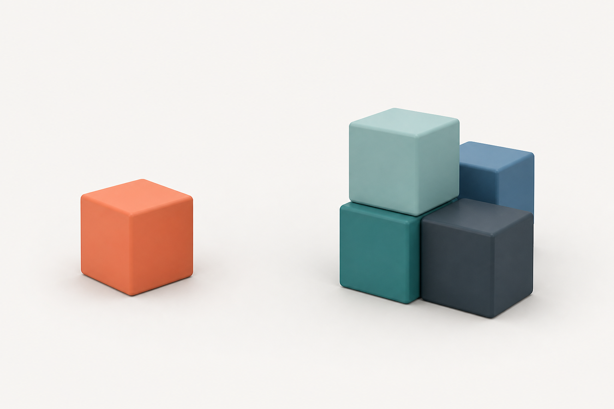
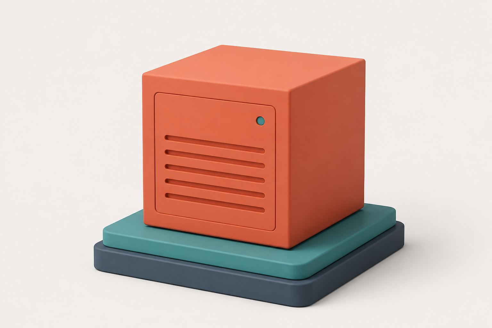

Model Vault is a Cohere-managed inference environment for deploying and serving Cohere models in an
isolated, single-tenant setup. It provides dedicated infrastructure with full control over model
selection, scaling, and performance monitoring, without you operating the underlying serving stack.

You manage all of your vaults in one place from the Cohere dashboard, where you can track spend, usage
hours, and activity across them. **Every vault is one of two types** — the deployment and management
experience is the same; the difference is the level of protection.

  

    

      
      
      
      vault.cohere.com
    

    
  

## Why Model Vault

  

    
    

      <h3>Dedicated and single-tenant</h3>
      
Your load balancer, serving middleware, inference servers, and GPU accelerators are isolated to you; only authentication and base compute are shared.

    

  

  

    
    

      <h3>Fully managed</h3>
      
Create a vault from the dashboard and let Cohere handle maintenance, deployments, updates, and scaling. There's no serving stack for you to operate.

    

  

  

    
    

      <h3>Models and performance tiers</h3>
      
Pick a model and a size tier (S, M, L, XL) to match your latency and throughput needs.

    

  

  

    
    

      <h3>Elastic capacity</h3>
      
Set a minimum and maximum replica range, with autoscaling available so you only pay for what you use.

    

  

  

    
    

      <h3>Built for production</h3>
      
Targets 99.9%+ availability SLOs, with request, latency, and utilization metrics to help you tune capacity.

    

  

  

    
    

      <h3>Standalone or with North</h3>
      
Call a vault directly over the API, or use it as the inference backend for <a href="/docs/model-vault/model-vault-with-north">North</a>.

    

  

## How it works

<Steps>
### Create a vault

In the [Vaults dashboard](/docs/model-vault/vaults-dashboard), [create a vault](/docs/model-vault/creating-a-vault): name it, choose a model and performance tier, and set its replica range.

### Get your endpoint

Once the vault is `Ready`, copy its **endpoint URL** and **model name** from the model card — see [Managing Vaults](/docs/model-vault/managing-vaults).

### Call it with the Cohere SDK

Point the SDK's `base_url` at your vault endpoint and send chat, embed, or rerank requests — see [Calling a Vault over the API](/docs/model-vault/api-access).
</Steps>

## Two types of vault

  <a className="mv-card" href="/docs/model-vault/standard">
    
    

      <h3>Standard Vault</h3>
      
A Cohere-managed, single-tenant deployment with data protected in transit and at rest. Best when you want dedicated inference without managing the serving stack.

    

    EXPLORE STANDARD VAULT →
  </a>
  <a className="mv-card" href="/docs/model-vault/encrypted">
    
    

      <h3>Encrypted Vault</h3>
      
Everything in a Standard Vault, plus confidential computing: prompts, responses, and model weights stay protected end to end inside hardware-backed trusted execution environments, with verifiable remote attestation. Best for regulated or highly sensitive workloads.

    

    EXPLORE ENCRYPTED VAULT →
  </a>

## How they compare

| | Standard Vault | Encrypted Vault 🔒 |
| --- | --- | --- |
| Managed, single-tenant deployment | Yes | Yes |
| Dashboard, monitoring, usage & billing | Yes | Yes |
| Use standalone or with North | Yes | Yes |
| Data protected in transit and at rest | Yes | Yes |
| Data protected **in use** (confidential computing) | — | Yes |
| Verifiable **remote attestation** before each connection | — | Yes |
| Compliance emphasis (GDPR, HIPAA, SOC 2) | Standard | Enhanced |
| Regions & data residency | [Regions & multi-region](/docs/model-vault/standard/regions) | {/* TODO: confirm encrypted region availability */} |
| Supported models | [Standard models](/docs/model-vault/standard/supported-models) | [Encrypted models](/docs/model-vault/encrypted/supported-models) |
| Pricing | [Standard pricing](/docs/model-vault/standard/pricing) | [Encrypted pricing](/docs/model-vault/encrypted/pricing) |

## How this documentation is organized

Pick your vault type first, then use the shared sections for the day-to-day flow:

- **[Standard Vault](/docs/model-vault/standard)** — what's specific to standard vaults (security & isolation, regions & multi-region, API usage, supported models, pricing).
- **[Encrypted Vault](/docs/model-vault/encrypted)** — what's specific to encrypted vaults (security model, attestation, confidential computing, key management, compliance, API usage, supported models, pricing).

The sections below apply to **every vault**, regardless of type:

- **Deploy & manage** — [The Vaults Dashboard](/docs/model-vault/vaults-dashboard), [Creating a Vault](/docs/model-vault/creating-a-vault), [Managing Vaults](/docs/model-vault/managing-vaults), [Scaling & Autoscaling](/docs/model-vault/scaling), and [Model Updates & Versioning](/docs/model-vault/model-versioning).
- **Inference & APIs** — [Calling a Vault over the API](/docs/model-vault/api-access), [Migrate from the Shared API](/docs/model-vault/migrating-from-shared-api), [Embeddings & Reranking](/docs/model-vault/embeddings-and-reranking), [API Keys](/docs/model-vault/api-keys), [Rate Limits & Quotas](/docs/model-vault/rate-limits), and [Async & Batch Inference](/docs/model-vault/async-batch-inference).
- **Operate & observe** — [Monitoring](/docs/model-vault/monitoring), [Logs & Tracing](/docs/model-vault/logs-and-tracing), and [Usage & Billing](/docs/model-vault/usage-and-billing).
- **[Model Vault with North](/docs/model-vault/model-vault-with-north)** — use a vault as the inference backend for North.

<Note title="Work in progress">
  This documentation is being actively expanded. The shared vault pages reflect the current product;
  Encrypted Vault pages are early drafts.
</Note>

## Get started

- New to Model Vault? Start with the [Quickstart](/docs/model-vault/quickstart).
- Need confidential computing? See [Encrypted Vaults](/docs/model-vault/encrypted).
