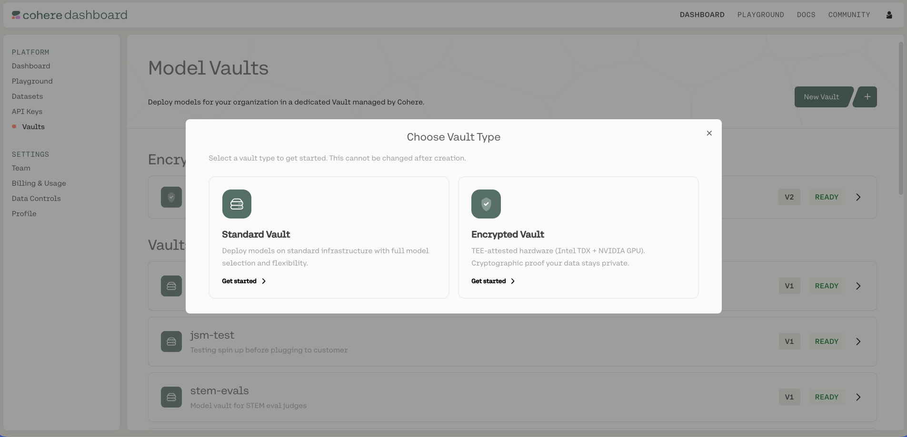
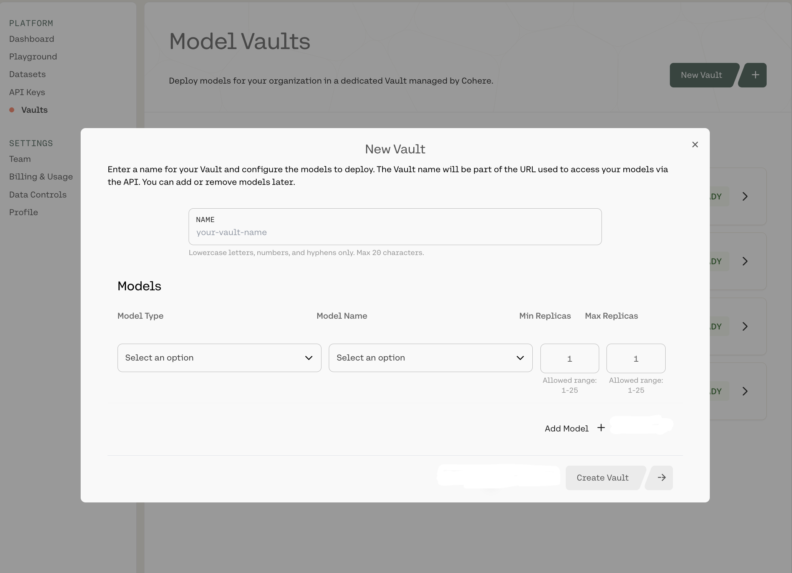
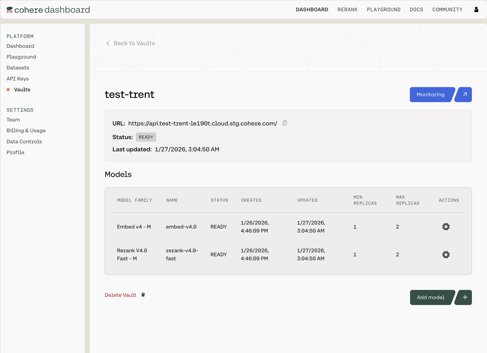
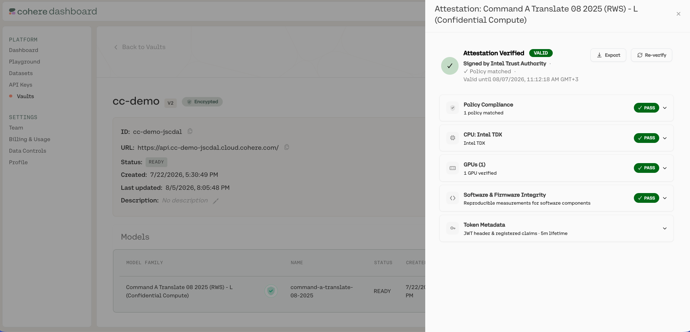

This quickstart walks you through creating your first vault from the Model Vault app and making an
inference request against it. The same flow applies to every vault; the only choice is whether to
create a **Standard** or an **Encrypted** vault.

<Steps>
## Choose a vault type

Go to [dashboard.cohere.com](https://dashboard.cohere.com/), open **Vaults**, and create a new vault. First
choose the vault type, **Standard** or **Encrypted** (this can't be changed after creation). Encrypted
vaults run inside hardware-backed trusted execution environments and support remote attestation. See
[Encrypted Vaults](../../docs/model-vault/encrypted).



## Select a model and performance tier

In the configuration panel, name your vault, select a model, and choose a performance tier, then set
the replica range. See [Creating a Vault](../../docs/model-vault/creating-a-vault) for the full walkthrough.



## Get your endpoint and model name

Once the vault status is **Ready**, open its summary page and copy the **endpoint URL** and **model
name**. See [Calling a Vault over the API](../../docs/model-vault/standard/api-access).



## (Encrypted only) Verify the attestation

If you created an encrypted vault, the client verifies the deployment's remote attestation
automatically before sending any data, and refuses the connection if it does not pass. You can also inspect the
attestation results, the CPU, GPU, software, and policy checks, in the Model Vault app or through the API,
so you have proof of exactly what is running. See
[Verifying Your Deployment](../../docs/model-vault/encrypted/verifying-deployment) and
[Remote Attestation](../../docs/model-vault/encrypted/attestation).



## Make a request

Point the Cohere SDK at your vault endpoint and call it like any other Cohere model.

```python PYTHON
import cohere

co = cohere.ClientV2(
    api_key="<COHERE_API_KEY>",
    base_url="<YOUR_VAULT_ENDPOINT_URL>",
)

response = co.chat(
    model="<YOUR_VAULT_MODEL_NAME>",
    messages=[{"role": "user", "content": "Hello from Model Vault!"}],
)

print(response.message.content[0].text)
```

</Steps>

## Next steps

- [Managing Vaults](../../docs/model-vault/managing-vaults): view vault details, edit, pause/resume, and delete models.
- [Calling a Vault over the API](../../docs/model-vault/standard/api-access): full request patterns, base URL configuration, and supported endpoints.
- [Monitoring](../../docs/model-vault/monitoring): track latency, throughput, and utilization.
- Go deeper on your vault type: [Standard Vault](../../docs/model-vault/standard) or [Encrypted Vault](../../docs/model-vault/encrypted).
