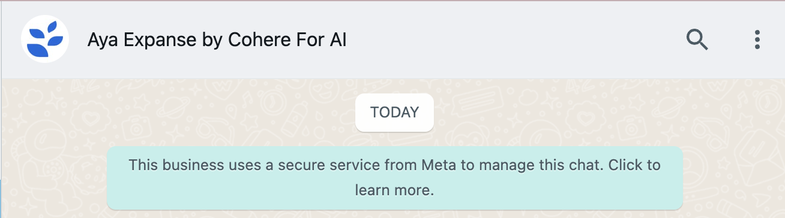
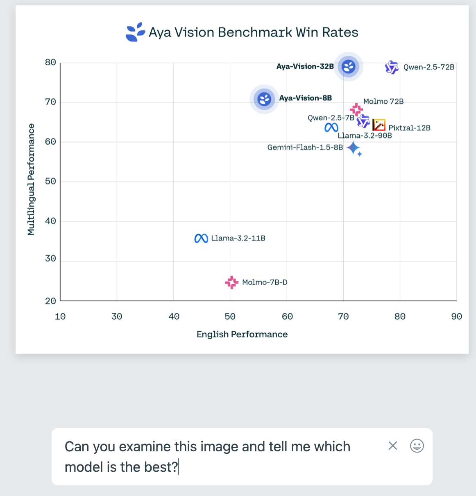

A massively multilingual large language model excelling in enterprise-scale tasks across **23 languages**. Built for scalability, reliability, and deep contextual understanding, Aya Expanse powers text generation, summarization, translation, and more, bridging global communication divides.  

## Key Capabilities  
- **Multilingual Support**: 23 languages  
- **Enterprise-Ready**: Scalable and reliable  
- **Customizable**: Fine-tune for specific use cases  

## Ideal For  
- Customer support  
- Content creation  
- Global communication  
- Data analysis  

Aya Expanse: The intelligent foundation for multilingual enterprise solutions.

## Model Details
| Model Name               | Description                                                                                                                                                                                                                                    | Modality        | Context Length | Maximum Output Tokens | Endpoints                                            |
|--------------------------|------------------------------------------------------------------------------------------------------------------------------------------------------------------------------------------------------------------------------------------------|-----------------|----------------|-----------------------|------------------------------------------------------|
| `c4ai-aya-expanse-8b`    | Aya Expanse is a highly performant 8B multilingual model, designed to rival monolingual performance through innovations in instruction tuning with data arbitrage, preference training, and model merging. Serves 23 languages.                | Text            | 8k             | 4k                    | [Chat](/reference/chat)                              |
| `c4ai-aya-expanse-32b`   | Aya Expanse is a highly performant 32B multilingual model, designed to rival monolingual performance through innovations in instruction tuning with data arbitrage, preference training, and model merging. Serves 23 languages.               | Text            | 128k           | 4k                    | [Chat](/reference/chat)                              |


## How Can I Get Access to the Aya Models?
If you want to test Aya, you have three options. First (and simplest), you can use the [Cohere playground](https://dashboard.cohere.com/playground/chat) or [Hugging Face Space](https://huggingface.co/spaces/CohereForAI/aya_expanse) to play around with them and see what they’re capable of.

Second, you can use the [Cohere Chat API](https://docs.cohere.com/v2/docs/chat-api) to work with Aya programmatically. Here’s a very lightweight example of using the Cohere SDK to create a Spanish-language tutor with Aya that tells a story with simple Spanish vocabulary (NOTE: you’ll need an API key to run this code, and if you haven’t installed the Cohere SDK you can do that with `pip install cohere`).

```python PYTHON
import cohere

co = cohere.ClientV2("<YOUR_API_KEY>")

response = co.chat(
    model="c4ai-aya-expanse-32b",
    messages=[
        {
            "role": "user",
            "content": "Eres un gran profesor de español. ¿Puedes escribirme una historia que ilustre vocabulario sencillo en español?",
        }
    ],
)

print(response.message.content[0].text)
```

And here’s an example output (remember: these models are stochastic, and what you see might look quite different).

```
¡Claro! Aquí te presento una historia corta que utiliza vocabulario sencillo en español:

**La aventura de María en el mercado**

Era una mañana soleada y María, una joven curiosa, decidió explorar el mercado local de su pueblo. Al entrar, se encontró con un mundo lleno de colores y aromas fascinantes.

En uno de los puestos, vio una montaña de frutas brillantes. Había manzanas rojas como la grana, naranjas naranjas como el atardecer, y plátanos amarillos como el sol. María eligió una manzana crujiente y le pidió al vendedor que le enseñara cómo pelar una naranja.

Caminando por los pasillos, se topó con una señora que vendía flores. Las rosas rojas olían a dulce miel, y los claveles blancos parecían pequeñas nubes. María compró un ramo de margaritas para decorar su habitación.

Más adelante, un señor amable ofrecía quesos de diferentes sabores. María probó un queso suave y cremoso que le encantó. También compró un poco de pan fresco para acompañarlo.

En la sección de artesanías, encontró un artista que tallaba hermosos platos de madera. María admiró su trabajo y aprendió la palabra "tallar", que significaba dar forma a la madera con cuidado.

Al final de su aventura, María se sintió feliz y orgullosa de haber descubierto tantas cosas nuevas. Había aprendido vocabulario relacionado con los colores, los sabores, las texturas y las artes. El mercado se había convertido en un lugar mágico donde la simplicidad de las palabras se unía a la riqueza de las experiencias.

Espero que esta historia te sea útil para ilustrar vocabulario sencillo en español. ¡Puedes adaptar y expandir la trama según tus necesidades!
```

Finally, you can directly download the raw models for research purposes because Cohere For AI has released [Aya Expanse 8B](https://huggingface.co/CohereForAI/aya-expanse-8b) and [Aya Expanse 32B](https://huggingface.co/CohereForAI/aya-expanse-32b) as open-weight models, through HuggingFace. What’s more, the massively multilingual instruction data used for development of these models has been [made available](https://huggingface.co/datasets/CohereForAI/aya_collection) for download as well.

### Aya Expanse Integration with WhatsApp

In addition to the above, you also have the option of talking to Aya Expanse through the popular messaging service WhatsApp. Below, we'll answer some questions about this process.

<Note>  
By communicating with Aya Expanse through WhatsApp, you agree to Cohere's Terms of Use and Privacy Policy. Large Language Models might hallucinate, so be sure to verify important information.
</Note>

#### How do I Talk to Aya with WhatsApp?
Use [this link](https://wa.me/14313028498) to open a WhatsApp chatbox with Aya Expanse. If you don't have WhatsApp downloaded on your machine you might need to do that, or, if you have it on your phone, you can follow the on-screen instructions to link your phone and WhatsApp Web. By the end, you should see a text window that looks something like this, which you can use to chat with the model:



#### Will I Get Charged for Talking to Aya?
Aya Expanse is free to use on WhatsApp. You will not be charged for any usage and are not limited in the number of interactions you can have with the model.

#### Are There Certain Aya Capabilities that Aren't Available Through WhatsApp?
Aya Expanse is a multilingual language model capable of conversing in 23 languages. However, [retrieval-augemented generation](https://docs.cohere.com/docs/retrieval-augmented-generation-rag) RAG and [tool-use](https://docs.cohere.com/docs/tools) are not available in WhatsApp, for that you should instead use the [Cohere chat endpoint](https://docs.cohere.com/reference/chat).

### Are There Special Commands I Should Keep in Mind while Chatting with Aya Expanse via Whatsapp?
Yes, you can send the “/clear” command to the model via WhatsApp to clear the context of your previous chat with the model and start a fresh conversation with Aya Expanse.

#### How do I Know It's Really Aya Expanse I'm Talking to?
If you follow the link provided above and see the "Aya Expanse by Cohere for AI" banner at the top, it's Aya.

#### What Should I do if the Model Becomes Unresponsive?
Aya Expanse should be accessible via Whatsapp at all times. Sometimes, a simple app refresh can resolve any temporary glitches. If the problem persists, we encourage you to report the issue on the [Cohere Discord server](https://discord.com/invite/co-mmunity).

#### Can I Use Aya Vision with WhatsApp?
Yes! To use Aya Vision with WhatsApp, follow exactly the same procedure outlined above. When you've made it into WhatsApp, you can simply upload an image and include your question in the `caption` field (you can also upload the image and ask a question afterwards).

Here's what that looks like:



And here's a sample output:


We have a dedicated document for Aya Vision, which you can find [here](/docs/aya-multimodal).

## Find More
We hope you’ve found this as fascinating as we do! If you want to see more substantial projects you can check out these notebooks ([source](https://huggingface.co/CohereForAI/aya-expanse-32b)):

- [Multilingual Writing Assistant](https://colab.research.google.com/drive/1SRLWQ0HdYN_NbRMVVUHTDXb-LSMZWF60)
- [AyaMCooking](https://colab.research.google.com/drive/1-cnn4LXYoZ4ARBpnsjQM3sU7egOL_fLB?usp=sharing)
- [Multilingual Question-Answering System](https://colab.research.google.com/drive/1bbB8hzyzCJbfMVjsZPeh4yNEALJFGNQy?usp=sharing)
