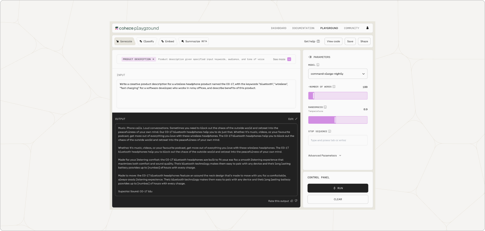

Here, you'll find safety benchmarks, intended use cases, and various other information pertaining to Cohere generation models.

## Intended Use Case

Generations may be used for interactive autocomplete, augmenting human writing processes, summarization, text rephrasing, and other text-to-text tasks in non-sensitive domains.

Outputs from Classify can be used for classification and analysis tasks, such as selecting the most likely completion for a sentence. Token likelihoods from Likelihood might be used to make fun claims about the “randomness” of your favourite author’s writing, or to explore the statistical differences between human-written and machine-generated text (see <a href="https://arxiv.org/abs/1906.04043" target="_blank">Gehrmann et al., 2019</a>).

Generations can address a large number of use cases. Check the presets for interesting examples.

## Usage Notes

Always refer to the [Usage Guidelines](/docs/usage-guidelines) for guidance on using the Cohere Platform responsibly. Additionally, please consult the following model-specific usage notes:

## Performance Benchmarks

Performance has been evaluated on the following research benchmarks. These metrics are reported on the Extremely Large (Beta) model. To gain a deeper understanding of what these benchmarks mean for your use case, read more about [Hellaswag](https://aclanthology.org/P19-1472.pdf) and [COPA](https://people.ict.usc.edu/~gordon/copa.html).

 

| **Model**       | **Benchmark** | **Metric**            | **Statistic** |
| --------------- | ------------- | --------------------- | ------------- |
| Extremely Large | Hellaswag     | Accuracy, Zero-Shot   | 0.805         |
|                 | PIQA          | Likelihood, Zero-Shot | 0.824         |

## Safety Benchmarks

Performance has been evaluated on the following safety-related research benchmarks. These metrics are reported on the Large model.

| **Model** | **Benchmark**         | **Metric**                                     | **Statistic** |
| --------- | --------------------- | ---------------------------------------------- | ------------- |
| XLarge    | Real Toxicity Prompts | Max Toxicity in 5K Unconditional Generations   | 0.93          |
|           | Real Toxicity Prompts | Percent Toxic in 10K Conditional Generations   | 0.08          |
|           | Real Toxicity Prompts | Percent Toxic in 10K "Challenging" Generations | 0.38          |
| Large     | StereoSet             | Stereotype Score                               | 51.95         |
|           | StereoSet             | Language Modeling Score                        | 80.92         |
|           | BOLD                  | Gender Ratio (M:F)                             | 1.99          |
|           | BOLD                  | Sentiment (+:-)                                | 3.21          |
|           | BOLD                  | Regard (+:-)                                   | 3.41          |
|           | BOLD                  | Toxic samples in 1K                            | 5.4           |

We are researching how to expand our safety benchmarking to the multilingual context; multilingual benchmarks will be introduced in the future.

### Model Toxicity and Bias

Language models learn the statistical relationships present in training datasets, which may include toxic language and historical biases along race, gender, sexual orientation, ability, language, cultural, and intersectional dimensions. We recommend that developers using the Generation model take model toxicity and bias into account and design applications carefully to avoid the following:

- **Toxic Degeneration:** Despite our ongoing efforts to remove harmful text from the training corpus, models may generate toxic text. This may include obscenities, sexually explicit content, and messages which mischaracterize or stereotype groups of people based on problematic historical biases perpetuated by internet communities (see <a href="https://arxiv.org/abs/2009.11462" target="_blank">Gehman et al., 2020</a> for more about toxic language model degeneration). We have put safeguards in place to avoid generating harmful text, but we highly recommend that developers build additional guardrails to ensure that text presented to end users is not toxic or harmful.

- **Reinforcing historical social biases:** Language models capture problematic associations and stereotypes prominent on the internet and society at large. They should not be used to make decisions about individuals or the groups they belong to. For example, it is dangerous to use Generation model outputs in CV ranking systems due to known biases (<a href="https://arxiv.org/abs/2004.09456" target="_blank">Nadeem et al., 2020</a>).

## Potential for Misuse

Guided by the <a href="https://2021.naacl.org/ethics/review-questions" target="_blank">NAACL Ethics Review Questions</a>, we describe below the model-specific concerns around misuse of the Generation model. By documenting adverse use cases, we aim to encourage Cohere and its customers to prevent adversarial actors from leveraging our models to the following malicious ends.

**Note:** The examples in this section are **not comprehensive** and are only meant to illustrate our understanding of potential harms. The examples are meant to be more model-specific and tangible than those in the [Usage Guidelines](/docs/usage-guidelines). Each of these malicious use cases violates our usage guidelines and Terms of Use, and Cohere reserves the right to restrict API access at any time.

- **Astroturfing:** Generated text used to provide the illusion of discourse or expression of opinion by members of the public on social media or any other channel.
- **Generation of misinformation and other harmful content:** The generation of news or other articles which manipulate public opinion, or any content which aims to incite hate or mischaracterize a group of people.
- **Human-outside-the-loop:** The generation of text about people, places, or events without a human-in-the-loop. This includes making automated decisions based on model-generated outputs which have real-world consequences on people, or posing as a human in any context where the end user is unaware that outputs are being generated by a language model.
