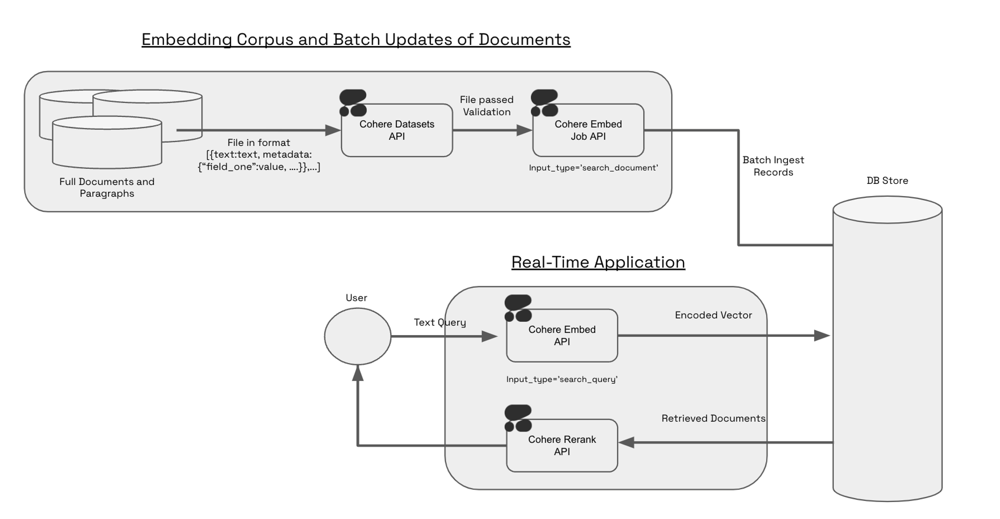

<Note title="This Guide Uses the Embed Jobs API.">
  You can find the API reference for the api [here](/reference/create-embed-job)
  The Embed Jobs API is only compatible with our embed v3.0 models
</Note>

In this guide, we show you how to use the embed jobs endpoint to asynchronously embed a large amount of texts. This guide uses a simple dataset of wikipedia pages and its associated metadata to illustrate the endpoint’s functionality. To see an end-to-end example of retrieval, check out this [notebook](https://github.com/cohere-ai/notebooks/blob/main/notebooks/Embed_Jobs_Semantic_Search.ipynb).

### How to use the Embed Jobs API

The Embed Jobs API was designed for users who want to leverage the power of retrieval over large corpuses of information. Encoding hundreds of thousands of documents (or chunks) via an API can be painful and slow, often resulting in millions of http-requests sent between your system and our servers. Because it validates, stages, and optimizes batching for the user, the Embed Jobs API is much better suited for encoding a large number (100K+) of documents. The Embed Jobs API also stores the results in a hosted Dataset so there is no need to store the result of your embeddings locally.

The Embed Jobs API works in conjunction with the Embed API; in production use-cases, Embed Jobs is used to stage large periodic updates to your corpus and Embed handles real-time queries and smaller real-time updates.



### Constructing a Dataset for Embed Jobs

To create a dataset for Embed Jobs, you will need to specify the `embedding_types`, and you need to set `dataset_type` as `embed-input`. The schema of the file looks like: `text:string`.

The Embed Jobs and Dataset APIs respect metadata through two fields: `keep_fields`, `optional_fields`. During the `create dataset` step, you can specify either `keep_fields` or `optional_fields`, which are a list of strings corresponding to the field of the metadata you’d like to preserve. `keep_fields` is more restrictive, since validation will fail if the field is missing from an entry. However, `optional_fields`, will skip empty fields and allow validation to pass.

#### Sample Dataset Input Format

```Text JSONL
{
"wiki_id": 69407798,
"url": "https://en.wikipedia.org/wiki?curid=69407798",
"views": 5674.4492597435465,
"langs": 38,
"title":"Deaths in 2022",
"text": "The following notable deaths occurred in 2022. Names are reported under the date of death, in alphabetical order. A typical entry reports information in the following sequence:",
"paragraph_id": 0,
"id": 0
}

{
"wiki_id": 3524766,
"url": "https://en.wikipedia.org/wiki?curid=3524766",
"views": 5409.5609619796405,
"title": "YouTube",
"text": "YouTube is a global online video sharing and social media platform headquartered in San Bruno, California. It was launched on February 14, 2005, by Steve Chen, Chad Hurley, and Jawed Karim. It is owned by Google, and is the second most visited website, after Google Search. YouTube has more than 2.5 billion monthly users who collectively watch more than one billion hours of videos each day. , videos were being uploaded at a rate of more than 500 hours of content per minute.",
"paragraph_id": 0,
"id": 1
}
```

As seen in the example above, the following would be a valid `create_dataset` call since `langs` is in the first entry but not in the second entry. The fields `wiki_id`, `url`, `views` and `title` are present in both JSONs.

```python PYTHON
# Upload a dataset for embed jobs
ds=co.datasets.create(
	name='sample_file',
	# insert your file path here - you can upload it on the right - we accept .csv and jsonl files
	data=open('embed_jobs_sample_data.jsonl', 'rb'),
	keep_fields=['wiki_id','url','views','title']
	optional_fields=['langs']
	dataset_type="embed-input",
  embedding_types=['float']
	)

# wait for the dataset to finish validation
print(co.wait(ds))
```

Currently the dataset endpoint will accept `.csv` and `.jsonl` files - in both cases, it is imperative to have either a field called `text` or a header called `text`. You can see an example of a valid `jsonl` file [here](https://raw.githubusercontent.com/cohere-ai/notebooks/main/notebooks/data/embed_jobs_sample_data.jsonl) and a valid csv file [here](https://raw.githubusercontent.com/cohere-ai/notebooks/main/notebooks/data/embed_jobs_sample_data.csv).

### 1\. Upload your Dataset

The Embed Jobs API takes in `dataset IDs` as an input. Uploading a local file to the Datasets API with `dataset_type="embed-input"` will validate the data for embedding. The input file types we currently support are `.csv` and `.jsonl`. Here's a code snippet of what this looks like:

```python PYTHON
import cohere
co = cohere.Client(api_key="<YOUR API KEY>")

input_dataset=co.datasets.create(
	name='your_file_name',
	data=open('/content/your_file_path', 'rb'),
	dataset_type="embed-input"
	)

# block on server-side validation
print(co.wait(input_dataset))
```

Upon uploading the dataset you will get a response like this:

```text Text
uploading file, starting validation...
```

Once the dataset has been uploaded and validated you will get a response like this:

```text TEXT
sample-file-m613zv was uploaded
```

If your dataset hits a validation error, please refer to the dataset validation errors section on the [datasets](/docs/datasets) page to debug the issue.

### 2\. Kick off the Embed Job

Your dataset is now ready to be embedded. Here's a code snippet illustrating what that looks like:

```python PYTHON
embed_job = co.embed_jobs.create(
	dataset_id=input_dataset.id,
	input_type='search_document' ,
	model='embed-english-v3.0',
  embedding_types=['float'],
	truncate='END')

# block until the job is complete
co.wait(embed_job)
```

Since we’d like to search over these embeddings and we can think of them as constituting our knowledge base, we set `input_type='search_document'`.

### 3\. Save down the Results of your Embed Job or View the Results of your Embed Job

The output of embed jobs is a dataset object which you can download or pipe directly to a database of your choice:

```python PYTHON
output_dataset=co.datasets.get(id=embed_job.output.id)
co.utils.save(filepath='/content/embed_job_output.csv', format="csv")
```

Alternatively if you would like to pass the dataset into a downstream function you can do the following:

```python PYTHON
output_dataset=co.datasets.get(id=embed_job.output.id)
results=[]
for record in output_dataset:
	results.append(record)
```

### Sample Output

The Embed Jobs API will respect the original order of your dataset and the output of the data will follow the `text: string`, `embedding: list of floats` schema, and the length of the embedding list will depend on the model you’ve chosen (i.e. `embed-english-light-v3.0` will be `384 dimensions` whereas `embed-english-v3.0` will be `1024 dimensions`).

Below is a sample of what the output would look like if you downloaded the dataset as a `jsonl`.

```json JSON
{
  "text": "The following notable deaths occurred in 2022. Names are reported under the date of death, in alphabetical order......",
  "embeddings": {
    "float":[0.006572723388671875, 0.0090484619140625, -0.02142333984375,....],
    "int8":null,
    "uint8":null,
    "binary":null,
    "ubinary":null
  }
}
```

If you have specified any metadata to be kept either as `optional_fields` or `keep_fields` when uploading a dataset, the output of embed jobs will look like this:

```json JSON
{
  "text": "The following notable deaths occurred in 2022. Names are reported under the date of death, in alphabetical order......",
  "embeddings": {
    "float":[0.006572723388671875, 0.0090484619140625, -0.02142333984375,....],
    "int8":null,
    "uint8":null,
    "binary":null,
    "ubinary":null
  }
	"field_one": "some_meta_data",
	"field_two": "some_meta_data",
}
```

### Next Steps

Check out our end to end [notebook](https://github.com/cohere-ai/notebooks/blob/main/notebooks/Embed_Jobs_Serverless_Pinecone_Semantic_Search.ipynb) on retrieval with Pinecone's serverless offering.
