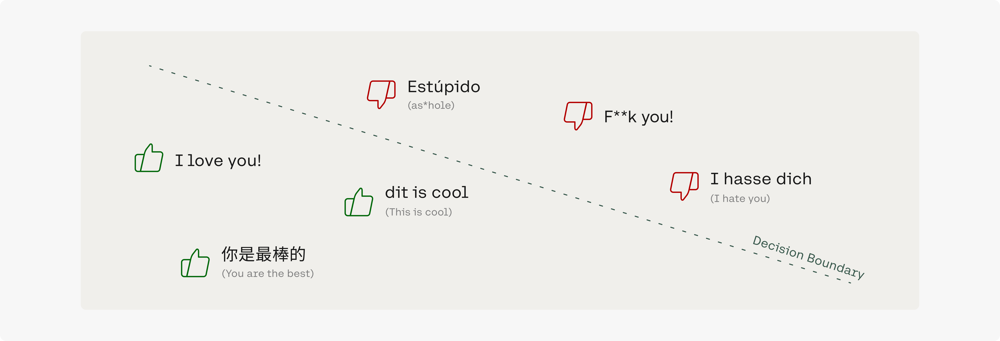

In today’s world, content moderation remains a major challenge. As platforms like online games increasingly attract an international audience, the complexity of content moderation has grown. Hateful content can make its way across multiple languages, and therefore has a greater probability of passing through content moderation tools.

To tackle this challenge, we use multilingual embeddings to build a content moderation tool that works across 100+ languages and only requires training data in English.

For content moderation, we just need a handful of training examples of harmful and acceptable content in one language, like English. We can then train a classifier to find the decision boundary in the vector space that helps us determine which type of content is undesirable on the platform.
