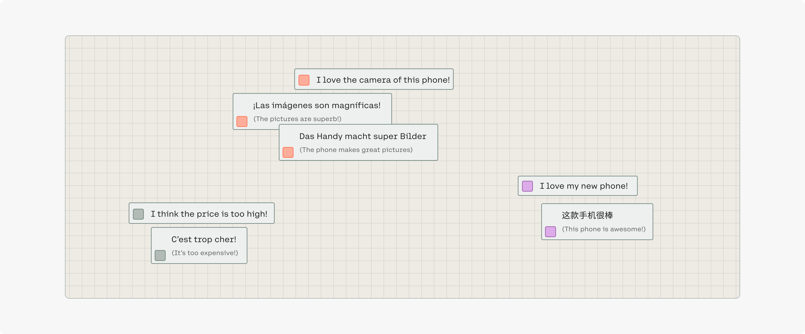

Successful products like the iPhone quickly get tens of thousands of reviews on eCommerce marketplaces and on social media, which are written in many languages. Getting insights from these reviews enables companies to better understand their customer base and to better drive their product roadmap. 

However, methods for content aggregation only worked well for English, and it wasn’t possible to see patterns across languages or to compare markets.

Cohere’s multilingual model maps text in different languages to the same vector spaces, allowing users to derive insights across languages and find patterns for specific markets (e.g., which markets care about the picture quality of smartphones).
