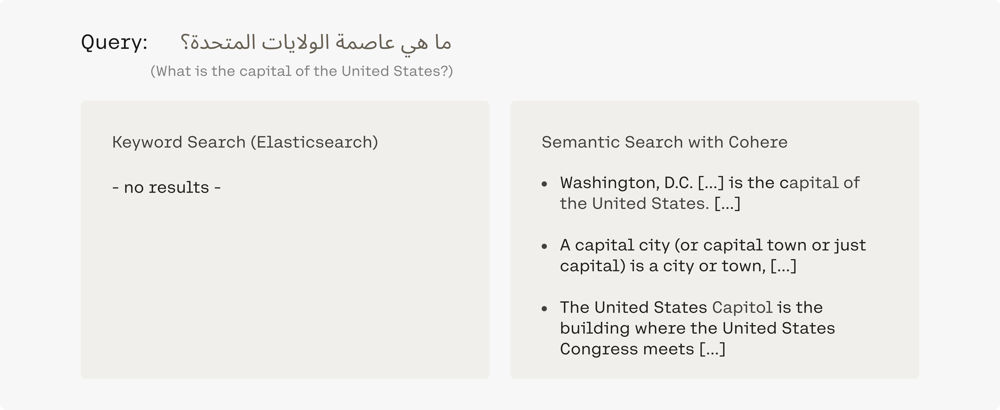

Semantic search is no longer restricted to queries and documents in the same language, but now also works across languages. For example, if we phrase the search query "What is the capital of the United States" in Arabic (“ما هي عاصمة الولايات المتحدة؟”), we get the same results, while keyword search can obviously not retrieve any relevant documents.

This enables interesting use cases. In the financial domain, for example, we can quickly find relevant information regardless of the language in which it has been published.
