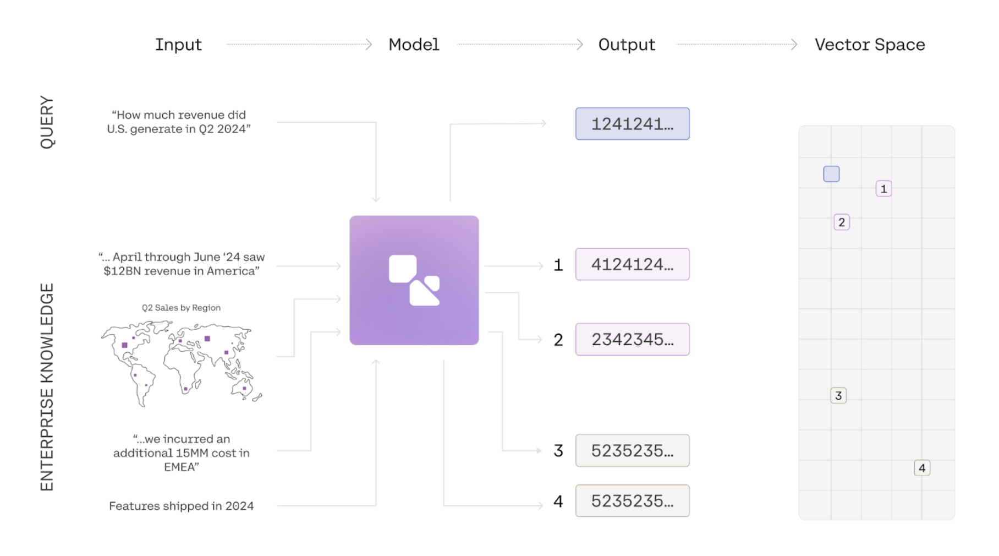

<Note title="This Guide Uses the Embed API.">  
 You can find the API reference for the api [here](/reference/embed)
 
 Image capabilities is only compatible with our embed v3.0 models
</Note>

In this guide, we show you how to use the embed endpoint to embed a series of images. This guide uses a simple dataset of graphs to illustrate how semantic search can be done over images with Cohere. To see an end-to-end example of retrieval, check out this [notebook](https://github.com/cohere-ai/cohere-developer-experience/blob/main/notebooks/Multimodal_Semantic_Search.ipynb).

### Introduction to Multimodal Embeddings

Information is often represented in multiple modalities. A document, for instance, may contain text, images, and graphs, while a product can be described through images, its title, and a written description. This combination of elements often leads to a comprehensive semantic understanding of the subject matter. Traditional embedding models have been limited to a single modality, and even multimodal embedding models often suffer from degradation in `text-to-text` or `text-to-image` retrieval tasks. The `embed-v3.0` series of models, however, is fully multimodal, enabling it to embed both images and text effectively. We have achieved state-of-the-art performance without compromising text-to-text retrieval capabilities.

### How to use Multimodal Embeddings

#### 1\. Prepare your Image for Embeddings

The Embed API takes in images with the following file formats: `png`, `jpeg`,`Webp`, and `gif`. The images must then be formatted as a Data URL.

```python PYTHON
# Import the necessary packages
import os
import base64


# Defining the function to convert an image to a base 64 Data URL
def image_to_base64_data_url(image_path):
    _, file_extension = os.path.splitext(image_path)
    file_type = file_extension[1:]

    with open(image_path, "rb") as f:
        enc_img = base64.b64encode(f.read()).decode("utf-8")
        enc_img = f"data:image/{file_type};base64,{enc_img}"
    return enc_img


image_path = "<YOUR IMAGE PATH>"
processed_image = image_to_base64_data_url(image_path)
```
#### 2\. Call the Embed Endpoint
```python PYTHON
# Import the necessary packages
import cohere

co = cohere.ClientV2(api_key="<YOUR API KEY>")

# format the input_object
image_input = [{"content": [{"type": "image", "image": processed_image}]}]

co.embed(
    model="embed-v4.0",
    inputs=image_input,
    input_type='search_document',
    embedding_types=["float"],
)
```

## Sample Output
Below is a sample of what the output would look like if you passed in a `jpeg` with original dimensions of `1080x1350` with a standard bit-depth of 24.
```json JSON
{
    'id': '0d9bb922-f15f-4b8b-9a2f-72577324528f', 
    'texts': [], 
    'images': [{'width': 1080, 'height': 1350, 'format': 'jpeg', 'bit_depth': 24}], 
    'embeddings': {'float': [[-0.035369873, 0.040740967, 0.008262634, -0.008766174, .....]]}, 
    'meta': {
    'api_version': {'version': '1'},
    'billed_units': {'images': 1}
    }, 
    'response_type': 'embeddings_by_type'
}
```
