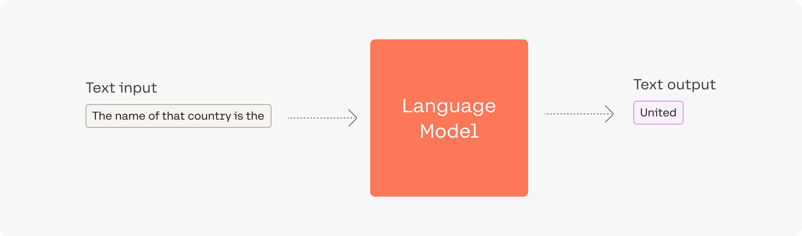
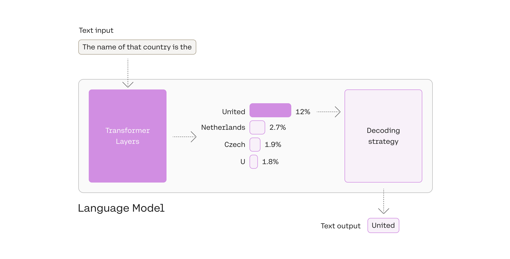
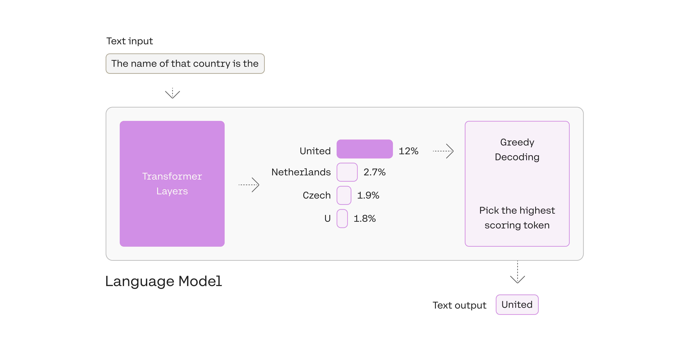
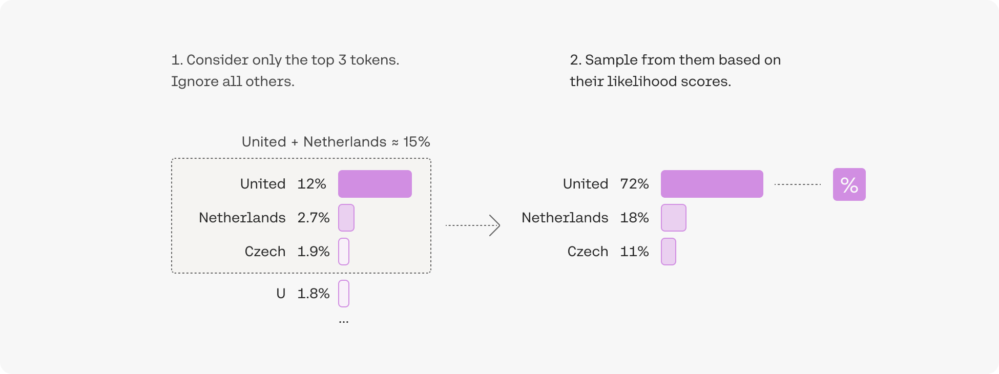
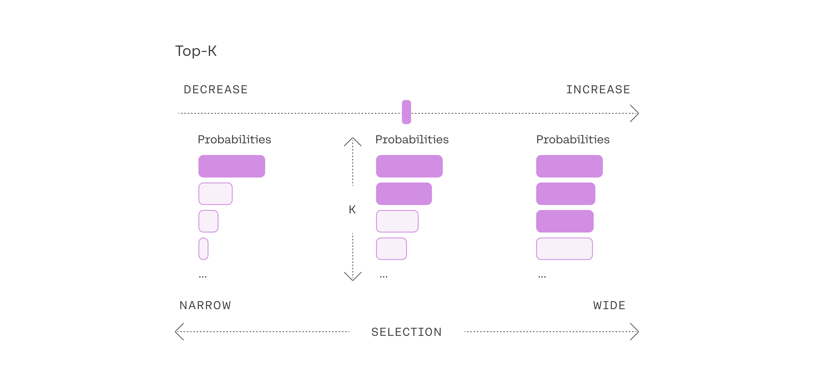

There are a handful of additional model parameters that impact the kinds of outputs Cohere models will generate. These include the `top-p`, `top-k`, `frequency_penalty`, and `presence_penalty`  parameters.

## Top-p and Top-k

The method you use to pick output tokens is an important part of successfully generating text with language models. There are several methods (also called decoding strategies) for picking the output token, with two of the leading ones being top-k sampling and top-p sampling.

Let’s look at the example where the input to the model is the prompt `The name of that country is the`:

<Frame caption="Example output of a generation language model.">

</Frame>


The output token in this case, `United`, was picked in the last step of processing -- after the language model has processed the input and calculated a likelihood score for every token in its vocabulary. This score indicates the likelihood that it will be the next token in the sentence (based on all the text the model was trained on).

<Frame caption="The model calculates a likelihood for each token in its vocabulary. The decoding strategy then picks one as the output.">

</Frame>


### 1\. Pick the top token: greedy decoding

You can see in this example that we picked the token with the highest likelihood, `United`.

<Frame caption="Always picking the highest scoring token is called 'Greedy Decoding'. It's useful but has some drawbacks.">

</Frame>


Greedy decoding is a reasonable strategy, but has some drawbacks; outputs can get stuck in repetitive loops, for example. Think of the suggestions in your smartphone's auto-suggest. When you continually pick the highest suggested word, it may devolve into repeated sentences.

### 2\. Pick from amongst the top tokens: top-k

Another commonly-used strategy is to sample from a shortlist of the top three tokens. This approach allows the other high-scoring tokens a chance of being picked. The randomness introduced by this sampling helps the quality of generation in a lot of scenarios.

<Frame caption="Adding some randomness helps make output text more natural. In top-3 decoding, we first shortlist three tokens then sample one of them by considering their likelihood scores.">

</Frame>

More broadly, choosing the top three tokens means setting the [top-k parameter](https://docs.cohere.com/reference/chat#request.body.k) to `3` (it defaults to `0`) with `k=3`. Changing the top-k parameter sets the size of the shortlist the model samples from as it outputs each token. Setting top-k to `1` gives us greedy decoding.

<Frame caption="Adjusting to the top-k setting.">

</Frame>

Note that when `k` is set to `0`, the model disables k sampling and uses p instead.

### 3\. Pick from amongst the top tokens whose probabilities add up to 15%: top-p

The difficulty of selecting the best top-k value opens the door for a popular decoding strategy that dynamically sets the size of the shortlist of tokens. This method, called _Nucleus Sampling_, creates the shortlist by selecting the top tokens whose sum of likelihoods does not exceed a certain value. A toy example with a [top-p value](https://docs.cohere.com/reference/chat#request.body.p) of `0.15` (it defaults to `0.75`) would look like this:

<Frame caption="In top-p, the size of the shortlist is dynamically selected based on the sum of likelihood scores reaching some threshold.">

</Frame>

Top-p is usually set to a high value (`p=0.75`, it's maximum value is `0.99`) with the purpose of limiting the long tail of low-probability tokens that may be sampled. We can use both top-k and top-p together. If both `k` and `p` are enabled, `p` acts after `k`. Here's a code snippet showing how this works:

```python PYTHON 
import cohere
co = cohere.ClientV2(api_key=<API_KEY>)
response = co.chat(
    model="command-a-03-2025",
    messages=[{"role": "user", "content": "hello world!"}],
    k=100,
    p=0.75
)
print(response)
```

## Frequency and Presence Penalties

The final set of parameters worth discussing in this context are `frequency_penalty` and `presence_penalty`, both of which work on logits (which are log probabilities that haven't been normalized) in order to influence how often a given token appears in output.

The frequency penalty penalizes tokens that have already appeared in the preceding text (including the prompt), and scales based on how many times that token has appeared. So a token that has already appeared 10 times gets a higher penalty (which reduces its probability of appearing) than a token that has appeared only once.

The presence penalty, on the other hand, applies the penalty regardless of frequency. As long as the token has appeared once before, it will get penalized.

These settings are useful if you want to get rid of repetition in your outputs.
