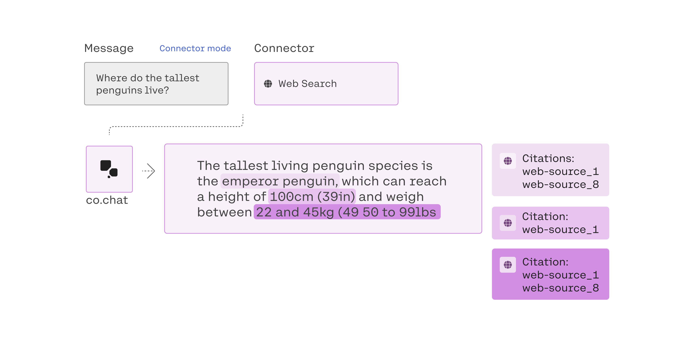
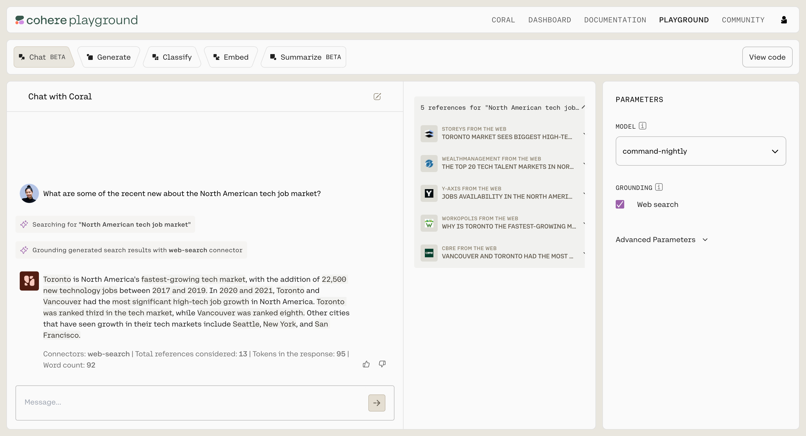

<Note title="This Guide Uses the Chat Endpoint.">  
 You can find the API reference for the endpoint [here](/reference/chat).
</Note>

[NEW PREAMBLE]

In this guide, we show how to use the Chat endpoint to create a simple Chatbot that, given an input query, responds to it considering the previous context.

## Getting Set Up

First, let's install the SDK (the examples below are in Python, Typescript, and Go):

