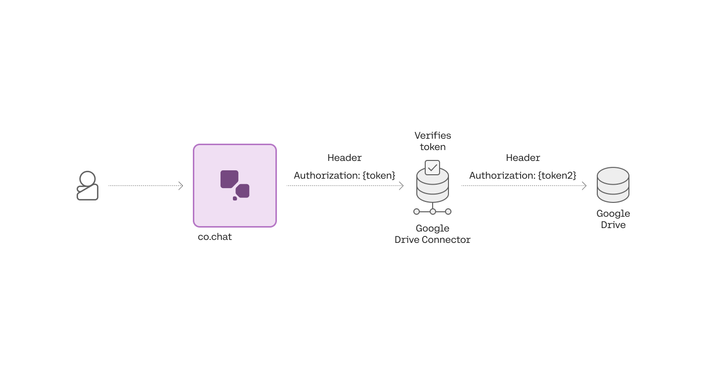
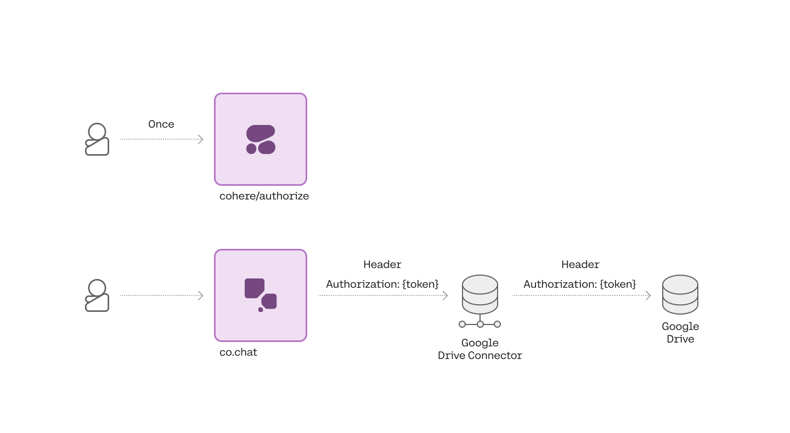
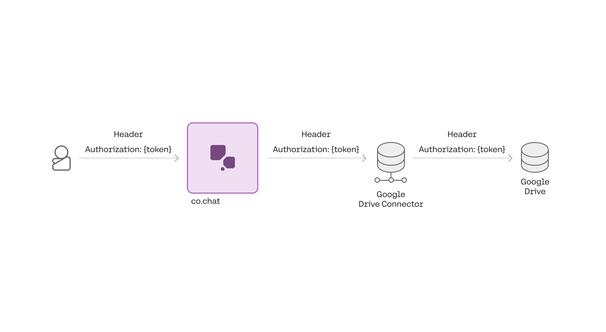

Cohere supports three methods for authentication and authorization to protect your connectors from unauthorized use. They are:

1. Service to Service Authentication
2. OAuth 2.0
3. Pass-Through

<Error title="Connector Authentication"> 
 We highly recommend using one authentication feature with your connector.
</Error>

The Chat API sends the request to your connector with the related auth token in the `Authorization` header. Your connector should therefore expect the header to contain this auth token, and it'll capture it, verify it, and use it in the appropriate manner to access the underlying data store.

```
Authorization: Bearer <token>
```

### Option 1: Service to Service Authentication

The first method is **service to service authentication**, through which Cohere sends requests to your connector with a single token that you generate and configure. We recommend service to service authentication when your connector is searching data that everyone in your organization has access to, such as company policies, public messaging channels, FAQs, etc.




To enable service level authentication, you will need to generate a token, configure your connector to verify it, and provide it to Cohere, either during registration or as part of an update.

First, start by generating a secure token. Here’s a snippet of what generating a token looks like in python:

```python PYTHON
# Generate a token
import secrets  
secrets.token_urlsafe(32)
```

After generating the token, you will have to configure your connector to check it. The quick start connectors should expose an environment variable for you to use. For example, the Google Drive connector exposes `CONNECTOR_API_KEY` for this purpose. After setting this environment variable, you should verify that requests without the appropriate `Authorization` header are being denied:

<CodeBlocks>
```curl CURL
curl --request POST  
    --url 'https://connector-example.com/search'
    --header 'Content-Type: application/json'  
    --data '{  
    "query": "How do I expense a meal?"  
  }'
```
```python PYTHON
import requests
r = requests.post('{base_connector_url}/search', {'query': 'How do I expense a meal?'})
```
```typescript TYPESCRIPT
const response = await fetch('{base_connector_url}/search'{
  method: 'POST',
  body: {'query': 'How do I expense a meal?'},
  headers: {'Content-Type': 'application/json'} });
const data = await response.json();

console.log(data);
```
</CodeBlocks>

You should also verify that requests with the correct header are successful:

<CodeBlocks>
```curl CURL
curl --request POST  
    --url 'https://connector-example.com/search'
    --header 'Content-Type: application/json' 
    --header 'Authorization: Bearer {Connector API key}'  
    --data '{  
    "query": "How do I expense a meal?"  
  }'
```
```python PYTHON
import requests
r = requests.post('{base_connector_url}/search',
                  data={'query': 'How do I expense a meal?'},
                  headers={"Authorization":"Bearer {Connector API key}"})
```
```typescript TYPESCRIPT
const response = await fetch('{base_connector_url}/search'{
  method: 'POST',
  body: {'query': 'How do I expense a meal?'},
  headers: {'Content-Type': 'application/json', 'Authorization': 'Bearer {Connector API key}',} });
const data = await response.json();

console.log(data);
```
</CodeBlocks>

Finally, you will have to provide Cohere with the token. You can do this during registration:

<CodeBlocks>
```curl CURL
curl --request POST  
  --url 'https://api.cohere.ai/v1/connectors' 
  --header 'Authorization: Bearer {Cohere API key}'  
  --header 'Content-Type: application/json'  
  --data '{  
    "name":"test-connector",  
    "description":"A test connector",  
    "url":"https://connector-example.com/search",  
    "service_auth": {  
       "type": "bearer",  
       "token": "{Connector API Key}"  
    }  
  }'
```
```python PYTHON
import cohere  
co = cohere.Client('Your API key')
created_connector = co.create_connector(
            name="test-connector",
            url="http://connector-example.com/search",
            service_auth={
                "type": "bearer",
                "token": "{Connector API Key}",
            },
        )
```
```typescript TYPESCRIPT
const { CohereClient } = require("cohere-ai");
const cohere = new CohereClient({
    token: "Your API key",
});
(async () => {
  const connector = await cohere.connectors.create({
    name: "test-connector",
    url: "http://connector-example.com/search",
    description: "A test connector",
    serviceAuth: {  
       type: "bearer",  
       token: "{Connector API Key}"  
    }  
  });
  console.log(connector);
})();
```
</CodeBlocks>

Or if you have already registered the connector, by performing an update:

<CodeBlocks>
```curl CURL
curl --request PATCH  
  --url 'https://api.cohere.ai/v1/connectors/{id}' 
  --header 'Authorization: Bearer {Cohere API key}'  
  --header 'Content-Type: application/json'  
  --data '{  
        "service_auth": {  
           "type": "bearer",  
           "token": "{Connector API Key}"  
        }   
    }'
```
```python PYTHON
import cohere
# initialize the Cohere Client with an API Key
co = cohere.Client('YOUR_API_KEY')
connectors = co.update_connector(connector_id, service_auth={
                "type": "bearer",
                "token": "{Connector API Key}",
            })
```
```typescript TYPESCRIPT
const { CohereClient } = require("cohere-ai");
const cohere = new CohereClient({
    token: "Your API key",
});
(async () => {
  const connector = await cohere.connectors.update(connector.id, {
    serviceAuth: {  
       type: "bearer",  
       token: "{Connector API Key}"  
    }
  });
  console.log(connector);
})();
```
</CodeBlocks>

Now when you call the Chat API with this connector specified, Cohere will now pass the configured bearer token in the search request to your connector.

### Option 2: OAuth 2.0

The second method of authentication and authorization is **OAuth 2.0**. Users are directed through a standard web flow requiring them to login to the underlying datasource and grant the connector permission to make requests on their behalf. This allows users to ground responses based on private data only they or a restricted group of people have access to.

Cohere supports the "Authorization Code Grant" type of OAuth 2.0 outlined in [section 4.1 of RFC 6749](https://datatracker.ietf.org/doc/html/rfc6749#section-4.1). In this context, a user’s browser is the "User-Agent," Cohere is the "Client," and the underlying datasource provides an "Authorization Server."




To enable **OAuth 2.0** for your connector, you will have to modify your connector to forward bearer tokens, configure OAuth 2.0 credentials in your data source, and provide them to Cohere, alongside other configuration details. Cohere then handles directing each user through the OAuth flow, during which process users will grant Cohere permission to query data on their behalf. Cohere also handles refreshing tokens when they expire so your connector doesn’t have to.

First you will have to modify your connector to forward the Authorization header from the request to the connector to the request to the data source. A few quickstart connectors (Google Drive and Slack) do this out of the box without any configuration, so you may wish to look at those to copy this functionality. If you have access to an API key for the service, you should be able test your connector with the following request (depending on the underlying data source; most handle personal API keys and OAuth access tokens similarly):

<CodeBlocks>
```curl CURL
curl --request POST  
    --url https://connector-example.com/search
    --header 'Content-Type: application/json' 
    --header 'Authorization: Bearer {Personal/Service API key}'  
    --data '{  
        "query": "How do I expense a meal?"  
      }'
```
```python PYTHON
import requests
r = requests.post('http://connector-example.com/search',
                  data={'query': 'How do I expense a meal?'},
                  headers={"Authorization":"Bearer {Personal/Service API key}"})
```
```typescript TYPESCRIPT
const response = await fetch('http://connector-example.com/search'{
  method: 'POST',
  body: {'query': 'How do I expense a meal?'},
  headers: {'Content-Type': 'application/json', 'Authorization': 'Bearer {Personal/Service API key}',} });
const data = await response.json();

console.log(data);
```
</CodeBlocks>

Next, you will need to configure OAuth 2.0 credentials in your data source. This looks different depending on the data source but when complete you should have a `client_id`, a `client_secret`, and optionally the desired `scope`s that define what Cohere can query on behalf of the user. You will also have to provide the following redirect URI as a part of the configuration:

```
https://api.cohere.com/v1/connectors/oauth/token
```

After you’ve obtained your credentials, you will also have to find the data source’s OAuth 2.0 “Authorize” and “Token” URLs. For example, Google’s OAuth 2.0 URLs look like this:

```
https://accounts.google.com/o/oauth2/auth
https://oauth2.googleapis.com/token
```

You will have to provide all of this information to Cohere during registration:

<CodeBlocks>
```curl CURL
curl --request POST  
  --url 'https://api.cohere.ai/v1/connectors' 
  --header 'Authorization: Bearer {Cohere API key}'  
  --header 'Content-Type: application/json'  
  --data '{  
    "name":"test-connector",  
    "description":"A test connector",  
    "url":"https://connector-example.com/search",  
    "oauth": {  
      "client_id": "xxx-yyy.apps.googleusercontent.com",  
      "client_secret": "zzz-vvv",  
      "authorize_url": "https://accounts.google.com/o/oauth2/auth",  
      "token_url": "https://oauth2.googleapis.com/token",  
      "scope": "https://www.googleapis.com/auth/drive.readonly"  
    }  
  }'
```
```python PYTHON
import cohere  
co = cohere.Client('Your API key')
created_connector = co.create_connector(
            name="test-connector",
            url="http://connector-example.com/search",
            oauth={  
              "client_id": "xxx-yyy.apps.googleusercontent.com",  
              "client_secret": "zzz-vvv",  
              "authorize_url": "https://accounts.google.com/o/oauth2/auth",  
              "token_url": "https://oauth2.googleapis.com/token",  
              "scope": "https://www.googleapis.com/auth/drive.readonly"  
            },
        )
```
```typescript TYPESCRIPT
const { CohereClient } = require("cohere-ai");
const cohere = new CohereClient({
    token: "Your API key",
});
(async () => {
  const connector = await cohere.connectors.create({
    name: "test-connector",
    url: "http://connector-example.com/search",
    description: "A test connector",
    oauth: {  
      clientId: "xxx-yyy.apps.googleusercontent.com",  
      clientSecret: "zzz-vvv",  
      authorizeUrl: "https://accounts.google.com/o/oauth2/auth",  
      tokenUrl: "https://oauth2.googleapis.com/token",  
      scope: "https://www.googleapis.com/auth/drive.readonly"  
    }  
  });
  console.log(connector);
})();
```
</CodeBlocks>

Or if you have already registered the connector, by performing an update:

<CodeBlocks>
```curl CURL
curl --request PATCH  
  --url 'https://api.cohere.ai/v1/connectors/{id}' 
  --header 'Authorization: Bearer {Cohere API key}'  
  --header 'Content-Type: application/json'  
  --data '{  
       "oauth": {  
          "client_id": "xxx-yyy.apps.googleusercontent.com",  
          "client_secret": "zzz-vvv",  
          "authorize_url": "https://accounts.google.com/o/oauth2/auth",  
          "token_url": "https://oauth2.googleapis.com/token",  
          "scope": "https://www.googleapis.com/auth/drive.readonly"  
        }   
    }'
```
```python PYTHON
import cohere
# initialize the Cohere Client with an API Key
co = cohere.Client('YOUR_API_KEY')
connectors = co.update_connector(connector_id, oauth={  
              "client_id": "xxx-yyy.apps.googleusercontent.com",  
              "client_secret": "zzz-vvv",  
              "authorize_url": "https://accounts.google.com/o/oauth2/auth",  
              "token_url": "https://oauth2.googleapis.com/token",  
              "scope": "https://www.googleapis.com/auth/drive.readonly"  
            })
```
```typescript TYPESCRIPT
const { CohereClient } = require("cohere-ai");
const cohere = new CohereClient({
    token: "Your API key",
});
(async () => {
  const connector = await cohere.connectors.update(connector.id, {
     oauth: {  
      clientId: "xxx-yyy.apps.googleusercontent.com",  
      clientSecret: "zzz-vvv",  
      authorizeUrl: "https://accounts.google.com/o/oauth2/auth",  
      tokenUrl: "https://oauth2.googleapis.com/token",  
      scope: "https://www.googleapis.com/auth/drive.readonly"  
    }  
  });
  console.log(connector);
})();
```
</CodeBlocks>

Now you have set up OAuth 2.0. Remember, before users are able to use the connector, they will have to complete an OAuth flow.

### Option 3: Pass-Through

The last option available for auth allows you to specify an access token per connector in the `/chat` request. This option is useful for debugging issues in your connector since it allows you to quickly change the token without making any other API calls. It can also be useful if the underlying data source does not implement OAuth 2.0 and you’d still like to support user-level authorization.




To use pass through authentication/authorization specify the access token in the chat request like so:

<CodeBlocks>
```python PYTHON
import cohere  
co = cohere.Client('Your API key')  
response = co.chat(  
	message="What is the chemical formula for glucose?",  
	connectors=[{"id": "web-search", "user_access_token": "{Personal/Service API key}" }]  
)
```
```curl CURL
curl --location 'https://production.api.cohere.ai/v1/chat' \
--header 'Content-Type: application/json' \
--header 'Authorization: Bearer {Your API key}' \
--data '
{
    "message": "What is the chemical formula for glucose?",
    "connectors": [{"id": "web-search", "user_access_token": "{Personal/Service API key}" }]
}
```
</CodeBlocks>

In this example, cohere will call your `internal-docs` connector with an Authorization header `Bearer {Personal/Service API key}`.

