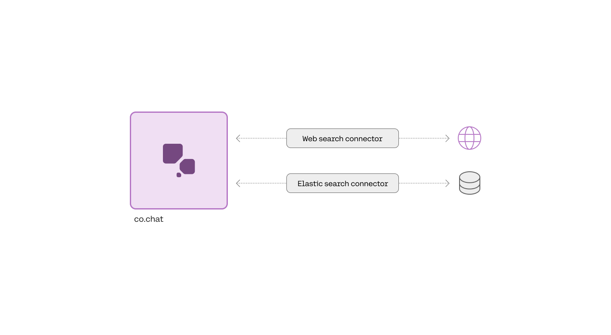

This section will provide a rough guide for implementing a connector. There are two major parts of this process:

1. Set up the connector and underlying data source, which requires:
   1. Configuring the connection between the connector and the data source
   2. Configuring the connection between the connector and the Chat API
   3. Deploying the connector
2. Register and use your connector with Cohere to get grounded generations

We highly recommend using one of the authentication and authorization methods outlined in our ["Connector Authentication"](/docs/connector-authentication) section.

### Step 1: Set up the Connector and Data Source

Configure the connection between the connector and the data source:




The connector acts as a proxy between Chat API and the data source. The first step is to configure it to be able to connect to and search the underlying data source. Linking the connector with the data source typically requires setting up a service account in the data source, configuring the service account’s permissions, and copying appropriate credentials into the connector’s environment.

We have provided helpful example skeleton code in this [github repository](https://github.com/cohere-ai/quick-start-connectors). Each of the quickstart connectors contains a detailed description of the necessary configuration in their README file. The skeleton code is a small example of how to connect to the data source. You will have to edit the code to make it applicable for your situation. You may, for example, customize the exact search query to better suit your needs. 

The quickstart connector for Google Drive, for example, requires you to create an “application” in the Google Cloud Console and copy variables into the connector’s environment, like so:

```
GDRIVE_SERVICE_ACCOUNT_INFO=xxxx
```

#### Configure the connection between the connector and the Chat API

Once the connection between the connector and the data source is configured you will need to ensure the response and response structure of the service is compatible with the Chat API. The connector must also respond within 30 seconds for the results to be used in the final generation. 

The request from the Chat API to the connector is a POST request that accepts a single `query` parameter in the body. The request URL must end with `/search` and contain no query parameters, like so: 

```curl
curl --request POST  
    --url 'https://connector-example.com/search'
    --header 'Content-Type: application/json'  
    --data '{  
    "query": "How do I expense a meal?"  
  }'
```
```python
import requests
r = requests.post('{base_connector_url}/search', {'query': 'How do I expense a meal?'})
```
```typescript
const response = await fetch('{base_connector_url}/search'{
  method: 'POST',
  body: {'query': 'How do I expense a meal?'},
  headers: {'Content-Type': 'application/json'} });
const data = await response.json();

console.log(data);
```

The response from the connector should be a JSON object with a list of documents in the result field, like so: 

```json Example Response JSON
{  
  "results": [  
  {  
    "id": "expense_doc_1",  
    "title": "Expense Policies for external travel",  
    "text": "You can expense any work-related...",  
    "url": "https://internal-site.com/expensing"  
    "created_at": "2023-11-25T20:09:31Z",  
  },  
   {  
    "id": "expense_doc_2",  
    "title": "Expense Policies for internal travel",  
    "text": "You can expense any work-related...",  
    "created_at": "2023-11-25T20:09:31Z",  
  },...  
  ]  
}
```

<Info title="Document Structure Recommendations">
The structure of the object in the results field is fully flexible, meaning any fields are allowed. However, we strongly recommend the following to improve the final generations: 

- Keep documents under 300 words or less. Or add a `text` field which is the field that is truncated when `prompt_truncation=true` in the request.
- Add a `timestamp` field to support temporal user queries.
- Add an `id` field to allow identification of the relevant document.
- Add a `title` field to allow the citations returned in the reply to be better-formatted.
- Use `excludes` to exclude fields, such as the `id`, from the prompt.
- Add a `url` field to allow the client to link to the document. 
 
More details can be found in the [documentation for chat](/reference/chat).
</Info>

#### Deploy the Connector

After the connector and data source are configured correctly, you will need to deploy the connector in a place that Cohere’s API can reach it. For now, this means an internet-facing service. It is important that you can provide Cohere with a URL to send a request to.

Once deployed, ensure that the connector can respond to requests from outside your network. Use the URL at which you made the connector available to register it with Cohere.

### Step 2: Register and use your Connector with Cohere

After you’ve deployed the connector and verified it can respond to requests, it is time to register the connector with Cohere. You can do so by sending the following POST request to our API. You will need a Cohere API key, which you can generate [here](https://dashboard.cohere.com/api-keys). Here’s an example request and related response:

```python
import cohere

# initialize the Cohere Client with an API Key
co = cohere.Client('YOUR_API_KEY')

created_connector = co.create_connector(
            name="Example connector",
            url="https://connector-example.com/search",
        )
```
```curl
curl --request POST  
  --url '<https://api.cohere.ai/v1/connectors'>  
  --header 'Authorization: Bearer {Cohere API key}'  
  --header 'Content-Type: application/json'  
  --data '{  
    "name":"Example Connector",  
    "description":"Description of your connector and underlying datasource",  
    "url":"<https://connector.example.com/search">  
  }'
```
```typescript
const { CohereClient } = require("cohere-ai");
const cohere = new CohereClient({
    token: "<<apiKey>>",
});
(async () => {
  const connector = await cohere.connectors.create({
    name: "test-connector",
    url: "https://example.com/search",
    description: "A test connector"
  });
  console.log(connector);
})();
```

```json Example Response JSON
{  
    "connector": {  
   	 "id": "example-connector-kh3g8q",  
   	 "organization_id": "00000000-1111-2222-3333-444444444444",  
   	 "name": "Example Connector",  
   	 "url": "https://connector-example.com/search",  
   	 "created_at": "2023-09-21T15:45:39.097677Z",  
   	 "updated_at": "2023-09-21T16:12:28.999055Z"  
    }  
}
```

Make note of the `id`, as you will need it when you want to use it later to ground model-generated responses. 

During registration, the API will attempt to query the connector to verify that it works as expected. If this step fails, ensure that the connector can respond to requests from outside your network, like so:

```curl
curl --request POST  
    --url 'https://connector-example.com/search'
    --header 'Content-Type: application/json'  
    --data '{  
    "query": "How do I expense a meal?"  
  }'
```
```python
import requests
r = requests.post('{base_connector_url}/search', {'query': 'How do I expense a meal?'})
```
```typescript
const response = await fetch('https://connector.example.com/search'{
  method: 'POST',
  body: {'query': 'How do I expense a meal?'},
  headers: {'Content-Type': 'application/json'} });
const data = await response.json();

console.log(data);
```

#### Use your Connector with the Chat API

In order to produce grounded generations, include your connector id in the `connectors` field in your chat request. Heres an example:

```python
import cohere  
co = cohere.Client('Your API key')  
response = co.chat(  
	message="What is the chemical formula for glucose?",  
	connectors=[{"id": "example_connector_id"}] # this is from the create step  
)
```
```curl
curl --request POST  \
--url <https://api.cohere.ai/chat>  \
--header 'Content-Type: application/json' \
--header 'Authorization: Bearer {Your API key}' \
--data '
{
    "message": "What is the chemical formula for glucose?",
    "connectors": [{"id": "example_connector_id"}]
}
```
```typescript
import { CohereClient } from "cohere-ai";
const cohere = new CohereClient({
    token: "YOUR_API_KEY",
});
(async () => {
    const response = await cohere.chat({
      message:"What is the chemical formula for glucose?",  
			connectors:[{"id": "web-search"}],  
    });
    console.log("Received response", response);
})();
```
```go
import (
  cohere       "github.com/cohere-ai/cohere-go/v2"
  cohereclient "github.com/cohere-ai/cohere-go/v2/client"
)
client := cohereclient.NewClient(cohereclient.WithToken("<YOUR_AUTH_TOKEN>"))
response, err := client.Chat(
  context.TODO(),
  &cohere.ChatRequest{
    Message: "What is the chemical formula for glucose?",
	  Connectors:[]*cohereclient.ChatConnector{{Id: "web-search"}},  
)
```

And here’s an example response:

```json Example Response JSON
{  
    "text": "To expense a meal, you will need to follow the guidelines set by the IRS. Firstly, the meal must not be lavish or extravagant. The taxpayer or their employee must be present when food or beverages are consumed. The food or beverages must be provided to a business associate. Most meals are deductible at 50% of the cost. Entertainment expenses are not deductible.",  
    "citations": [  
   	 {  
   		 "start": 47,  
   		 "end": 73,  
   		 "text": "Expense Policy.",  
   		 "document_ids": [  
   			 "internal-docs_0"  
   		 ]  
   	 },   
    ],  
    "documents": [  
   	 {  
   		 "id": "internal-docs_0",  
   		 "snippet": "Writing off these expenses is a smart move, but how do you go about it?\n\nThe good news is that business meals are 50 percent deductible. This means that every time you take out a client for dinner and drinks, you get to write off half of the bill.\n\nHowever, you can not go around deducting meals indiscriminately. The IRS has guidelines and tests that help you correctly deduct your meals. These include:\n\nConsidering the business context, the meal must not be lavish or extravagant.\n\nThe taxpayer or an employee of the taxpayer is present at the meal.\n\nThe expense must be an ordinary and necessary expense, under the Internal Revenue Code (IRC) Section 162(a), which is incurred or paid to carry on a trade or business.\n\nFood and beverages must be purchased separately from entertainment in the case that the entertainment activity provides food and beverages.",  
   		 "title": "Expense Policies",  
   		 "url": "https://internal-site.com/expensing"  
   	 },  
    ],  
    "search_results": [  
   	 {  
   		 "search_query": {  
   			 "text": "expense a business meal",  
   			 ...  
   		 },  
   		 "document_ids": [  
   			 "internal-docs_0",  
                                                 ...  
   		 ],  
   		 "connector": {  
   			 "id": "internal-docs"  
   		 }  
   	 }  
    ],  
    "search_queries": [  
   	 {  
   		 "text": "expense a business meal",  
   	 }  
    ],  
}
```
