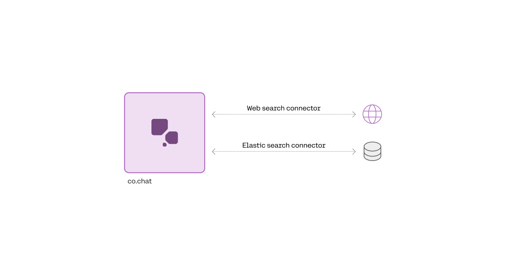

As the name implies, Connectors are ways of connecting to data sources. They enable you to combine Cohere large language models (LLMs), which power the [Chat API endpoint](/reference/chat), with data sources such as internal documents, document databases, the broader internet, or any other source of context which can inform the replies generated by the model.

Connectors enhance Cohere [retrieval augmented generation (RAG)](/docs/retrieval-augmented-generation-rag) offering and can respond to user questions and prompts with substantive, grounded generations that contain citations to external public or private knowledge bases. To see an example of grounded generations with citations, try out [the Cohere dashboard](https://coral.cohere.com/) after enabling web search grounding. 

The following graphic demonstrates the flow of information when using a connector:




## Using Connectors to Create Grounded Generations

Connectors are specified when calling the Chat endpoint, which you can read more about [here](/docs/chat-api#connectors-mode). An example request specifying the managed web-search connector would look like this:

<CodeBlocks>
```python PYTHON
import cohere  
co = cohere.Client(api_key='Your API key')

response = co.chat(
  model="command-r-plus-08-2024"
	message="What is the chemical formula for glucose?",  
	connectors=[{"id": "web-search"}]  
)
```
```curl CURL
curl --location 'https://production.api.cohere.ai/v1/chat' \
--header 'Content-Type: application/json' \
--header 'Authorization: Bearer {Your API key}' \
--data '
{
    "message": "What is the chemical formula for glucose?",
    "connectors": [{"id": "web-search"}]
}
```
```typescript TYPESCRIPT
import { CohereClient } from "cohere-ai";
const cohere = new CohereClient({
    token: "YOUR_API_KEY",
});
(async () => {
    const response = await cohere.chat({
      message:"What is the chemical formula for glucose?",  
			connectors:[{"id": "web-search"}],  
    });
    console.log("Received response", response);
})();
```
```go GO
import (
  cohere       "github.com/cohere-ai/cohere-go/v2"
  cohereclient "github.com/cohere-ai/cohere-go/v2/client"
)
client := cohereclient.NewClient(cohereclient.WithToken("<YOUR_AUTH_TOKEN>"))
response, err := client.Chat(
  context.TODO(),
  &cohere.ChatRequest{
    Message: "What is the chemical formula for glucose?",
	  Connectors:[]*cohereclient.ChatConnector{{Id: "web-search"}},  
)
```
</CodeBlocks>

If you or an administrator at your organization has created a new connector, you can add this connector id to the list. Here’s an example:

```python PYTHON
connectors=[{"id": "web-search"}, {"id": "customer-connector-id"}].
```

The response will then contain the generated text with citation elements that link to the documents returned from the connector. For example, the formula `C6H12O6` below has a citation element that links to three websites. 

```json Example Response JSON
{  
    "text": "The chemical formula for glucose is C6H12O6.",  
    "generation_id": "667f0844-e5c9-4108-8624-45b7687ca6f3",  
    "citations": [  
        {  
            "start": 36,  
            "end": 44,  
            "text": "C6H12O6.",  
            "document_ids": [  
                "web-search_3:0",  
                "web-search_3:4",  
                "web-search_4:0",  
                "web-search_4:1"  
            ]  
        }  
    ],  
    "documents": [  
        {  
            "id": "web-search_3:0",  
            "snippet": "Chemical Compound Formulas\n\nGlucose is a simple sugar with six carbon atoms and one aldehyde group. This monosaccharide has a chemical formula C6H12O6.\n\nIt is also known as dextrose. It is referred to as aldohexose as it contains 6 carbon atoms and an aldehyde group. It exists in two forms, open-chain or ring structure. It is synthesized in the liver and kidneys of animals. In plants, it is found in fruits and in different parts of plants. D- glucose is the naturally occurring form of glucose. It can occur either in solid or liquid form. It is water-soluble and is also soluble in acetic acid.",  
            "title": "Glucose C6H12O6 - Chemical Formula, Structure, Composition, Properties, uses and FAQs of Glucose.",  
            "url": "https://byjus.com/chemistry/glucose/"  
        },  
        {  
            "id": "web-search_3:4",  
            "snippet": "\n\nFrequently Asked Questions- FAQs\n\nHow do you represent glucose?\n\nThe chemical formula of Glucose is C6H12O6. Glucose is a monosaccharide containing an aldehyde group (-CHO). It is made of 6 carbon atoms, 12 hydrogen atoms and 6 oxygen atoms. Glucose is an aldohexose.\n\nIs glucose a reducing sugar?\n\nGlucose is a reducing sugar because it belongs to the category of an aldose meaning its open-chain form contains an aldehyde group. Generally, an aldehyde is quite easily oxidized to carboxylic acids.\n\nWhat are the 5 reducing sugars?\n\nThe 5 reducing sugars are ribose, glucose, galactose, glyceraldehyde, xylose.\n\nWhat are the elements of glucose?",  
            "title": "Glucose C6H12O6 - Chemical Formula, Structure, Composition, Properties, uses and FAQs of Glucose.",  
            "url": "https://byjus.com/chemistry/glucose/"  
        },  
        {  
            "id": "web-search_4:0",  
            "snippet": "Science, Tech, Math › Science\n\nGlucose Molecular Formula and Facts\n\nChemical or Molecular Formula for Glucose\n\nScience Photo Library - MIRIAM MASLO. / Getty Images\n\nProjects & Experiments\n\nChemistry In Everyday Life\n\nAbbreviations & Acronyms\n\nAnne Marie Helmenstine, Ph.D.\n\nAnne Marie Helmenstine, Ph.D.\n\nPh.D., Biomedical Sciences, University of Tennessee at Knoxville\n\nB.A., Physics and Mathematics, Hastings College\n\nDr. Helmenstine holds a Ph.D. in biomedical sciences and is a science writer, educator, and consultant. She has taught science courses at the high school, college, and graduate levels.\n\nLearn about our Editorial Process\n\nUpdated on November 03, 2019\n\nThe molecular formula for glucose is C6H12O6 or H-(C=O)-(CHOH)5-H. Its empirical or simplest formula is CH2O, which indicates there are two hydrogen atoms for each carbon and oxygen atom in the molecule.",  
            "title": "Know the Chemical or Molecular Formula for Glucose",  
            "url": "https://www.thoughtco.com/glucose-molecular-formula-608477"  
        },  
            ],  
    "search_results": [  
        {  
            "search_query": {  
                "text": "chemical formula for glucose",  
                "generation_id": "66e388c8-d9a8-4d43-a711-0f17c3f0f82a"  
            },  
            "document_ids": [  
                "web-search_3:0",  
                "web-search_3:4",  
                "web-search_4:0",  
            ],  
            "connector": {  
                "id": "web-search"  
            }  
        }  
    ],  
    "search_queries": [  
        {  
            "text": "chemical formula for glucose",  
            "generation_id": "66e388c8-d9a8-4d43-a711-0f17c3f0f82a"  
        }  
    ]  
}
```

## A Caveat on Deploying Connectors

Connector registration only works _natively_ on the Cohere platform. You can, however, register a connector for e.g. Azure or another platform using the [Cohere toolkit](/docs/coral-toolkit) (more technical detail is available [here](https://github.com/cohere-ai/cohere-toolkit/?tab=readme-ov-file#how-to-add-a-connector-to-the-toolkit).) You might also find it useful to read about Cohere deployments on [Amazon](/docs/cohere-on-aws), [Azure](/docs/cohere-on-microsoft-azure), and [single-container cloud environments](/docs/single-container-on-private-clouds).
