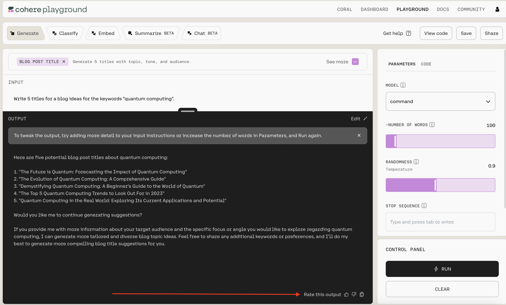

The Feedback API allows users to provide feedback on responses created from the [Chat API](/reference/chat).

The endpoint accepts preference and performance feedback, which we use to improve our models.  This guide provides a starting point for using the Feedback endpoint.

You can see a live example of the Feedback API in action on our [playground](https://dashboard.cohere.ai/playground/generate). In the image below, we've asked the model to generate titles for a blog post on quantum computing. If you look in the bottom right (where the red arrow is pointing), you'll see you can give a "thumbs up" or a "thumbs down" to provide feedback on the quality of the model's output. The other "stack of papers" icon let's you easily copy the output. 




Or, you can read below to learn how to call the feedback endpoint with our API.

***

### Generate Feedback

You can produce detailed feedback based on the annotator's acceptance of the generated response using the `generate_feedback` endpoint. 

#### **Parameters**

The endpoint has a number of settings you can use to control the kind of output it generates:

- `request_id` (String, required): The request_id of the generation request to give feedback on.
- `good_response` (Boolean, required): Whether the response was good or not.
- `model` (String): The unique ID of the model.
- `desired_response` (String): The desired response. Used when an annotator edits a suggested response.
- `flagged_response` (Boolean): Whether the response was flagged or not.
- `flagged_reason` (String):  The reason the response was flagged.
- `prompt `(String): The original prompt used to generate the response.
- `annotator_id` (String): The annotator's ID.

#### **Example Requests**

If the annotator _accepts_ the suggested response, you could format a request like this:

```python PYTHON
import cohere
co = cohere.Client("<YOUR_API_KEY>")

generations = co.generate(
    prompt=f"Write me a polite email responding to the one below: {email}. Response:"
)
if user_accepted_suggestion:
    co.generate_feedback(
        request_id=generations[0].id, good_response=True
    )
```

If the annotator _edits_ the suggested response, you could format a request like this:

```python PYTHON
email = "email@example.com"
generations = co.generate(
    prompt=f"Write me a polite email responding to the one below: {email}. Response:"
)
if user_edits_suggestion:
    co.generate_feedback(
        request_id=generations[0].id,
        good_response=False,
        desired_response=user_edited_suggestion,
    )
```

#### **Example Response**

### Generate Preference Feedback

Alternatively, you can generate feedback based on which response an annotator prefers with the `generate_preference_feedback` endpoint.

#### **Parameters**

- `ratings` (List[PreferenceRating], required): A list of PreferenceRating objects.
- `model` (String):  The unique ID of the model.
- `prompt` (String): The original prompt used to generate the response.
- `annotator_id` (String):  The annotator's ID.

#### **Example Request**

A user accepts a model's suggestion in an assisted writing setting, and prefers it to a second suggestion. Here's what a request might look like:

```python PYTHON
generations = co.generate(
    prompt=f"Write me a polite email responding to the one below: {email}. Response:",
    num_generations=2,
)
if user_accepted_idx:  # prompt user for which generation they prefer
    ratings = []
    if user_accepted_idx == 0:
        ratings.append(PreferenceRating(request_id=0, rating=1))
        ratings.append(PreferenceRating(request_id=1, rating=0))
    else:
        ratings.append(PreferenceRating(request_id=0, rating=0))
        ratings.append(PreferenceRating(request_id=1, rating=1))
    co.generate_preference_feedback(ratings=ratings)
```
