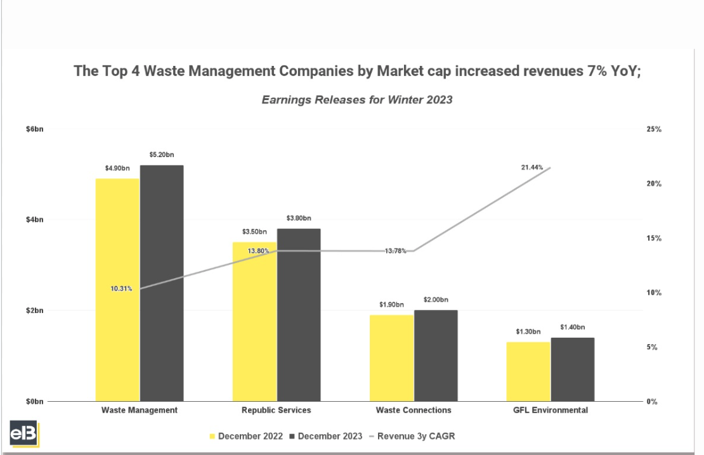
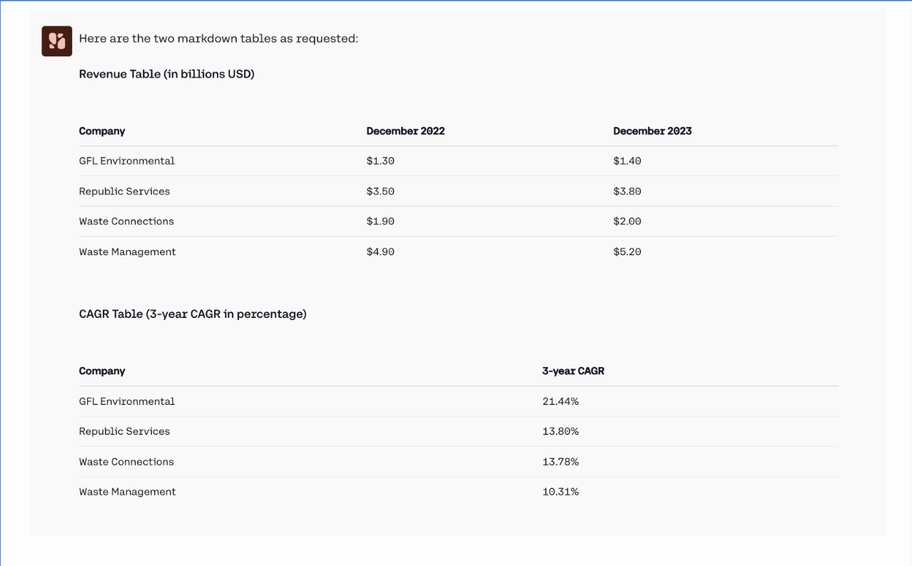

## Introduction 
Multimodality has become an important part of the modern generative AI landscape, as there's real demand for models able to understand and interpret visual data, map relationships between text and visual inputs, and handle use cases like image captioning, visual question-answering, and object identification. 

Cohere has models capable of interacting with images, and they're excellent in enterprise use cases such as:

- Analysis of charts, graphs, and diagrams;
- Extracting and understanding in-image tables;
- Document optical character recognition (OCR) and question answering;
- Natural-language image processing, including translation of text found in images.

For more detailed breakdowns of these and other applications, check out [our cookbooks](https://docs.cohere.com/v2/page/cookbooks).

Cohere models that can interact with images are designed to work through an interface and API structure that looks almost exactly like all of our other Command models, making it easy to get started with our image-processing functionality straightaway. 

This image, for example, contains a graph of earnings for various waste management companies:



We can have Command A Vision analyze this image for us with the following:

```pyton PYTHON 
response = co.chat(
    model="command-a-vision-07-2025",
    messages=[
        {
            "role": "user",
            "content": [
                {"type": "text", "text": "Please create two markdown tables. One for Revenue. One for CAGR. the company names should be in alphabetical order in both."},
                {"type": "image_url", "image_url": {"url": base64_url}},
            ],
        }
    ],
)
```

And you should get something like this: 



The rest of this document fleshes out Cohere's models work with image inputs, including information on limitations, token calculations, and more.

## Image Detail

The Chat API allows users to control the level of image `“detail”` sent to the model, which can be one of `“low”`, `“high”`, or `“auto”` (the default).

Lower detail helps reduce the overall token count (and therefore price and latency), but may result in poorer performance. We recommend trying both levels of detail to identify whether the performance is sufficient at `"low"`.

The `detail` property is specified for each image, here's what that look like: 

```python PYTHON 
co.chat(
  model="command-a-vision-07-2025",
  messages=[
	{ "role": "user", "content": [
            {"type": "text",
              "text": "what's in this image?"
              },
            {"type": "image_url",
            "image_url": {
              "url": "https://cohere.com/favicon-32x32.png",
              "detail": "high" # Here's where we're setting the detail.
          }
        },
      ]
    }
  ]
)
```

When detail is set to “low”:
- If the image area is larger than 512px * 512px, it will be resized to fit into these dimensions while attempting to maintain the aspect ratio.
- Each “low” detail image takes up 256 tokens that count towards the model’s context length.

When detail is set to “high”:
- If the image area is larger than 1536px * 2048px it will be resized to fit into these dimensions while attempting to maintain the aspect ratio, so that it can be cached.
- Under the hood, the API will divide the image into one or more tiles of 512x512 pixels, plus one additional 512x512 pixel _preview_ tile; each of these tiles takes up 256 tokens that count towards the model’s context length. 

When detail is unspecified or is set to “auto”: 
- If any of the image sides are larger than 768px then `high` detail will be used, otherwise detail will be set to `low`.

Here's an example calculation of how an image is processed into tokens:

- Suppose a user provides a 10,000px * 20,000px image.
- This image would be resized down to 1024px * 2048px (since the longest side has to be at most 2048 pixels long), which fits into eight tiles of 512x512.
- What ultimately gets sent to the model is one 512px * 512px preview thumbnail in addition to eight tiles of 512px * 512px. Since the thumbnail is 256 tokens, and each of the eight tiles is 256 tokens, that means the image will take up 9 x 256 = 2304 tokens. 

## Passing in an Image

### Image URL Formats
Cohere supports images in two formats, base64 _data_ URLs and HTTP _image_ URLs.

A base64 data URL (e.g., `“data:image/png;base64,...”`) has the advantage of being usable in deployments that don't have access to the internet. Here's what that looks like:

```python PYTHON
co.chat(
    model="command-a-vision-07-2025",
    messages=[
        {
            "role": "user",
            "content": [
                {"type": "text", "text": "what's in this image?"},
                {
                    "type": "image_url",
                    "image_url": {"url": "data:image..."},
                },
            ],
        }
    ],
)
```

An HTTP image URL (e.g., “https://cohere.com/favicon-32x32.png”) is faster, but requires you to upload your image somewhere and is not available in outside platforms (Azure, Bedrock, etc.) HTTP image URLs make the API easy to try out, as data URLs are long and difficult to deal with. Moreover, including long data URLs in the request increases the request size and the corresponding network latency.

Here's what that looks like:

```python PYTHON
co.chat(
    model="command-a-vision-07-2025",
    messages=[
        {
            "role": "user",
            "content": [
                {"type": "text", "text": "what's in this image?"},
                {
                    "type": "image_url",
                    "image_url": {
                        "url": "https://cohere.com/favicon-32x32.png"
                    },
                },
            ],
        }
    ],
)
```

For use cases like chatbots, where the images accumulate in the chat history, we recommend you use HTTP/HTTPs image URLs, since the request size will be smaller, and, with server-side caching, will result in faster response times.

## Limitations

### Image Counts 
The Cohere API has the following limitations with respect to image counts:
- You can pass in a maximum of 20 images per request, or 20 megabytes (mb) in total data, whichever comes first.

### File types
These are the supported file types:
- PNG (`.png`)
- JPEG (`.jpeg` and `.jpg`)
- WEBP (`.webp`)
- Non-animated GIF (`.gif`)

### Non-Latin Alphabets
Performance may vary when processing images containing text in non-Latin scripts, like Japanese or Korean characters.

### Text Size
To enhance accuracy, consider enlarging small text in images while ensuring no crucial visual information is lost. If you're expecting small text in images, set `detail='high'`.

A good rule of thumb is: 'if you have trouble reading image in a text, then the model will too.'

### Rate Limits
Image inputs don't change rate limit considerations; for more detail, check out our dedicated [rate limit documentation](https://docs.cohere.com/docs/rate-limits).

### Understanding Costs
To understand how to calculate costs for a model, consult the breakdown above about how _tokens_ are determined by the model, then consult our dedicated [pricing page](https://cohere.com/pricing?_gl=1*9o1g49*_gcl_au*MTE3MTc3OTk1OC4xNzUwMjQ1NzE0*_ga*MTAxNTg1NTM1MS4xNjk1MjMwODQw*_ga_CRGS116RZS*czE3NTEyOTcxMDQkbzMyMyRnMSR0MTc1MTI5NzExMiRqNTIkbDAkaDA.) to figure out what your ultimate spend will be.

### Acceptable Use 
Please refer to our [usage policy](https://docs.cohere.com/docs/usage-policy).

## Prompt Engineering for Image Models
Prompting for text-generation and models that can work with images is very similar. If you're having success with a prompt in one of Cohere's standard language models, it should work for our image models as well. 

## Best Practices

### Resizing Large Images
If you’re working with images that are larger than the model can handle, consider resizing them yourself, as this will have positive impacts on latency, cost, and performance.

### Structured Outputs and JSON Mode
Many use cases (such as OCR) work best with Cohere's structured output capabilities. To learn more about this, consult the [structured output guide](https://docs.cohere.com/v2/docs/structured-outputs).

### Getting the best Results out of the Model
Here are some techniques for optimizing model outputs:
- Apply prompt techniques that work well for text-based interactions.
- Reduce network latency by shrinking large images on the client before sending them via the API.
- Enlarge small text in images to improve readability and model performance.