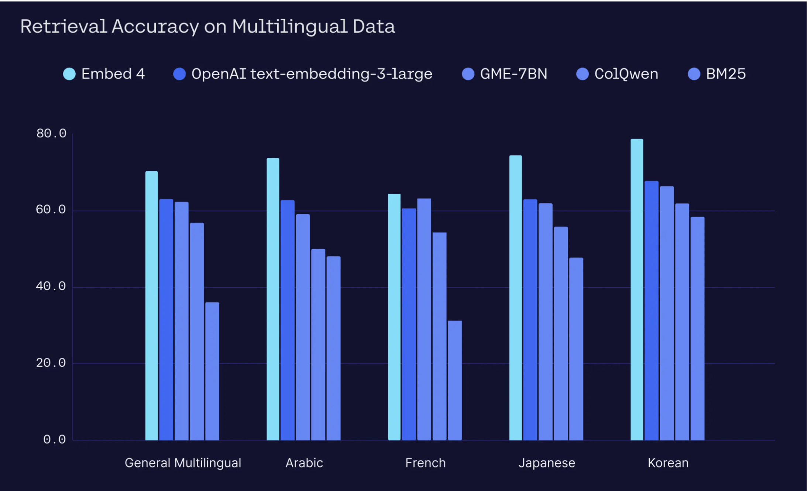

[NOTES from MICHAEL 06/09/2025]
- Simplest possible example
- ~Image detail~
  - Discuss tradeoffs, when does each make scenes
  - 'high' means image is split into tiles (up to `n`, whatever the max is), each tile is 256*something 
    - Provide an example, i.e., 1000x1000, you'll have 1000/256x1000/256, plus the preview tile, this will result in `n` tokens.
  - Token counting
- Image specs  
  - formats 
    - PNG, JPEG, GIF 
  - Works will in JSON mode (THINK ABOUT WHERE TO PUT THIS.)

## Introduction 
Multimodality has become an important part of the modern generative AI landscape, as there's real demand for models able to understand and interpret visual data, map relationships between text and visual inputs, and handle use cases like image captioning, visual question-answering, and object identification. 

[THIS IS DUPLICATIVE OF THE 'USE CASES' SECTION BELOW, I'LL HAVE TO FIND A WAY TO CONSOLIDATE]
Excellent in enterprise use cases that benefit from processing images and documents' visual components, such as:

- Analysis of charts, graphs, and diagrams;
- Extracting and understanding in-image tables;
- Document optical character recognition (OCR) and question answering;
- Natural-language image processing, including translation of text found in images.
- more… (cookbook)

Cohere's vision models are designed to work through an interface and API structure that looks almost exactly like all of our other Command models, making it easy to get started with our image-processing functionality straightaway. 

This image, for example, contains a summary of retrieval accuracy data from multiple languages:



We can have Command Vision caption this image for us with the following:

```pyton PYTHON 
response = co.chat(
    model="command-a-vision-epsilon",
    messages=[
        {
            "role": "user",
            "content": [
                {"type": "text", "text": "what's in this image?"},
                {"type": "image_url", "image_url": {"url": base64_url}},
            ],
        }
    ],
)

print(response.message.content[0].text)
```

And you should get something like this: 

```mdx 
This image is a bar chart titled "Retrieval Accuracy on Multilingual Data". It compares the retrieval accuracy of five different models across four languages. 

Here's a breakdown of the chart:

* **Models:**
    * Embed 4 (represented by light blue bars)
    * OpenAI text-embedding-3-large (represented by dark blue bars)
    * GME-7BN (represented by purple bars)
    * ColQwen (represented by green bars)
    * BM25 (represented by orange bars)

* **Languages:**
    * General Multilingual
    * Arabic
    * French
    * Japanese
    * Korean

* **Accuracy:** The y-axis represents retrieval accuracy as a percentage, ranging from 0% to 80%.

The chart shows that Embed 4 generally achieves the highest retrieval accuracy across all languages, followed closely by OpenAI text-embedding-3-large. GME-7BN, ColQwen, and BM25 show varying levels of accuracy, with BM25 generally performing the lowest.

It's important to note that this is just a snapshot of retrieval accuracy and doesn't provide information about other factors such as model size, training data, or computational requirements.
```

The rest of this document fleshes out Cohere's Vision models work, including information on limitations, token calculations, and more.

## Image Detail

Cohere's API will allow users to control the level of image “detail” sent to the model. This property is specified for each image and can be set to `“low”`, `“high”` or `“auto”` (the default). Here' what that look like: 

```python PYTHON 
co.chat(
  model="command-vision",
  messages=[
	{ "role": "user", "content": [
            {"type": "text",
              "text": "what's in this image?"
              },
            {"type": "image_url",
            "image_url": {
              "url": "https://cohere.com/favicon-32x32.png",
              "detail": "high" # Here's where we're setting the detail.
          }
        },
      ]
    }
  ]
)
```

When detail is set to “low”:
- If the image area is larger than 512x512px, it will be resized to fit into these dimensions while attempting to approximate the aspect ratio.
- Each “low” detail image takes up 256 tokens that count towards the model’s context length.

When detail is set to “high”:
- If the image area is larger than 1536x2048px it will be resized to fit into these dimensions while attempting to approximate the aspect ratio, so that it can be cached.
- Under the hood, the model will divide the image into one or more tiles of 512x512 pixels, plus one additional 512x512 pixel _preview_ tile; each of these tiles takes up 256 tokens that count towards the model’s context length. 

When detail is unspecified or is set to “auto”: 
- If any of the sides is larger than 768px (configurable per model) then use detail `high`, otherwise use detail `low`.

For an example of how these cost calculations work, check out the section below. 

[Per Cassie's comment: We can also discuss this calculation logic in the pricing section like OpenAI's page https://platform.openai.com/docs/guides/images-vision?api-mode=chat]

Here are some tradeoffs to keep in mind when deciding between different levels of detail:
[ADD IN]

## Passing in an Image

### Image Formats
Cohere's Vision models support images in three formats:

- Base64: can be used anywhere,
  - how to encode
  - API structure
- HTTP URL: faster, but you need to upload your image somewhere, and not available outside platform (not in Azure, Bedrock)
  - HTTP means you don't have to re-upload the image on every request.
    - With the ChatAPI, you have to append messages, which would be prohibitive if you're sending massive images. But with an HTTP URL, multi-turn is leaner. This is much lower latency.
- URL: how to format, API structure [HOW IS THIS DIFFERENT?]


As with Cohere's [Aya models](https://docs.cohere.com/docs/aya-vision), users can send in images as base64 data url strings (e.g., `“data:image/png;base64,...”`) by setting the `content` type to `image_url”`:

```python PYTHON
co.chat(
    model="command-vision",
    messages=[
        {
            "role": "user",
            "content": [
                {"type": "text", "text": "what's in this image?"},
                {
                    "type": "image_url",
                    "image_url": {"url": "data:image..."},
                },
            ],
        }
    ],
)
```

In addition to specifying images as base64 data urls, the API supports HTTP and HTTPS URLs (eg “https://cohere.com/favicon-32x32.png”). This is useful for two reasons:

- First, it makes the API easy to try out in postman, as data URLs are long and hard to deal with.
- Second, including long data URLs in the request increases the request size and increases network latency. For use cases like chatbots, where the old images accumulate in the chat history, we recommend you use image URLs, since the request size will be smaller, and with server-side caching will result in faster response times.

Here's what that looks like:

```python PYTHON
co.chat(
    model="command-vision",
    messages=[
        {
            "role": "user",
            "content": [
                {"type": "text", "text": "what's in this image?"},
                {
                    "type": "image_url",
                    "image_url": {
                        "url": "https://cohere.com/favicon-32x32.png"
                    },
                },
            ],
        }
    ],
)
```

## Limitations of working with the Image API

### Image Counts 
The Cohere API has the following limitations with respect to image counts:
- You can pass in a maximum of 20 images per request, or 20 megabytes (mb) in total data, whichever comes first.
- API structure [?]

### Max size of a single image

For Command Vision:
- Low-resolution: 512px x 512px
- High-resolution: 1536px (short side) x 2048px (long side)
  - Walter says "high-resolution can be up to 512px*12 total pixels but maybe that's harder to communicate," but I'm not sure what he means.

### File types
These are the supported file types:
- PNG (`.png`)
- JPEG (`.jpeg` and `.jpg`)
- WEBP (`.webp`)
- Non-animated GIF (`.gif`)

### Accuracy considerations
(Low-quality images, complex scenes)


### Specific Task Limitations
(e.g., precise counting, spatial reasoning, identifying people, detecting AI-generated images)

### Non-Latin Alphabets
Performance may vary when processing images containing text in non-Latin scripts, like Japanese or Korean characters.

### Text Size
If looking at small text in images, set `detail='high'`

### Potential Errors
In some cases, the model might produce inaccurate descriptions or captions.

### Rate Limits

Image inputs don't change rate limit considerations; for more detail, check out our dedicated [rate limit documentation](https://docs.cohere.com/docs/rate-limits).

### Understanding Costs 

- How image tokens are estimated (e.g., (width_px * height_px) / xyz)
- Impact of image size and number on cost

Here's an example calculation of how an image is broken down by the model:
- Suppose a user provides a 10,000px x 20,000px image.
- This image would be resized down to 1024x2048px (since the longest side has to be at most 2048 pixels long)
the 1024x2048 image fits 8 tiles of 512x512
- What ultimately gets sent to the model is one 512x512 preview thumbnail in addition to eight tiles of 512x512. Since the thumbnail is 256 tokens, and each of the 8 tiles is 256 tokens, that means the image will take up 9 x 256 = 2304 tokens.

## Prompt Engineering for Image Models

- How to create effective prompts (system prompt/user prompt)
- Image/text ordering
- [MAYBE LEAVE THIS OUT, Cassie says "We don't support interleaved image and text"] Referencing Images (e.g., "Image 1:", "Image 2:")
- Multi-turn prompting (e.g. In multi-turn chat, does the API hold context/tokens of the images in the previous turns?)

## Example Use Cases

Excellent in enterprise use cases that benefit from processing images and documents' visual components, such as:

- Chart, graph, diagram, table understanding, and analysis
- Document OCR and Q&A
- Real-world natural image processing
- more… (cookbook)

## Guidelines 

- No real-time content blocking will take place in the API
- Images cached in GCS will go through CSAM checks
- Cohere Tokens
- Put'Inappropriate Use' in the guidelines section (IF I decide to include one).
- Safety and Responsible AI (Prohibited content, biased interpretations)
- Should work with Safety team to ensure we document this properly

## Best Practices

- Handling common errors
- Recommended image size/resolution
- Resizing Large Images (Benefits: latency, cost, performance; recommended dimensions)
- Impact of image Quality (Clarity, blurriness, legibility of text)
- Getting best results out of the model
- Official languages: English, Portuguese, Italian, French, German, and Spanish.