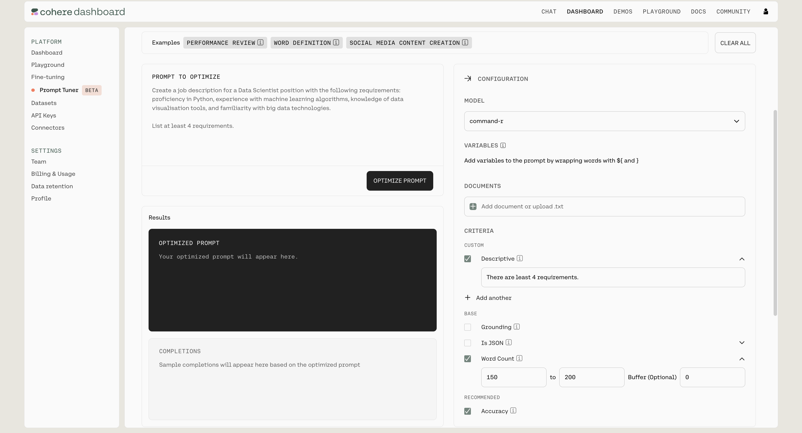
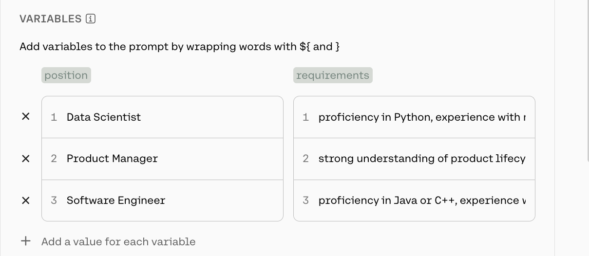

<Error>
This feature is in beta, so it may experience changes and updates in the future.
</Error>

# Introduction

[Prompt Tuner](https://dashboard.cohere.com/prompt-tuner)  is an intuitive tool developed by Cohere to streamline the process of defining a robust prompt for user-specific needs. A model's effectiveness can significantly depend on how well the input prompt is formulated. The Prompt Tuner addresses this challenge by automating the trial-and-error process traditionally associated with prompt optimization.

With the Prompt Tuner, you:

- provide the initial prompt you wish to optimize and 
- define criteria important to your goals, such as word count, output format, or hallucination checks. 

The tool then iterates through various prompt modifications, evaluating each against the selected criteria to determine the most effective prompt configuration. 

**Optimize a prompt without writing a single line of code.** 

# Starting the optimization

Cohere models are utilized in various enterprise scenarios. For instance, a model could be prompted to write a job description for a specific position with a word limit of 200 words. An initial prompt might look like this:

```
Create a job description for a Data Scientist position with the following requirements: proficiency in Python, experience with machine learning algorithms, knowledge of data visualisation tools, and familiarity with big data technologies.

List at least 4 requirements.
```

However, this prompt could be improved by being more specific. This can be done using the [Prompt Tuner](https://dashboard.cohere.com/prompt-tuner) in the Cohere Dashboard.

## 1. Input the initial prompt

The left-hand side of the [Prompt Tuner](https://dashboard.cohere.com/prompt-tuner) provides a window to paste the initial prompt.

## 2. Specify criteria

The right-hand side is reserved for optimization parameters. For now, we will focus on `CRITERIA`. The remaining parameters will be discussed in the next section of this document.

`CRITERIA` allows you to **specify the requirements for optimizing the prompts**, either through a set of predefined criteria or using natural language. In the example above, since we aim for the job description to be no more than 200 words, set the word count between 150 and 200.

### Define custom criteria

One of the most compelling features of the [Prompt Tuner](https://dashboard.cohere.com/prompt-tuner?tab=tuner) is its **ability to support custom criteria defined in natural language**. You can select the `Descriptive` box and provide a text description of how the completion should meet this criterion.

Example:

```
There are least 4 requirements.
```

## 3. Run the optimization

Once done, press the `OPTIMIZE PROMPT` button.



# Understanding the results

After the optimization is complete, you will see the **best** prompt and its completions. However, you can also access all the prompts generated by the tuner by clicking the drop-down button in the top right corner of the prompt window. 

The tuner iteratively generates new prompts, focusing on criteria that still need improvement. Consequently, a table displaying the scores for each requirement at each iteration is also presented.

# Improving the results

The [Prompt Tuner](https://dashboard.cohere.com/prompt-tuner) offers a rich set of parameters that can be adjusted, giving you full control over prompt optimization. Understanding how to set these parameters is crucial for achieving good results.

### CRITERIA

The optimized prompt is a direct product of the input prompt and the criteria it is meant to optimize. More criteria can be added to guide the optimization process and achieve better results.

There are two types of criteria:

- **Rule-based**: These are the foundational criteria for each query:
  - Word Count: Checks whether the number of words is within a specified range.
  - Is JSON: Checks if the completion is a valid JSON object. Optionally, allows checking the generated schema agains a specific JSON Schema.
  - Grounding: Measures whether the information in the completion is derived from the prompt and provided documents.
  - Accuracy: Measures how well the completion follows the instructions defined in the prompt.
- **Custom**: Custom criteria allows users to define their own descriptions to create evaluation prompts and check the generated completions.

### MODEL

`MODEL` lets you choose a model from the Cohere suite for which the prompt should be optimized for.

### VARIABLES

`VARIABLES` allows you to test how the prompt generalizes to multiple scenarios. Suppose writing a job description should be extended to multiple positions with different requirements.

For example: 

- **Job posting 1: **
  - **Position:** Data Scientist,
  - **Requirements:** proficiency in Python, experience with machine learning algorithms, knowledge of data visualisation tools, and familiarity with big data technologies.
- **Job posting 2:**
  - **Position:** Product Manager
  - **Requirements:** Strong understanding of product lifecycle management, experience with market research and user feedback analysis, excellent communication and leadership skills, and familiarity with Agile methodologies.
- **Job posting 3:** 
  - **Position:** Software Engineer
  - **Requirements:** Proficiency in Java or C++, experience with software development lifecycle, strong problem-solving skills, and familiarity with version control systems like Git.

To account for this, the initial prompt can be modified to include placeholders:

```
Create a job description for a ${position} position with the following requirements: ${requirements}.
```

<aside class="side">

</aside>

After adjusting the prompt, the variable names will appear in the `VARIABLES` section, where the appropriate values can be entered.

<br />

<br />

### DOCUMENTS

Cohere models have strong Retrieval Augmented Generation (RAG) capabilites. Therefore, the [Prompt Tuner](https://dashboard.cohere.com/prompt-tuner) also allows you to optimize prompts for these use cases, as well. If you want to ground your task in the context of a document, you can upload the document, and the optimizer will handle the rest.

Note: Currently, we only support raw text documents.

# More examples

For more examples, please see the example section where we provide templates for more real-life scenarios:  

- Performance Review
- Word Definition
- Social Media Content Creation
