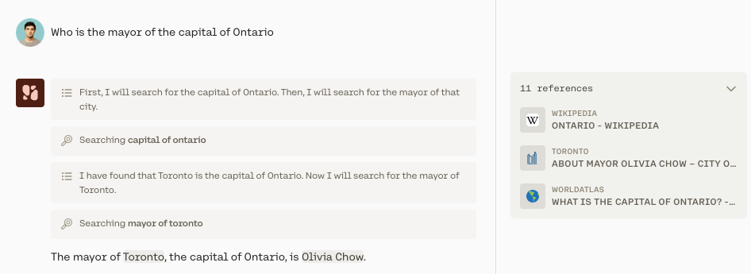
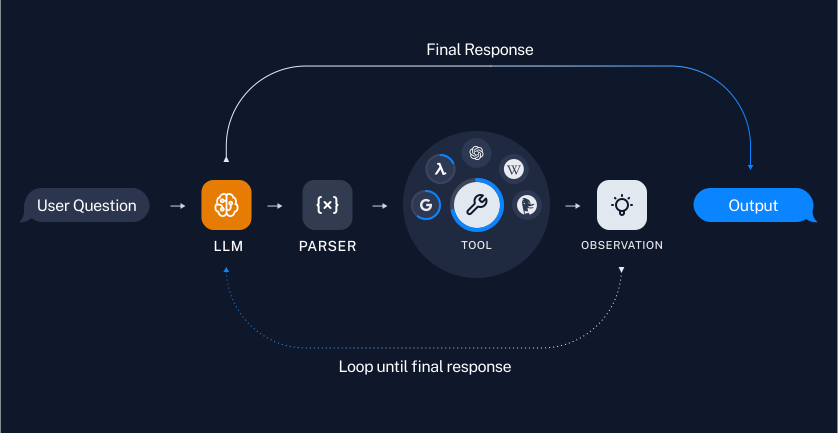
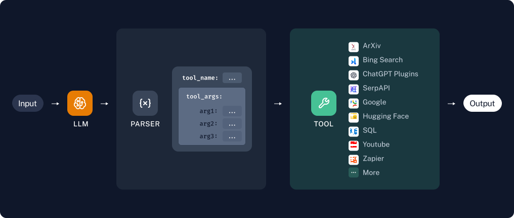

Tool use is a technique which allows Cohere's models to invoke external tools: search engines, APIs, functions, databases, and so on. Given a list of tool definitions, the model will generate a plan of action and decide which tools to use, in which order, and with what parameters.

For example, given the `web-search` tool, the model can start answering complex questions that require performing internet searches.


Notice that the model learned information from the first search, which it then used to perform a second web search. This behavior is called "multi-step" because the model tackles the task step by step.

Also, note that multi-step is enabled by default.

## Using the Chat API with Tools

### Step 1: Define the tools

```python PYTHON
# define the `web_search` tool.

def web_search(query: str) -> list[dict]:
  # your code for performing a web search goes here
  # return [{
  #		"url": "https://en.wikipedia.org/wiki/Ontario",
  #		"text": "The capital of Ontario is Toronto, ..."
  #	}]

web_search_tool = {
  "name": "web_search",
  "description": "performs a web search with the specified query",
  "parameter_definitions": {
    "query": {
      "description": "the query to look up",
      "type": "str",
      "required": True
    }
  }
}
```

### Step 2: Ask model for tool calls and send back tool results

```python PYTHON
import cohere
co = cohere.Client(api_key="<YOUR API KEY>")

message = "Who is the mayor of the capital of Ontario?"
model = "command-r-plus"

# STEP 2: Check what tools the model wants to use and how

res = co.chat(model=model, message=message, force_single_step=False, tools=[web_search_tool])

# as long as the model sends back tool_calls,
# keep invoking tools and sending the results back to the model
while res.tool_calls:
  print(res.text) # This will be an observation and a plan with next steps
  tool_results = []
  for call in res.tool_calls:
    # use the `web_search` tool with the search query the model sent back
    web_search_results = {"call": call, "outputs": web_search(call.parameters["query"])}
    tool_results.append(web_search_results)
    
  # call chat again with tool results
  res = co.chat(
    model="command-r-plus",
    chat_history=res.chat_history,
    message="",
    force_single_step=False,
    tools=[web_search_tool],
    tool_results=tool_results
  )
  
 print(res.text) # "The mayor of Toronto, the capital of Ontario is Olivia Chow"
```

## How Does Multi-step Tool Use Work?

<Frame caption={<a href="https://python.langchain.com/docs/use_cases/tool_use">Source</a>}>

</Frame>

Here’s an outline of the basic steps involved in multi-step tool use:

- Given a user request, the model comes up with a plan to solve the problem which answers questions such as "Which tools should be used," and "In what order should they be used."
- The model then carries out the plan by repeatedly executing actions (using whatever tools are appropriate), reasoning over the results, and re-evaluating the plan.
- After each Action -> Observation ->Reflection cycle, the model reflects about what to do next. This reflection involves analyzing what has been figured out so far, determining whether any changes need to be made to the plan, and what to do next. The model can take as many steps as it deems necessary.
- Once the model decides it knows how to answer the user question, it proceeds to generating the final response.

## How Does Multi-step Tool Use Differ From Single-step Tool Use?

In single-step tool use, the model is also equipped with access to a bevy of tools to answer a question.

That said single-step tool use only facilitates the model calling multiple tools **during a single step**. The model cannot execute a sequence of steps, and it cannot use the results from one tool call in a subsequent step.

<Frame caption={<a href="https://python.langchain.com/docs/use_cases/tool_use">Source</a>}>

</Frame>


## FAQs

#### When Should I Use Multi-step Tool Use?

For more complex queries it's probably better to operate in multi-step mode, which is the default (you can operate in single-step mode by setting `force_single_step=True`). In multi-step mode, the model can reason across steps and select multiple tools to answer a question completely.

#### What is the difference between tool use and Retrieval Augmented Generation (RAG)?

Tool use is a natural extension of retrieval augmented generation (RAG). RAG is about enabling the model to interact with an information retrieval system (like a vector database). Our models are trained to be excellent at RAG use cases.

Tool use pushes this further, allowing Cohere models to go far beyond information retrieval, interact with search engines, APIs, functions, databases, and many other tools.