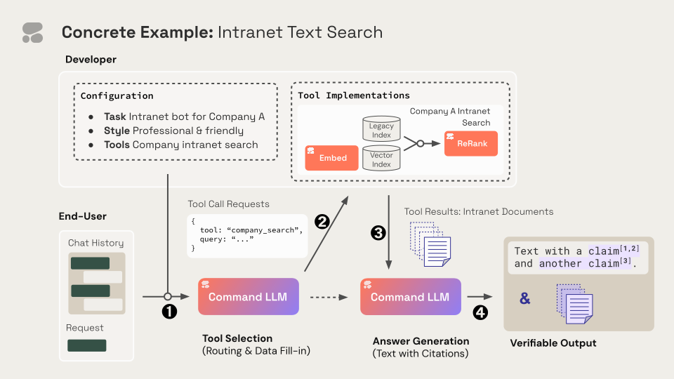

Tool use is a technique which allows developers to connect Cohere's Command family of models to external tools like search engines, APIs, functions, databases, etc. It comes in two variants, single-step and multi-step, and this doc will focus on single-step tool use.

Single-step tool use enables a richer set of behaviors by leveraging data stored in tools, taking actions through APIs, interacting with a vector database, querying a search engine, etc. To use it, set `force_single_step=True` when creating the model.

This is particularly valuable for enterprise developers, since a lot of enterprise data lives in external sources.

Check out [this notebook](https://github.com/cohere-ai/cohere-developer-experience/blob/main/notebooks/agents/Vanilla_Tool_Use.ipynb) for worked-out examples.

## What Is Possible with Single-Step Tool Use?

Single-step tool use (or “function calling”) opens up a wide range of new use cases. Below, we walk through a few examples. 

It's now possible to reliably ask the model to recommend a tool (or set of tools) to use and offer advice on how to use them, which you can pass back to the model for more flexible workflows. Tool use allows your chatbot to interact with your CRM to change the status of a deal, for example, or to engage with a Python interpreter to conduct data science analysis.

A popular application is to transform a user message into a search query for a vector database or any search engine. Because the user message can be transformed into one or many search queries, it's possible to do multiple subtasks based on the content of the message.

For instance, this enables your work assistant to automatically search across different databases and platforms to retrieve relevant information or to conduct comparative analysis.

## The Four Steps of Single-Step Tool Use (Theory)

Single-step tool use allows developers to tell Command R which tools it can interact with and how to structure interactions (e.g. API requests, or anything that can be formatted in JSON). Command R then dynamically selects the right tools and the right parameters for these interactions. Developers can then execute these tool calls, and receive tool results in return. Finally, to generate the final response from the model, developers submit these tool results to the Command R model.

We want to stress that it's the _developers_ executing tool calls and submitting final results to Command R.

Here's a graphic that represents the four steps discussed below:




Feel free to refer back to it as you read on.

### Step 1 - Configure the Request to the Model

In order to begin a single-step tool use workflow, a developer must provide a few things:

- The user request.
- A list of tools to the model
- (Optionally) a preamble containing instructions about the task the desired style for the output.
- (Optionally) a chat history for the model to work with.

Developers can provide one or many tools to the model. Every tool is described with a schema, indicating the tool name, description, and parameters (code snippets below).

### Step 2 - the Model Dynamically Chooses the Right Tool

Once you've completed step one, the model will intelligently select the right tool(s) to call -- and the right parameters for each tool call -- based on the content of the user message.

### Step 3 - The _Developer_ Can Then Execute The Tool Calls

With the list of tool(s), the developer can then execute the appropriate calls (e.g. by pinging an API) using the tool parameters generated by the model. These tool calls will return tool results that will be fed to the model in Step 4.

As things stand, the developer is responsible for executing these tool calls, as the tool call executes on the developer’s side.

### Step 4 - Command R Generates an Answer Based on the Tool Results

Finally, the developer calls the Cohere model, providing the tool results, in order to generate the model's final answer. Cohere makes it easy to provide tool results back to the model through the `tool_results` parameter (demonstrated in code snippets below).

## The Four Steps of Single-Step Tool Use (Step-by-Step Example)

For the sake of this illustration, we'll assume a developer is building a chatbot to assist with sales-related questions. The chatbot has access to two tools to answer user questions: a daily sales report tool which holds data on sales volumes, and a product catalog which contains information about each product being sold.

Here is a walkthrough of what a relevant single-step tool use workflow would look like.

### Step 1

The developer provides the sales database and the products database to the model using the `tools` parameter.

Observe that, for each tool, the developer describes the tool name, description, and inputs. Each input can have a type and can be marked as required.

```python PYTHON
import cohere
co = cohere.Client(api_key="<YOUR API KEY>")

# tool descriptions that the model has access to
tools = [
   {
       "name": "query_daily_sales_report",
       "description": "Connects to a database to retrieve overall sales volumes and sales information for a given day.",
       "parameter_definitions": {
           "day": {
               "description": "Retrieves sales data for this day, formatted as YYYY-MM-DD.",
               "type": "str",
               "required": True
           }
       }
   },
   {
       "name": "query_product_catalog",
       "description": "Connects to a a product catalog with information about all the products being sold, including categories, prices, and stock levels.",
       "parameter_definitions": {
           "category": {
               "description": "Retrieves product information data for all products in this category.",
               "type": "str",
               "required": True
           }
       }
   }
]

# preamble containing instructions about the task and the desired style for the output.
preamble = """
## Task & Context
You help people answer their questions and other requests interactively. You will be asked a very wide array of requests on all kinds of topics. You will be equipped with a wide range of search engines or similar tools to help you, which you use to research your answer. You should focus on serving the user's needs as best you can, which will be wide-ranging.

## Style Guide
Unless the user asks for a different style of answer, you should answer in full sentences, using proper grammar and spelling.
"""

# user request
message = "Can you provide a sales summary for 29th September 2023, and also give me some details about the products in the 'Electronics' category, for example their prices and stock levels?"

response = co.chat(
   message=message,
   force_single_step=True,
   tools=tools,
   preamble=preamble,
   model="command-r-08-2024"
)
```

### Step 2

The model's response contains the list of appropriate tools to call in order to answer the user's question, as well as the appropriate inputs for each tool call.

```python PYTHON
print("The model recommends doing the following tool calls:")
print("\n".join(str(tool_call) for tool_call in response.tool_calls))

# An example output:
# cohere.ToolCall {
#	name: query_daily_sales_report
#	parameters: {'day': '2023-09-29'}
#	generation_id: 4807c924-9003-4d6b-8069-eda03962c465
#}
#cohere.ToolCall {
#	name: query_product_catalog
#	parameters: {'category': 'Electronics'}
#	generation_id: 4807c924-9003-4d6b-8069-eda03962c465
#}

```

### Step 3

Now, the developer will query the appropriate tools and receive a tool result in return.

```python PYTHON
tool_results = []
# Iterate over the tool calls generated by the model
for tool_call in response.tool_calls:
   # here is where you would call the tool recommended by the model, using the parameters recommended by the model
   output = functions_map[tool_call.name](**tool_call.parameters)
   # store the output in a list
   outputs = [output]
   # store your tool results in this format
   tool_results.append({
       "call": tool_call,
       "outputs": outputs
   })


print("Tool results that will be fed back to the model in step 4:")
print(json.dumps(tool_results, indent=4))
# Tool results that will be fed back to the model in step 4:
#[
#    {
#        "call": {
#            "name": "query_daily_sales_report",
#            "parameters": {
#                "day": "2023-09-29"
#            },
#            "generation_id": "4807c924-9003-4d6b-8069-eda03962c465"
#        },
#        "outputs": [
#            {
#                "date": "2023-09-29",
#                "summary": "Total Sales Amount: 10000, Total Units Sold: 250"
#            }
#        ]
#    },
#    {
#        "call": {
#            "name": "query_product_catalog",
#            "parameters": {
#                "category": "Electronics"
#            },
#            "generation_id": "4807c924-9003-4d6b-8069-eda03962c465"
#        },
#        "outputs": [
#            {
#                "category": "Electronics",
#                "products": [
#                    {
#                        "product_id": "E1001",
#                        "name": "Smartphone",
#                        "price": 500,
#                        "stock_level": 20
#                    },
#                    {
#                        "product_id": "E1002",
#                        "name": "Laptop",
#                        "price": 1000,
#                        "stock_level": 15
#                    },
#                    {
#                        "product_id": "E1003",
#                        "name": "Tablet",
#                        "price": 300,
#                        "stock_level": 25
#                    }
#                ]
#            }
#        ]
#    }
#]

```

### Step 4

Call the chat endpoint again with the tool results to get the final model answer. Note that this is done through the `tool_results` parameter, with the other parameters operating as expected.

```python PYTHON
response = co.chat(
   message=message,
   tools=tools,
   tool_results=tool_results,
   preamble=preamble,
   model="command-r-08-2024",
   temperature=0.3
)


print("Final answer:")
print(response.text)


# Final answer:
# On the 29th of September 2023, there were 250 units sold, with a total sales amount of 10,000. 


# The Electronics category contains three products:
# - Smartphone: 500 (price), 20 (stock level)
#- Laptop: 1000 (price), 15 (stock level)
#- Tablet: 300 (price), 25 (stock level)

```

This step comes with a unique differentiator: the language model cites which tool results were used to generate the final model answer! These citations make it easy to check where the model’s generated response claims are coming from.

More on this in the next section.

### Single-Step Tool Use has Built-In Citations

At Cohere, we care about building responsible, useful, and factually-accurate models.

For this reason, Cohere single-step tool use comes with a unique differentiator; as part of its generation, the underlying model cites which tool results were used to generate the final model answer. These citations make it easy to check where the model’s generated response claims are coming from.

In other words, the model only generates claims that are verifiable through fine-grained citations.

These citations are optional — you can decide to ignore them. Having said that, citations tend to be valuable in single-step tool use; they help users gain visibility into the model reasoning, as well as sanity check the final model generation.

Developers can control the granularity of these citations. Simply split tool results into multiple tool result objects (`tool_results` accepts lists). The language model will then cite tool results at the specified level of granularity.

```python PYTHON
print("Citations that support the final answer:")
for cite in response.citations:
  print(cite)

# Citations that support the final answer:
#{'start': 7, 'end': 29, 'text': '29th of September 2023', 'document_ids': ['query_daily_sales_report:0:0']}
#{'start': 42, 'end': 75, 'text': '10,000 sales with 250 units sold.', 'document_ids': ['query_daily_sales_report:0:0']}
#{'start': 112, 'end': 127, 'text': 'three products.', 'document_ids': ['query_product_catalog:1:0']}
#{'start': 234, 'end': 244, 'text': 'Smartphone', 'document_ids': ['query_product_catalog:1:0']}
#{'start': 247, 'end': 250, 'text': '500', 'document_ids': ['query_product_catalog:1:0']}
#{'start': 253, 'end': 255, 'text': '20', 'document_ids': ['query_product_catalog:1:0']}
#{'start': 260, 'end': 266, 'text': 'Laptop', 'document_ids': ['query_product_catalog:1:0']}
#{'start': 269, 'end': 273, 'text': '1000', 'document_ids': ['query_product_catalog:1:0']}
#{'start': 276, 'end': 278, 'text': '15', 'document_ids': ['query_product_catalog:1:0']}
#{'start': 283, 'end': 289, 'text': 'Tablet', 'document_ids': ['query_product_catalog:1:0']}
#{'start': 292, 'end': 295, 'text': '300', 'document_ids': ['query_product_catalog:1:0']}
#{'start': 298, 'end': 300, 'text': '25', 'document_ids': ['query_product_catalog:1:0']}
```

## The Model Can Still Answer Directly if no Tool is Relevant

There may be times when a single-step tool use query doesn't turn up a tool that will help answer the question. In those scenarios the model will return an empty list of `tool_calls`, along with an empty string in the `text` field. In that case, call the Chat API again with an empty list of `tool_results`

```python PYTHON
res = co.chat(message=message, tools=tools)

if not response.tool_calls:
  	co.chat(message=message, tools=tools, tool_results=[])
```

## Forcing Tool Use

During the tool calling step, the model may decide to either:
- make tool call(s)
- or, respond to a user message directly.

You can force the model to make tool call(s), i.e. to not respond directly, by setting the `force_single_step=True` and providing some tool definitions through the `tools` parameter.

This is equivalent to setting the `tool_choice` as `REQUIRED` in the v2 API. 

Besides, you can force the model to respond directly, by setting `force_single_step=True` and by providing some tool results through the `tool_results` parameter. This is equivalent to specifying `tool_choice` as `NONE` in the v2 API.

## Single-Step Tool Use and Chat History

Single-step tool use functions as part of a two-part conversational process. Here’s how that works:

- In Step 1, developers can provide a chat history through the `chat_history` parameter.
- In Step 2, the model will decide which tool(s) to call, as well as the right tool(s) parameters, based on the `chat_history`.

This is valuable for scenarios where the user and chatbot need multiple messages to achieve a task, as those are situations in which the model needs to remember and reference previous messages. This continuity in interactions between a user and a conversational algorithm results in nuanced and helpful responses. For example, it allows users to make edit requests, make follow up requests to the chatbot, and to disambiguate co-references across multiple messages.

Suppose a user asks for how much of a given product is in stock in a warehouse, and then asks, "When was the last purchase of this product?" The chatbot needs to understand what "this product" refers to, which it can puzzle out based on the chat history. In short, it would identify the product that was discussed previously to make the relevant tool calls before providing a response.

## How to Get Good Answers With Single-Step Tool Use

To get good answers with single-step tool use, make sure that the tool name and description as well as the names and descriptions for each parameter are descriptive. If you're not getting the model to recommend your tool correctly, iterate on those descriptions and names to help the model understand the tool better.

When you pass the tool results back to the model make sure that they are structured in a comprehensive way. For example, if you are passing the results of a `add_numbers` function:

```
outputs = [{"number": 2343}] # Not Great
outputs = [{"sum": 2343}] # Better
```

## What's Next?

Here, we'll preview some of the functionality we plan on adding in the coming months.

### Cohere-hosted Tools

The model can currently handle any tool provided by the developer. That having been said, Cohere has implemented some pre-defined tools that users can leverage out-of-the-box.

Specifically we're going to roll out a **Python interpreter** tool and a **Web search** tool. 

Please [reach out](mailto:MAXIMEVOISIN@COHERE.COM) to join the beta.

## Getting started

Check out [this notebook](https://github.com/cohere-ai/cohere-developer-experience/blob/main/notebooks/agents/Vanilla_Tool_Use.ipynb) for a worked-out examples.

## FAQ

### When Should I Use Single-step Tool Use?

You should operate in single-step mode when you want the model to answer a question after one step. With a query like "Is there a reservation available at Johnny's Pizza or Alfredo's Pizza at 9PM," for example, the model would query the APIs for Johny's Pizza and Alfredo's Pizza, in parallel.

### If I provide many tools to the model, will the model ignore the tools that aren’t useful for the user message?

- Yes. The model has the ability of assessing the value of a given tool in answering a given query, and will ignore any (and all) tools that don't serve that purpose. 

### If I provide many tools to the model, can the model call each tool multiple times?

- Yes, the model may call each tool 0-to-many times.

### If I provide tools to the model, can the model decide to not call any tool?

- Yes, the model may return an empty list of `tool_calls` which indicates that no tool call is required. This is common for user queries like greetings, chitchat, out-of-scope request, or safety violations, which do not require calling tools.
- The model has a tendency to provide tool suggestions even if they might not be directly relevant to the question. To encourage direct answers to irrelevant questions, we recommend including a sentence in the preamble such as: "When a question is irrelevant or unrelated to the available tools, please choose to directly answer it."

### Why is the output of a tool a list of objects?

- Some tools (such as search for example) might produce many different documents (eg: search results). In order for the model to cite the documents individually when generating the response, the output has to be a list of objects. If your tool returns a single object, wrap it in a list. For example:
  ```
  outputs=[{"sum": 25}]
  ```

Are there any other caveats I should be aware of?

- Yes. An important one is that the model may return tool parameters that are invalid, so be sure to give everything a thorough once-over.

