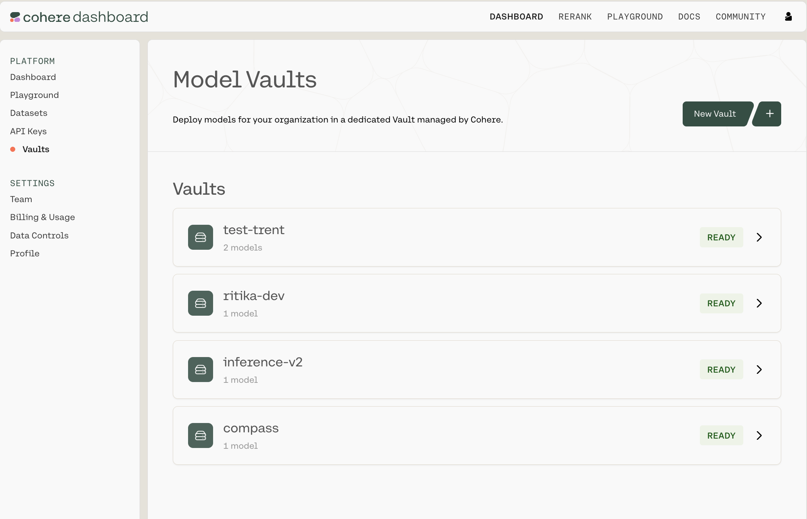
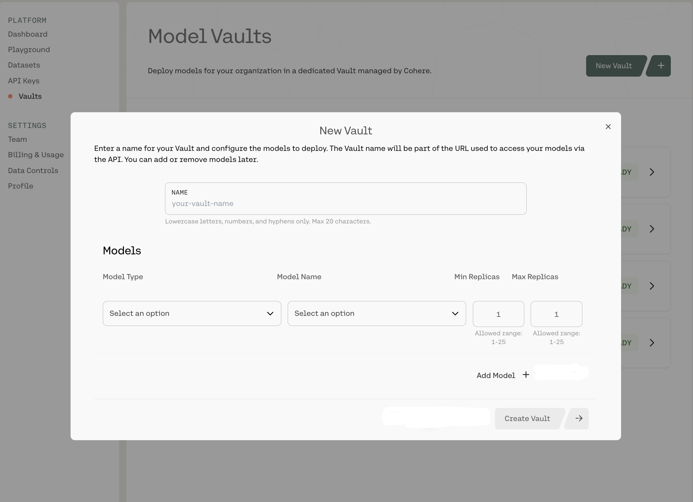
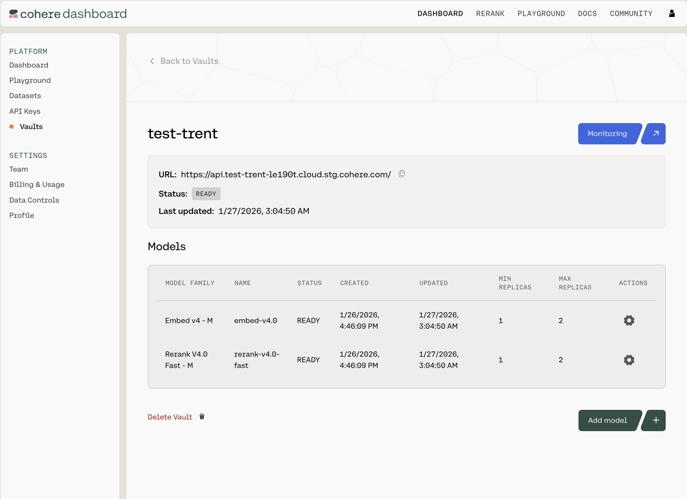
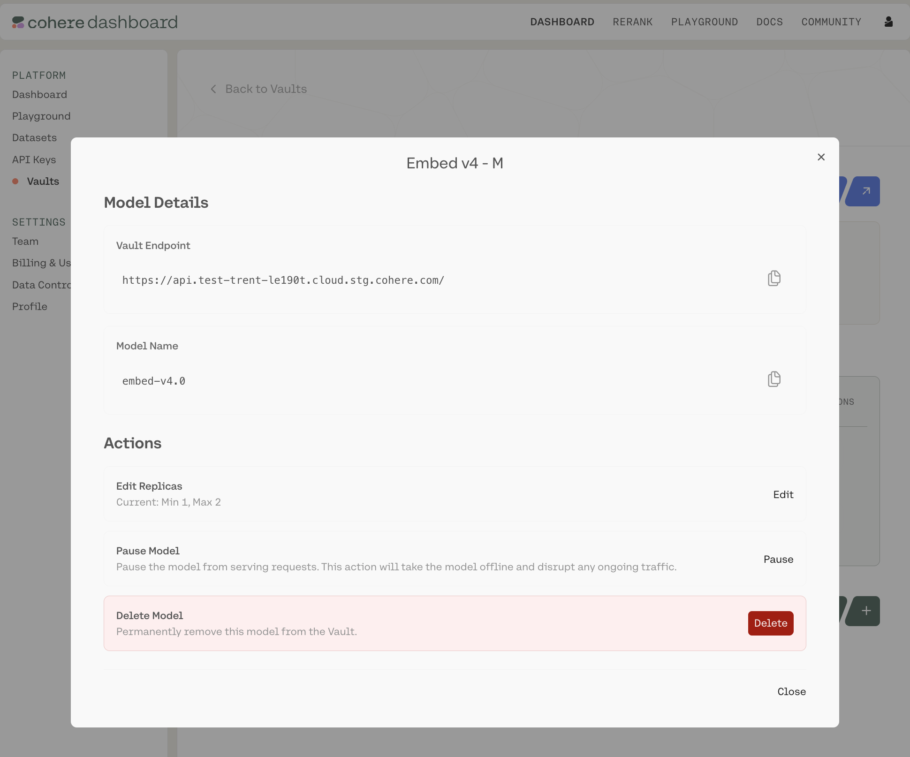
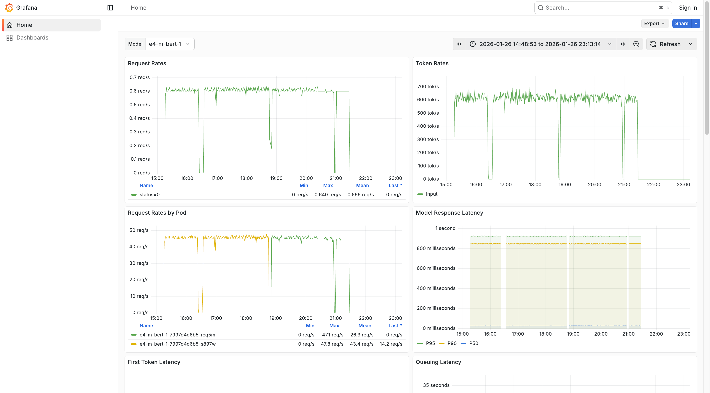

Model Vault is a Cohere-managed inference environment for deploying and serving Cohere models in an isolated, single-tenant setup. This deployment option provides dedicated infrastructure with full control over model selection, scaling, and performance monitoring.

Here are some of the advantages of using Model Vault: 

- Deploy models in a dedicated inference environment, from the Cohere dashboard, without operating the underlying serving infrastructure.
- Use metrics on request patterns, latency, and resource utilization to tune capacity.
- Targets 99.9%+ availability SLOs.
- For each model, you can choose various performance tiers, which are denoted with different sizes:
    - Small (S)
    - Medium (M)  
    - Large (L) 
    - Extra Large (XL)

These are Model Vault's core architectural components:

- **Logically isolated**: Isolates all infrastructure components, including the network load balancer, reverse proxy, serving middleware, inference servers, and GPU accelerators.
- **Minimal shared components**: Shared infrastructure is limited to authentication and underlying Kubernetes/compute resources (nodes, CPU, and memory).
- **Cohere-managed operations**: Cohere handles maintenance, deployments, updates, and scaling.

<Warning>
When Zero Data Retention (ZDR) is enabled for a Model Vault (Standalone) deployment, Cohere processes inputs and outputs for inference but does not retain any prompts or responses.
</Warning>

**Supported Models** 

| Model Name | Type of Model | Supported | Self-Serve Ability |
| --- | --- | --- | --- |
| Embed v4 | Embeddings | Yes | Yes |
| Rerank-v3.5 | Reranker | Yes | Yes |
| Rerank-v4.0 | Reranker | Yes | Yes |
| Command-A | Generative | Yes | No - Behind a Waitlist |
| Command-A Vision | Generative | Yes | No - Behind a Waitlist |
| Command-A Reasoning | Generative | Yes | No - Behind a Waitlist |
| Command-A Translate | Generative | Yes | No - Behind a Waitlist |
| North Bundle | Generative + Compass Bundle | Yes | No - Behind a Waitlist |
| Compass Bundle | Embedding + Reranker + Vision Parser | Yes | No - Behind a Waitlist |

## Setting up a Model Vault in the Dashboard 

Navigate to https://dashboard.cohere.com/ and select 'Vaults' from the left-hand menu.

This opens the 'Model Vaults' page, where you can:

- View and manage existing Vaults
- Create new Vaults

Each Vault will have a status tag with one of the following values:

- Pending 
- Deploying 
- Ready 
- Degraded

### Creating a new Vault

To create a new Vault, click `New Vault +` in the top-right corner. That will open up the following Vault configuration panel:

Here, you can:

- Name your Vault
- Select a model type and a specific model:
    - Chat 
        - Command A 03 2025 - L 
        - Command A 03 2025 - XL 
        - Etc. 
    - Embed 
        - Embed English v3 - M 
        - Embed English v3 - S 
        - Etc. 
    - Rerank 
        - Rerank v3.5 - M 
        - Etc. 
- Set the minimum and maximum number of replicas:
    - Each can be configured from 1-25

When you're done, click `Create Vault ->` in the bottom-right corner.

<Warning>
There is currently a limit of **three** Vaults per organization. Reach out to your Cohere representative to request an increase. 
</Warning>

### Interacting with Your Existing Vaults in the Dashboard 

Clicking into any of the Vaults opens up a summary page like this:

You can see the URL (which you'll need to interact with this Vault over an API), the Vault's status, when it was last updated, which models it contains, and the configuration details for each. 

For each row, there is a gear icon under the `Actions` column. Clicking it opens a pop-up model card with model-specific information: 

Here, you can: 

- Copy various pieces of technical information (the API endpoint for this Vault, the model name, etc.)
- Edit the model configuration (changing the minimum and maximum replicas)
- Pause/resume the model (CAUTION: this will turn down the model and halt all ongoing traffic)
- Delete the model 

### Monitoring a Model 
If you click into a Vault, you will see a `Monitoring` button in the top-right corner. Clicking it opens a Grafana dashboard which offers various analytics into the performance of this particular Vault, such as:

- First Token Latency
- Queuing Latency 
- Average GPU Duty Cycle 
- Etc. 

This let's you gather analytics related to specific models, modify the time range over which your analytics are gathered, inspect various on-page graphs, or export and share your data.

You can change the model with the `Model` dropdown in the top-left corner, use the 'Search' bar at the top of the screen to find particular pieces of information quickly and easily, and refresh your data by clicking 'Refresh' at the top of the screen. 

### Interacting with a Vault over the API

Once your Vault is set up in the dashboard, use the Vault endpoint URL and model name shown in the model card in API calls.