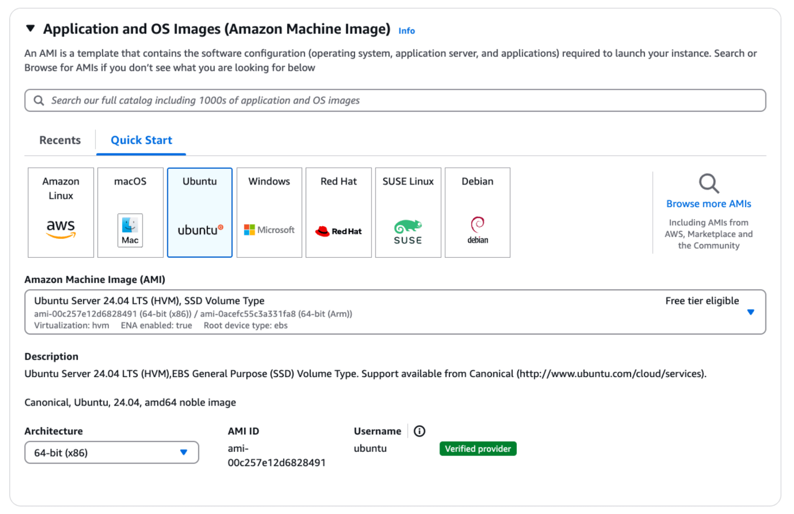
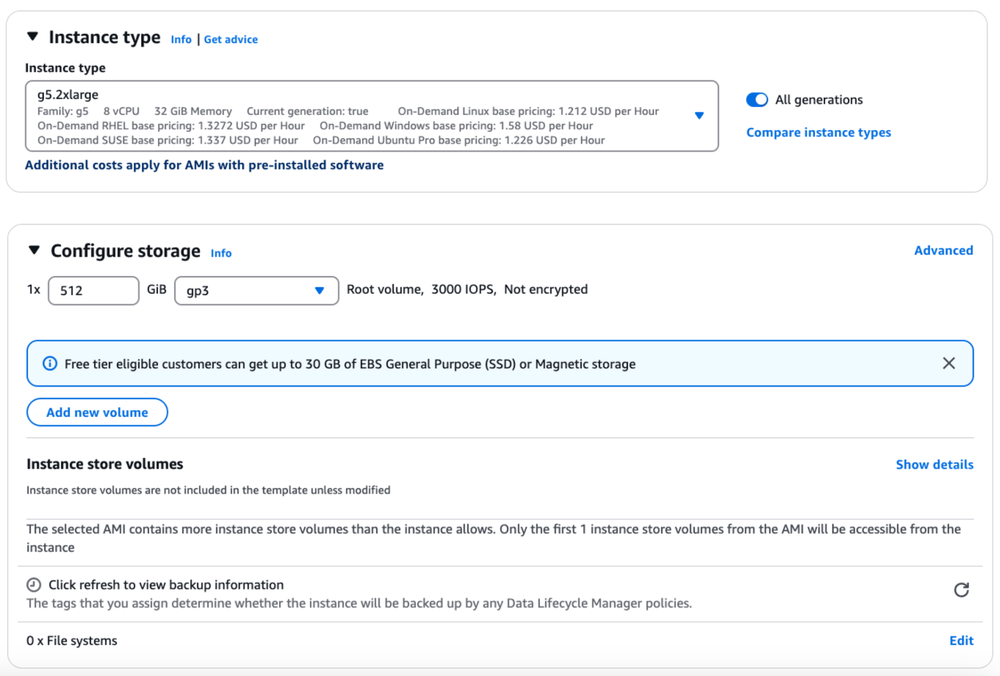
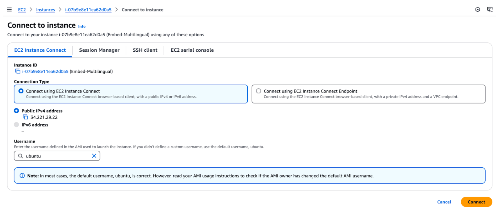
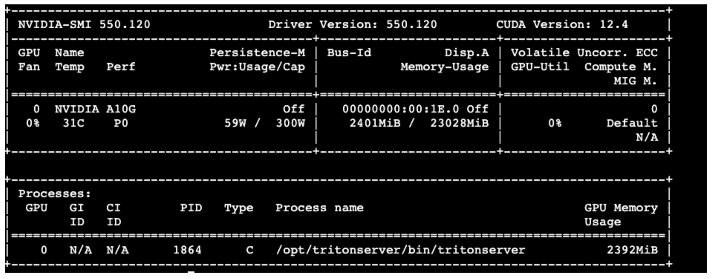
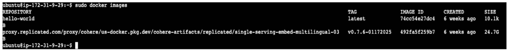
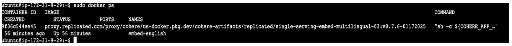
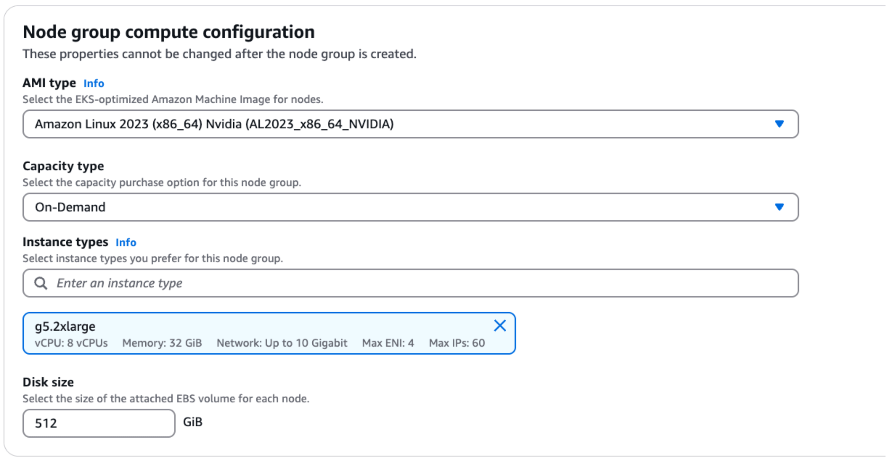
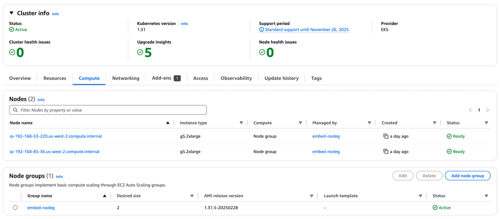

## Introduction

This guide walks you through the process of setting up a production-ready environment for deploying Cohere models in AWS.

Private deployment in AWS offers enhanced security, compliance, and control over your infrastructure and applications while leveraging AWS’s reliable and scalable cloud services.

## What this guide will cover

This guide provides comprehensive instructions for deploying applications in a private AWS environment using EC2 instances and Amazon EKS (Elastic Kubernetes Service).

Note: This guide uses an example of deploying the Embed Multilingual 3 model. If you are deploying a different model, the instance sizing will differ – please [contact sales](emailto:team@cohere.com) for further information.

## Prerequisites

Before beginning this deployment, you should have:

- An AWS account with appropriate permissions
- Basic familiarity with AWS services and the AWS console
- Understanding of Linux command line operations
- Knowledge of containerization concepts if deploying containerized applications
- The licence ID and model tag for the model you want to deploy. Please reach out to the [Cohere team](mailto:team@cohere.com) to get these.

Follow this guide sequentially to ensure all components are properly configured for a secure and efficient private deployment in AWS.

## Deploying via EC2 instances

Amazon Elastic Compute Cloud (EC2) provides scalable computing capacity in the AWS cloud and forms the foundation of your private deployment.

In this section, we’ll walk through launching an appropriate GPU-enabled EC2 instance, connecting to it securely, and installing the necessary NVIDIA drivers to utilize the GPU hardware.

The following sections provide a step by step guide to deploy the Embed Multilingual 3 model on EC2.

### Launch EC2 instance

First, launch an EC2 instance with the following specifications:

- Application and OS images - Ubuntu
- Instance Type - g5.2xlarge - 8vCPU
- Storage - 512 GB - root volume






### SSH to the EC2 instance using AWS console - ‘EC2 Instance Connect’ option.

Next, connect to your EC2 instance using the “EC2 Instance Connect” option. This allows you to access the instance through a browser-based client using the default username “ubuntu.” Ensure your instance has a public IPv4 address for successful connection.




### Install Nvidia drivers

Next, install the NVIDIA drivers on your EC2 instance to enable GPU support. Use the following commands to install the necessary drivers and the NVIDIA CUDA toolkit.

- Nvidia drivers
    
    ```bash
    sudo apt install -y ubuntu-drivers-common
    sudo ubuntu-drivers install
    sudo apt install nvidia-cuda-toolkit
    ```
    
    [Further reference](https://documentation.ubuntu.com/aws/en/latest/aws-how-to/instances/install-nvidia-drivers/)
    
- Nvidia container toolkit
    
    ```bash
    curl -fsSL https://nvidia.github.io/libnvidia-container/gpgkey | sudo gpg --dearmor -o /usr/share/keyrings/nvidia-container-toolkit-keyring.gpg && curl -s -L https://nvidia.github.io/libnvidia-container/stable/deb/nvidia-container-toolkit.list | sed 's#deb https://#deb [signed-by=/usr/share/keyrings/nvidia-container-toolkit-keyring.gpg] https://#g' | sudo tee /etc/apt/sources.list.d/nvidia-container-toolkit.list
    sed -i -e '/experimental/ s/^#//g' /etc/apt/sources.list.d/nvidia-container-toolkit.list
    sudo apt-get update
    sudo apt-get install -y nvidia-container-toolkit
    ```
    
    [Further reference](https://docs.nvidia.com/datacenter/cloud-native/container-toolkit/latest/install-guide.html)
    
- Reboot the system
This is often necessary after installing drivers or making significant system changes to ensure all components are properly initialized and running with the latest configurations.
    
    Before rebooting, restart any mentioned services after running the above commands.
    
    ```bash
    sudo reboot
    ```
    
- Verify that the GPU is correctly installed
    
    ```bash
    nvidia-smi
    ```
    



### **Install docker on the instance**

Next, install Docker on your instance. This involves updating the package list, installing Docker, starting the Docker service, and verifying the installation by running a test container.

```bash
sudo apt-get update
sudo apt-get install docker.io -ysudo systemctl start docker
sudo docker run hello-world
sudo systemctl enable docker
docker --version
```

[Further reference](https://medium.com/@srijaanaparthy/step-by-step-guide-to-install-docker-on-ubuntu-in-aws-a39746e5a63d)

### **Define environment variables**

```bash
export CUSTOMER_TAG=proxy.replicated.com/proxy/cohere/us-docker.pkg.dev/cohere-artifacts/replicated/single-serving-embed-multilingual-03:<YOUR_MODEL_TAG>
export LICENSE_ID="<YOUR_LICENSE_ID>"
export DOCKER_CONFIG=$(mktemp -d)
cat <<EOF > "${DOCKER_CONFIG}/config.json" { "auths": { "proxy.replicated.com": {"auth": "$(echo -n "${LICENSE_ID}:${LICENSE_ID}" | base64 | tr -d '\n')"}}EOF
```

[Further reference](https://docs.cohere.com/v2/docs/single-container-on-private-clouds)

### **Pull container image**

Next, prepare the environment by obtaining the required software components for deployment.

```bash
sudo docker pull $CUSTOMER_TAG
```

If you encounter an error “permission denied while trying to connect to the Docker daemon socket at”, run the following command:

```bash
sudo chmod 666 /var/run/docker.sock
```

[Further reference](https://stackoverflow.com/questions/48957195/how-to-fix-docker-got-permission-denied-issue)

Then, verify that the image has been pulled successfully:

```bash
sudo docker images
```



### **Start container**

Next, run the Docker container. This starts the container in detached mode with GPU support.

```bash
sudo docker run -d --rm --name embed-english --gpus=1 --net=host proxy.replicated.com/proxy/cohere/us-docker.pkg.dev/cohere-artifacts/replicated/single-serving-embed-multilingual-03:<YOUR_MODEL_TAG>

sudo docker ps
```



### **Call the model**

Next, test calling the model by executing the `curl` command to send a `POST` request to the local server. This tests the model’s functionality by providing input data for processing.

```bash
curl --header "Content-Type: application/json" --request POST http://localhost:8080/embed --data-raw '{"texts": ["testing multilingual embeddings"], "input_type": "classification"}'
```

## Deploying via EKS (Elastic Kubernetes Service)

Amazon Elastic Kubernetes Service (EKS) provides a managed Kubernetes environment, allowing you to run containerized applications at scale. It leverages Kubernetes’ orchestration capabilities for efficient resource management and scalability.

In this section, we’ll walk through setting up an EKS cluster, configuring it for GPU support, and deploying your application.

### **Launch EKS cluster**

First, launch an EKS cluster by following the steps in the [AWS documentation](https://docs.aws.amazon.com/eks/latest/userguide/getting-started-console.html), and in particular, the steps in Prerequisites and Step 1-4.

The steps in summary:

- Install AWS CLI and Kubectl
- Create the Amazon EKS cluster
- As part of adding nodes to the cluster in step3, use the following
    - AMI type - Amazon Linux 2023 - Nvidia (nvidia drivers pre-installed)
    - Instance Type - g5.2xlarge - 8vCPU
    - Storage - 512 GB



You can then view the cluster information in the AWS console.



### **Define environment variables**

Next, set environment variables from the machine where the AWS CLI and Kubectl are installed.

```bash
export CUSTOMER_TAG=proxy.replicated.com/proxy/cohere/us-docker.pkg.dev/cohere-artifacts/replicated/single-serving-embed-multilingual-03:<YOUR_MODEL_TAG>
export LICENSE_ID="<YOUR_LICENSE_ID>"
export DOCKER_CONFIG=$(mktemp -d)
cat <<EOF > "${DOCKER_CONFIG}/config.json" { "auths": { "proxy.replicated.com": {"auth": "$(echo -n "${LICENSE_ID}:${LICENSE_ID}" | base64 | tr -d '\n')"}}EOF
kubectl create secret generic cohere-pull-secret --from-file=.dockerconfigjson="{$DOCKER_CONFIG}/config.json" --type=kubernetes.io/dockerconfigjson
```

[Further reference](https://docs.cohere.com/v2/docs/single-container-on-private-clouds)

### **Generate application manifest**

Next, generate an application manifest by creating a file named `cohere.yaml`. The file contents should be copied from [this link](https://docs.cohere.com/v2/docs/single-container-on-private-clouds).

### **Start deployment**

Next, start the deployment by applying the configuration file. Then, check the status and monitor the logs of your pods.

```bash
kubectl apply -f cohere.yaml
kubectl get pods
kubectl logs -f <pod-name-from-above-command>
```

### **Call the model**

Next, run the model by first setting up port forwarding.

```bash
kubectl port-forward svc/cohere 8080:8080
```

Then, open a second window and send a test request using the curl command.

```bash
curl --header "Content-Type: application/json" --request POST http://localhost:8080/embed --data-raw '{"texts": ["testing embeddings in english"], "input_type": "classification"}'
```
