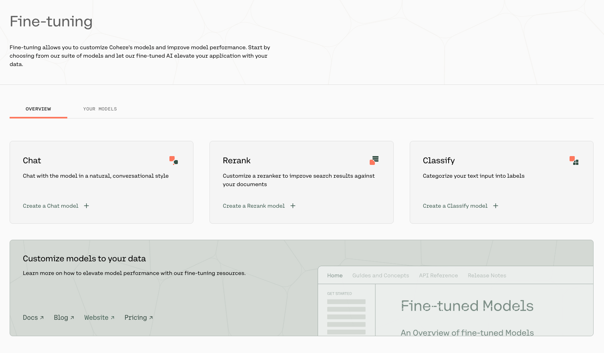
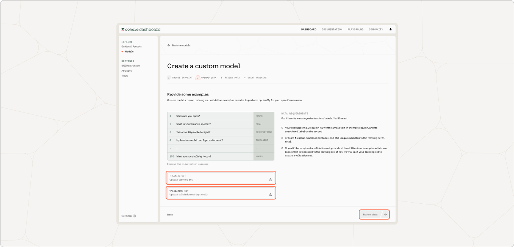
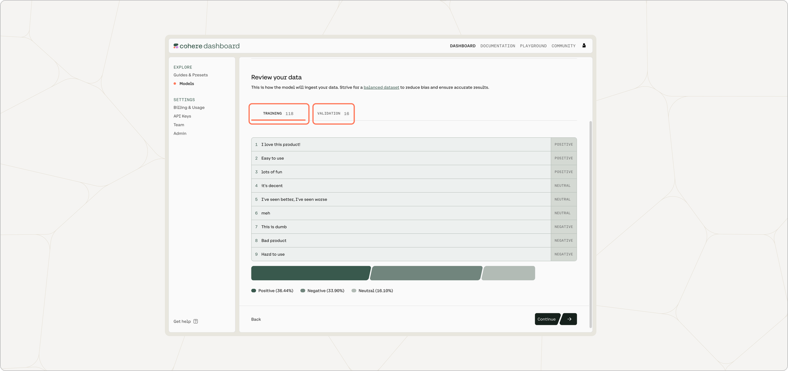
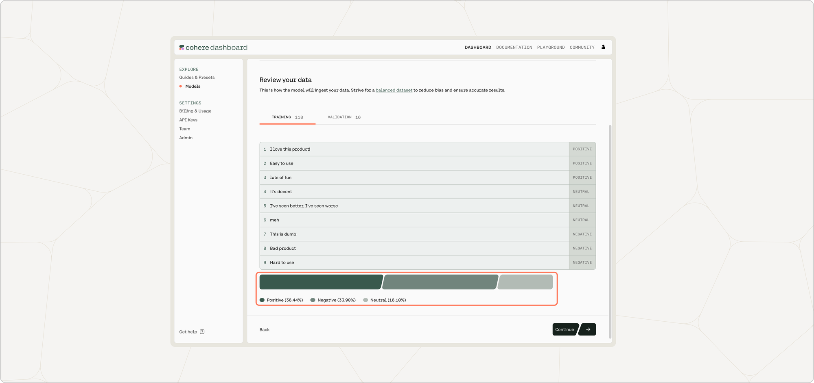

In this section, we will walk through how you can start training a fine-tuning model for Classification with both the [Web UI](/docs/fine-tuning-with-the-web-ui) and the Python SDK.

## Web UI

Creating a fine-tuned model for Classification with the Web UI consists of a few simple steps, which we'll walk through now.

### Choose the Classify Option

Go to the [fine-tuning page](http://dashboard.cohere.com/fine-tuning) and click on 'Create a Classify model'.




### Upload Your Data

Upload your custom dataset data by going to 'Training data' and clicking on the upload file button. Your data should be in `csv` or `.jsonl` format with exactly two columns—the first column consisting of the examples, and the second consisting of the labels. 




You also have the option of uploading a validation dataset. This will not be used during training, but will be used for evaluating the model’s performance post-training. To upload a validation set, go to 'Upload validation set (optional)' and repeat the same steps you just went through with the training dataset. If you don’t upload a validation dataset, the platform will automatically set aside part of the training dataset to use for validation.

At this point in time, if there are labels in the training set with less than five unique examples, those labels will be removed.

<Frame caption="The 'Area' label had fewer than five examples, so it has been removed from the training set.">

</Frame>

Once done, click 'Next'.

### Preview Your Data

The preview window will show a few samples of your custom training dataset, and your validation dataset (if you uploaded it).

Toggle between the 'Training' and 'Validation' tabs to see a sample of your respective datasets. 




At the bottom of this page, the distribution of labels in each respective dataset is shown.




If you are happy with how the samples look, click 'Continue'.

### Start Training

Now, everything is set for training to begin! Click 'Start training' to proceed.

### Calling the Fine-tuned Model

Once your model completes training, you can call it by selecting 'Try in Playground' from the [model list view](https://dashboard.cohere.com/fine-tuning?tab=models):


or by selecting 'Try in Playground' from the model overview page:


Or, you can go to the [classify playground](https://dashboard.cohere.com/playground/classify) and select your model from the drop down menu:

## Python SDK

Text classification is one of the most common language understanding tasks. A lot of business use cases can be mapped to text classification. Examples include:

- Evaluating the tone and sentiment of an incoming customer message (e.g. classes: 'positive' and 'negative').
- Routing incoming customer messages to the appropriate agent (e.g. classes: 'billing', 'tech support', 'other').
- Evaluating if a user comment needs to be flagged for moderator attention (e.g. classes: 'flag for moderation', 'neutral').
- Evaluating which science topic a given piece of text is related to (e.g. classes: 'biology', 'physics'). Since a given piece of text might be germane to more than one topic, this is an example of 'multilabel' classification, which is discussed in more detail at the end of this document.

## Create a New Fine-tuned Model

In addition to using the Web UI for fine-tuning models, customers can also kick off fine-tuning jobs programmatically using the [Cohere Python SDK](https://pypi.org/project/cohere/). This can be useful for fine-tunes that happen on a regular cadence, such as nightly jobs on newly-acquired data.

Using `co.finetuning.create_finetuned_model()`, you can create a fine-tuned model using either a single-label or multi-label dataset.

### Examples

Here are some example code snippets for you to use.

### Starting a Single-label Fine-tune

```python PYTHON
# create dataset
single_label_dataset = co.datasets.create(name="single-label-dataset",
                                          data=open("path/to/train.csv, "rb"),
                                          type="single-label-finetune-input",
                                          parse_info=ParseInfo(delimiter=",")) # parse_info is optional
print(single_label_dataset.await_validation())
                                              
# start the fine-tune job using this dataset
finetune = co.finetuning.create_finetuned_model(
  request=FinetunedModel(
    name="single-label-ft",
    settings=Settings(
      base_model=BaseModel(
        base_type="BASE_TYPE_CLASSIFICATION",
      ),
      dataset_id=single_label_dataset.id,
    ),
  ),
)

print(f"fine-tune ID: {finetune.id}, fine-tune status: {finetune.status}")
```

### Starting a Multi-label Fine-tune

```python PYTHON
# create dataset
multi_label_dataset = co.create_dataset(name="multi-label-dataset",
                                        data=open("path/to/train.jsonl", "rb"),
                                        dataset_type="multi-label-finetune-input")
  
print(multi_label_dataset.await_validation())
                                              
# start the fine-tune job using this dataset
finetune = co.finetuning.create_finetuned_model(
  request=FinetunedModel(
    name="single-label-ft",
    settings=Settings(
      base_model=BaseModel(
        base_type="BASE_TYPE_CLASSIFICATION",
      ),
      dataset_id=single_label_dataset.id,
    ),
  ),
)

print(f"fine-tune ID: {finetune.id}, fine-tune status: {finetune.status}")
```

### Calling a fine-tune

```python PYTHON
import cohere

co = cohere.ClientV2('Your API key')
# get the custom model object
ft = co.finetuning.get_finetuned_model(finetune.finetuned_model.id)

response = co.classify(
    inputs=["classify this!"],
    model=ft.id+"-ft",
)

# Printing the model's response.
print(response)
```

We can’t wait to see what you start building! Share your projects or find support on our [Discord](https://discord.com/invite/co-mmunity).
