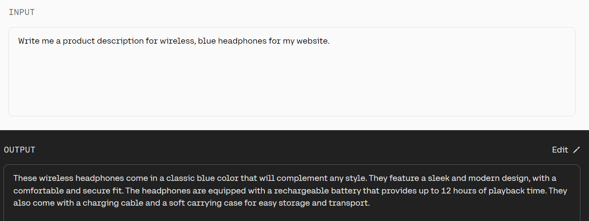
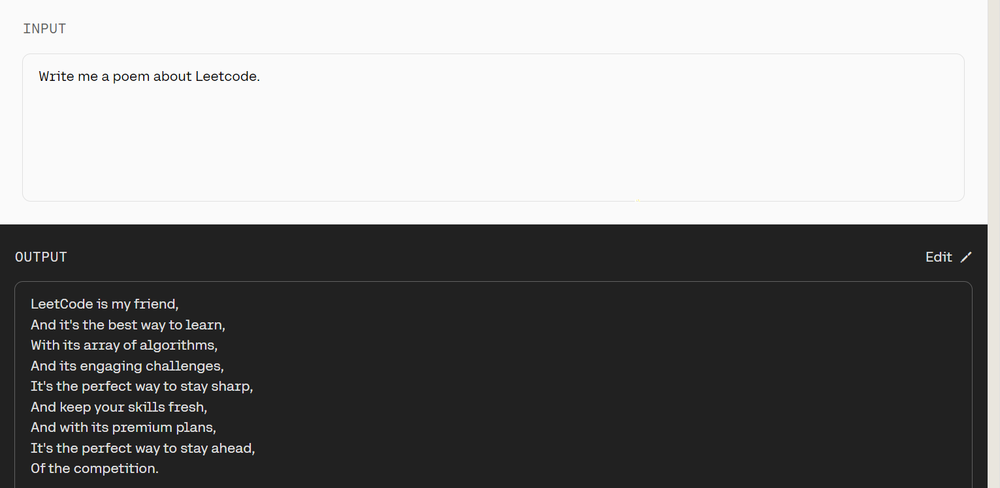
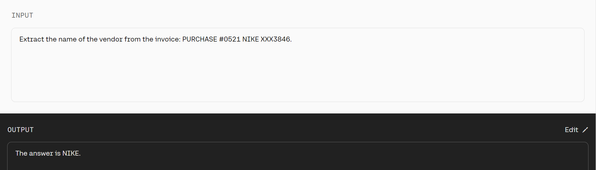

<Info title="Note">  
 For most use cases we recommend our latest model [Command A](https://docs.cohere.com/docs/command-a) instead.

</Info>


### Model Details
| Latest Model              | Description                                                                                                                                                                                                                                                                                                                                                                                           | Modality               | Context Length | Maximum Output Tokens | Endpoints                                                         |
|---------------------------|-------------------------------------------------------------------------------------------------------------------------------------------------------------------------------------------------------------------------------------------------------------------------------------------------------------------------------------------------------------------------------------------------------|------------------------|----------------|-----------------------|-------------------------------------------------------------------|
| `command`                 | An instruction-following conversational model that performs language tasks with high quality, more reliably and with a longer context than our base generative models.                                                                                                                                                                                                                                |  Text                  | 4k             | 4k                    | [Chat](/reference/chat),  <br/>[Summarize](/reference/summarize)  |
| `command-light`           | A smaller, faster version of `command`. Almost as capable, but a lot faster.                                                                                                                                                                                                                                                                                                                          |  Text                  | 4k             | 4k                    | [Chat](/reference/chat),  <br/>[Summarize](/reference/summarize-2)|


The Command family of models responds well with instruction-like prompts, and are available in two variants: `command-light` and `command`. The `command` model demonstrates better performance, while `command-light` is a great option for applications that require fast responses.


For information on toxicity, safety, and using this model responsibly check out our [Command model card](https://docs.cohere.com/docs/responsible-use).

## Example Prompts










## Get Started

### Set up

Install the SDK, if you haven't already.

`pip install cohere`

Then, set up the Cohere client.

```python PYTHON
import cohere

co = cohere.ClientV2(api_key="<YOUR API KEY>")
```

### Create prompt

```python PYTHON
message = "Write an introductory paragraph for a blog post about language models."
```

### Generate text

```python PYTHON
response = co.chat(
    model="command", messages=[{"role": "user", "content": message}]
)

intro_paragraph = response.message.content[0].text
```

## FAQ

### Can users train Command?

Users cannot train Command in OS at this time. However, our team can handle this on a case-by-case basis. Please email [team@cohere.com](mailto:team@cohere.com) if you’re interested in training this model.

### Where can I leave feedback about Cohere generative models?

Please leave feedback on [Discord](https://discord.com/invite/co-mmunity).

### What's the context length on the command models?

A model's "context length" refers to the number of tokens it's capable of processing at one time. In the table above, you can find the context length (and a few other relevant parameters) for the different versions of the command models.