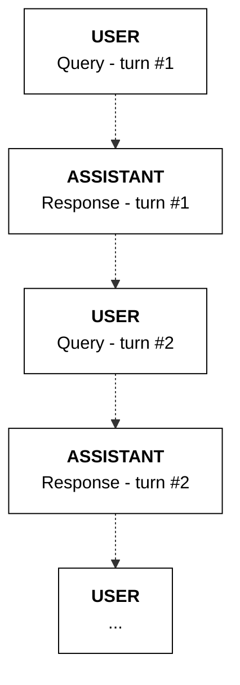

This section expands on the [basic RAG usage](https://docs.cohere.com/docs/retrieval-augmented-generation-rag) by demonstrating a more complete example that includes:
- Retrieval and reranking of documents (via the Embed and Rerank endpoints).
- Building RAG for chatbots (involving multi-turn conversations).

## Setup

First, import the Cohere library and create a client.

<Tabs>
<Tab title="Cohere platform">

```python PYTHON
# ! pip install -U cohere
import cohere
import json
import numpy as np

co = cohere.ClientV2(
    "COHERE_API_KEY"
)  # Get your free API key here: https://dashboard.cohere.com/api-keys
```
</Tab>

<Tab title="Private deployment">
```python PYTHON
# ! pip install -U cohere
import cohere
import json
import numpy as np

co = cohere.ClientV2(
    api_key="", base_url="<YOUR_DEPLOYMENT_URL>"  # Leave this blank
)
```
</Tab>
</Tabs>

## Step 1: Generating search queries

Next, we create a search query generation tool for generating search queries from user queries.

```python PYTHON
def generate_search_queries(messages):

    # Define the query generation tool
    query_gen_tool = [
        {
            "type": "function",
            "function": {
                "name": "search_query_generator",
                "description": "Generates a list of search queries for searching external sources such as the internet or knowledge bases. If the user's query can be answered directly without searching for additional information, do not use this tool.",
                "parameters": {
                    "type": "object",
                    "properties": {
                        "queries": {
                            "type": "array",
                            "items": {"type": "string"},
                            "description": "A list of search queries.",
                        }
                    },
                    "required": ["queries"],
                },
            },
        }
    ]

    # Generate search queries (if any)
    search_queries = []

    res = co.chat(
        model="command-r-08-2024",
        messages=messages,
        tools=query_gen_tool,
        temperature=0.1,
    )

    if res.message.tool_calls:
        for tc in res.message.tool_calls:
            queries = json.loads(tc.function.arguments)["queries"]
            search_queries.extend(queries)

    return search_queries
```

## Step 2: Fetching relevant documents

### Retrieval with Embed

Given the search query, we need a way to retrieve the most relevant documents from a large collection of documents.

This is where we can leverage text embeddings through the [Embed endpoint](https://docs.cohere.com/reference/embed). 

The Embed endpoint enables semantic search, which lets us to compare the semantic meaning of the documents and the query. It solves the problem faced by the more traditional approach of lexical search, which is great at finding keyword matches, but struggles at capturing the context or meaning of a piece of text.

The Embed endpoint takes in texts as input and returns embeddings as output.

First, we need to embed the documents to search from. We call the Embed endpoint using `co.embed()` and pass the following arguments:

- `model`: Here we choose `embed-english-v3.0`, which generates embeddings of size 1024
- `input_type`: We choose `search_document` to ensure the model treats these as the documents (instead of the query) for search
- `texts`: The list of texts (the FAQs)
- `embedding_types`: We choose the `float` as the embedding type.


```python PYTHON
# Define the documents
documents = [
    {
        "data": {
            "text": "Joining Slack Channels: You will receive an invite via email. Be sure to join relevant channels to stay informed and engaged."
        }
    },
    {
        "data": {
            "text": "Finding Coffee Spots: For your caffeine fix, head to the break room's coffee machine or cross the street to the café for artisan coffee."
        }
    },
    {
        "data": {
            "text": "Team-Building Activities: We foster team spirit with monthly outings and weekly game nights. Feel free to suggest new activity ideas anytime!"
        }
    },
    {
        "data": {
            "text": "Working Hours Flexibility: We prioritize work-life balance. While our core hours are 9 AM to 5 PM, we offer flexibility to adjust as needed."
        }
    },
    {
        "data": {
            "text": "Side Projects Policy: We encourage you to pursue your passions. Just be mindful of any potential conflicts of interest with our business."
        }
    },
    {
        "data": {
            "text": "Reimbursing Travel Expenses: Easily manage your travel expenses by submitting them through our finance tool. Approvals are prompt and straightforward."
        }
    },
    {
        "data": {
            "text": "Working from Abroad: Working remotely from another country is possible. Simply coordinate with your manager and ensure your availability during core hours."
        }
    },
    {
        "data": {
            "text": "Health and Wellness Benefits: We care about your well-being and offer gym memberships, on-site yoga classes, and comprehensive health insurance."
        }
    },
    {
        "data": {
            "text": "Performance Reviews Frequency: We conduct informal check-ins every quarter and formal performance reviews twice a year."
        }
    },
    {
        "data": {
            "text": "Proposing New Ideas: Innovation is welcomed! Share your brilliant ideas at our weekly team meetings or directly with your team lead."
        }
    },
]

# Embed the documents
doc_emb = co.embed(
    model="embed-english-v3.0",
    input_type="search_document",
    texts=[doc["data"]["text"] for doc in documents],
    embedding_types=["float"],
).embeddings.float
```

Next, we add a query, which asks about how to get to know the team.

We choose `search_query` as the `input_type` in the Embed endpoint call. This ensures the model treats this as the query (instead of the documents) for search.


```python PYTHON
# Add the user query
messages = [
    {"role": "user", "content": "How to get to know my teammates"}
]

# Generate the search query
# Note: For simplicity, we are assuming only one query generated. For actual implementations, you will need to perform search for each query.
queries_for_search = generate_search_queries(messages)[0]
print("Search query: ", queries_for_search)

# Embed the search query
query_emb = co.embed(
    model="embed-english-v3.0",
    input_type="search_query",
    texts=[queries_for_search],
    embedding_types=["float"],
).embeddings.float
```

```mdx
Search query:  how to get to know your teammates
```

Now, we want to search for the most relevant documents to the query. For this, we make use of the `numpy` library to compute the similarity between each query-document pair using the dot product approach.

Each query-document pair returns a score, which represents how similar the pair are. We then sort these scores in descending order and select the top most similar pairs, which we choose 5 (this is an arbitrary choice, you can choose any number).

Here, we show the most relevant documents with their similarity scores.


```python PYTHON
# Compute dot product similarity and display results
n = 5
scores = np.dot(query_emb, np.transpose(doc_emb))[0]
max_idx = np.argsort(-scores)[:n]

retrieved_documents = [documents[item] for item in max_idx]

for rank, idx in enumerate(max_idx):
    print(f"Rank: {rank+1}")
    print(f"Score: {scores[idx]}")
    print(f"Document: {retrieved_documents[rank]}\n")
```

```mdx
Rank: 1
Score: 0.32653470360872655
Document: {'data': {'text': 'Team-Building Activities: We foster team spirit with monthly outings and weekly game nights. Feel free to suggest new activity ideas anytime!'}}

Rank: 2
Score: 0.26851855352264786
Document: {'data': {'text': 'Proposing New Ideas: Innovation is welcomed! Share your brilliant ideas at our weekly team meetings or directly with your team lead.'}}

Rank: 3
Score: 0.2581341975304149
Document: {'data': {'text': 'Joining Slack Channels: You will receive an invite via email. Be sure to join relevant channels to stay informed and engaged.'}}

Rank: 4
Score: 0.18633336738178463
Document: {'data': {'text': "Finding Coffee Spots: For your caffeine fix, head to the break room's coffee machine or cross the street to the café for artisan coffee."}}

Rank: 5
Score: 0.13022396595682814
Document: {'data': {'text': 'Health and Wellness Benefits: We care about your well-being and offer gym memberships, on-site yoga classes, and comprehensive health insurance.'}}
```


### Reranking with Rerank

Reranking can boost the results from semantic or lexical search further. The [Rerank endpoint](https://docs.cohere.com/reference/rerank) takes a list of search results and reranks them according to the most relevant documents to a query. This requires just a single line of code to implement.

We call the endpoint using `co.rerank()` and pass the following arguments:

- `query`: The user query
- `documents`: The list of documents we get from the semantic search results
- `top_n`: The top reranked documents to select
- `model`: We choose Rerank English 3

Looking at the results, we see that since the query is about getting to know the team, the document that talks about joining Slack channels is now ranked higher (1st) compared to earlier (3rd).

Here we select `top_n` to be 2, which will be the documents we will pass next for response generation.


```python PYTHON
# Rerank the documents
results = co.rerank(
    model="rerank-v3.5",
    query=queries_for_search,
    documents=[doc["data"]["text"] for doc in retrieved_documents],
    top_n=2,
)

# Display the reranking results
for idx, result in enumerate(results.results):
    print(f"Rank: {idx+1}")
    print(f"Score: {result.relevance_score}")
    print(f"Document: {retrieved_documents[result.index]}\n")

reranked_documents = [
    retrieved_documents[result.index] for result in results.results
]
```
```mdx
Rank: 1
Score: 0.07272241
Document: {'data': {'text': 'Team-Building Activities: We foster team spirit with monthly outings and weekly game nights. Feel free to suggest new activity ideas anytime!'}}

Rank: 2
Score: 0.058674112
Document: {'data': {'text': 'Joining Slack Channels: You will receive an invite via email. Be sure to join relevant channels to stay informed and engaged.'}}
```

## Step 3: Generating the response

Finally, we call the Chat endpoint by passing the retrieved documents. This tells the model to run in RAG-mode and use these documents in its response.

The response and citations are then generated based on the the query and the documents retrieved.


```python PYTHON
# Generate the response
response = co.chat(
    model="command-r-plus-08-2024",
    messages=messages,
    documents=reranked_documents,
)

# Display the response
print(response.message.content[0].text)

# Display the citations and source documents
if response.message.citations:
    print("\nCITATIONS:")
    for citation in response.message.citations:
        print(citation, "\n")
```
```mdx
You can get to know your teammates by joining Slack channels and participating in team-building activities. You will receive an invite via email to join the Slack channels. You can also suggest new activity ideas for team-building activities.

CITATIONS:
start=38 end=60 text='joining Slack channels' sources=[DocumentSource(type='document', id='doc:1', document={'id': 'doc:1', 'text': 'Joining Slack Channels: You will receive an invite via email. Be sure to join relevant channels to stay informed and engaged.'})] type='TEXT_CONTENT' 

start=82 end=107 text='team-building activities.' sources=[DocumentSource(type='document', id='doc:0', document={'id': 'doc:0', 'text': 'Team-Building Activities: We foster team spirit with monthly outings and weekly game nights. Feel free to suggest new activity ideas anytime!'})] type='TEXT_CONTENT' 

start=117 end=144 text='receive an invite via email' sources=[DocumentSource(type='document', id='doc:1', document={'id': 'doc:1', 'text': 'Joining Slack Channels: You will receive an invite via email. Be sure to join relevant channels to stay informed and engaged.'})] type='TEXT_CONTENT' 

start=186 end=212 text='suggest new activity ideas' sources=[DocumentSource(type='document', id='doc:0', document={'id': 'doc:0', 'text': 'Team-Building Activities: We foster team spirit with monthly outings and weekly game nights. Feel free to suggest new activity ideas anytime!'})] type='TEXT_CONTENT' 
```

## Chatbots (multi-turn)

Building chatbots requires maintaining the memory or state of a conversation over multiple turns. To do this, we can keep appending each turn of a conversation to the messages list.

First, we append the assistant's response to the messages list via the `assistant` role.

Then, in the second turn, when provided with a rather vague follow-up user message ("Are they mostly remote?"), the model correctly infers that the context is about the user's teammates (generated search query: "are my teammates mostly remote?").

From here, we can retain the context over multiple conversation turns by appending the user's message to the messages list via the `user` role, which then be followed by the assistant's response via the `assistant` role, and so on.


```python PYTHON
messages.append(
    {"role": "assistant", "content": response.message.content[0].text}
)

messages.append(
    {"role": "user", "content": "Are they mostly remote?"}
)

queries_for_search = generate_search_queries(messages)[0]
print("Search query: ", queries_for_search)

# ...continue to retrieval, reranking, and response generation steps...
```

```mdx
Search query:  are my teammates mostly remote?
```

**State management**

The sequence of messages is represented in the diagram below.


