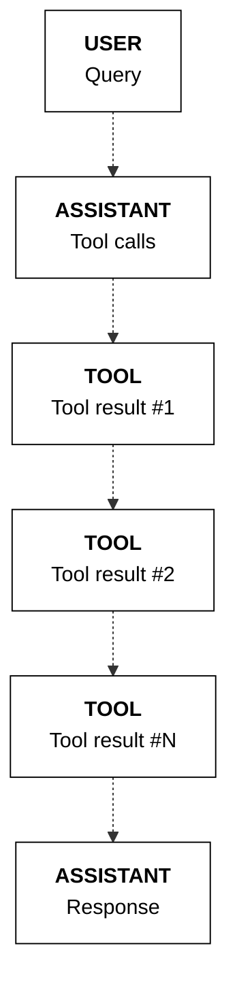
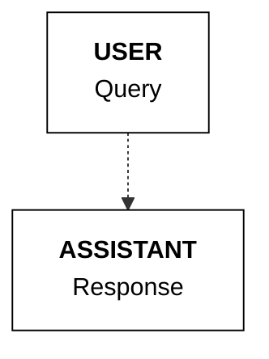
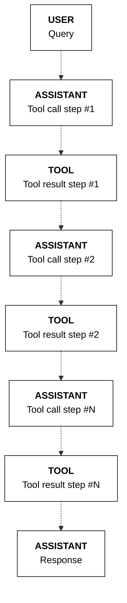
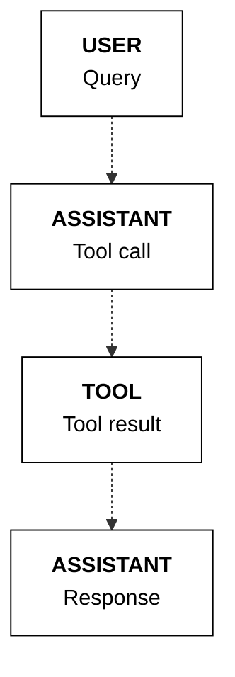
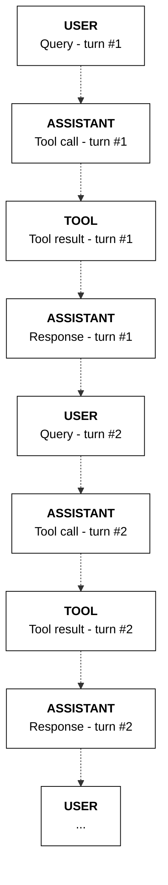

The tool use feature of the Chat endpoint comes with a set of capabilities that enable developers to implement a variety of tool use scenarios. This section describes the different patterns of tool use implementation supported by these capabilities. Each pattern can be implemented on its own or in combination with the others.

## Setup

First, import the Cohere library and create a client.

<Tabs>
<Tab title="Cohere platform">

```python PYTHON
# ! pip install -U cohere
import cohere

co = cohere.ClientV2("COHERE_API_KEY") # Get your free API key here: https://dashboard.cohere.com/api-keys
```
</Tab>

<Tab title="Private deployment">
```python PYTHON
# ! pip install -U cohere
import cohere

co = cohere.ClientV2(
    api_key="", # Leave this blank
    base_url="<YOUR_DEPLOYMENT_URL>"
)
```
</Tab>
</Tabs>

Let's use the same `get_weather` tool as in the previous example[[TODO - link to basic example page]].

```python PYTHON
def get_weather(location):
    # Implement any logic here 
    return [{"temperature": "20C"}]
    # Return a list of objects e.g. [{"url": "abc.com", "text": "..."}, {"url": "xyz.com", "text": "..."}]

functions_map = {"get_weather": get_weather}

tools = [
    {
        "type": "function",
        "function": {
            "name": "get_weather",
            "description": "gets the weather of a given location",
            "parameters": {
                "type": "object",
                "properties": {
                    "location": {
                        "type": "string",
                        "description": "the location to get the weather, example: San Francisco.",
                    }
                },
                "required": ["location"],
            },
        },
    },
]
```

## Parallel tool calling
The model can determine that more than one tool call is required, where it will call multiple tools in parallel. This can be calling the same tool multiple times or different tools for any number of calls.

In the example below, the user asks for the weather in Toronto and New York. This requires calling the `get_weather` function twice, one for each location. This is reflected in the model's response, where two parallel tool calls are generated.

```python PYTHON
messages = [{"role": "user", "content": "What's the weather in Toronto and New York?"}]

response = co.chat(
    model="command-r-plus-08-2024",
    messages=messages,
    tools=tools
)

if response.message.tool_calls:
    messages.append(
        {
            "role": "assistant",
            "tool_plan": response.message.tool_plan,
            "tool_calls": response.message.tool_calls,
        }
    )
    print(response.message.tool_plan, "\n")
    print(response.message.tool_calls)
```
```mdx wordWrap
I will search for the weather in Toronto and New York.

[
    ToolCallV2(
        id="get_weather_9b0nr4kg58a8",
        type="function",
        function=ToolCallV2Function(
            name="get_weather", arguments='{"location":"Toronto"}'
        ),
    ),
    ToolCallV2(
        id="get_weather_0qq0mz9gwnqr",
        type="function",
        function=ToolCallV2Function(
            name="get_weather", arguments='{"location":"New York"}'
        ),
    ),
]
```
**State management**

When tools are called in parallel, we append the messages list with one single `assistant` message containing all the tool calls and one `tool` message for each tool call.

```python PYTHON
import json

if response.message.tool_calls:
    for tc in response.message.tool_calls:
        tool_result = functions_map[tc.function.name](
            **json.loads(tc.function.arguments)
        )
        tool_content = []
        for data in tool_result:
            # Optional: the "document" object can take an "id" field for use in citations, otherwise auto-generated
            tool_content.append({"type": "document", "document": {"data": json.dumps(data)}})
        messages.append(
            {"role": "tool", "tool_call_id": tc.id, "content": tool_content}
        )
```

The sequence of messages is represented in the diagram below.



## Directly answering
A key attribute of tool use systems is the model’s ability to choose the right tools for a task. This includes the model's ability to decide to *not* use any tool, and instead, respond to a user message directly.

In the example below, the user asks for a simple arithmetic question. The model determines that it does not need to use any of the available tools (only one, `get_weather`, in this case), and instead, directly answers the user.

```python PYTHON
messages = [{"role": "user", "content": "What's 2+2?"}]

response = co.chat(
    model="command-r-plus-08-2024",
    messages=messages,
    tools=tools
)

if response.message.tool_calls:
    print(response.message.tool_plan, "\n")
    print(response.message.tool_calls)

else:
    print(response.message.content[0].text)
```
```mdx wordWrap
The answer to 2+2 is 4.
```

**State management**

When the model opts to respond directly to the user, there will be no items 2 and 3 above (the tool calling and tool response messages). Instead, the final `assistant` message will contain the model's direct response to the user.



## Multi-step tool use

The Chat endpoint supports multi-step tool use, which enables the model to perform sequential reasoning. This is especially useful in agentic workflows that require multiple steps to complete a task.

As an example, suppose a tool use application has access to a web search tool. Given the question "What was the revenue of the most valuable company in the US in 2023?”,  it will need to perform a series of steps in a specific order:
- Identify the most valuable company in the US in 2023
- Then only get the revenue figure now that the company has been identified

To illustrate this, let's start with the same weather example and add another tool called `get_capital_city`, which returns the capital city of a given country.

Here's the function definitions for the tools:
```python PYTHON
def get_weather(location):
    temperature = {
        "bern": 22,
        "madrid": 24,
        "brasilia": 28
    }
    loc = location.lower()
    if loc in temperature:
        return [{"temperature": {loc: temperature[loc]}}]
    return [{"temperature": {loc: "Unknown"}}]

def get_capital_city(country):
    capital_city = {
        "switzerland": "bern",
        "spain": "madrid", 
        "brazil": "brasilia"
    }
    country = country.lower()
    if country in capital_city:
        return [{"capital_city": {country: capital_city[country]}}]
    return [{"capital_city": {country: "Unknown"}}]

functions_map = {
    "get_capital_city": get_capital_city,
    "get_weather": get_weather
}
```

And here are the corresponding tool schemas:
```python PYTHON
tools = [
    {
        "type": "function",
        "function": {
            "name": "get_weather",
            "description": "gets the weather of a given location",
            "parameters": {
                "type": "object",
                "properties": {
                    "location": {
                        "type": "string",
                        "description": "the location to get the weather, example: San Francisco.",
                    }
                },
                "required": ["location"],
            },
        },
    },
    {
        "type": "function", 
        "function": {
            "name": "get_capital_city",
            "description": "gets the capital city of a given country",
            "parameters": {
                "type": "object",
                "properties": {
                    "country": {
                        "type": "string",
                        "description": "the country to get the capital city for",
                    }
                },
                "required": ["country"],
            },
        },
    },
]
```

Next, we implement the four-step tool use workflow as described in the previous page [[TODO - link to basic example page]].

The key difference here is the second (tool calling) and third (tool execution) steps are put in a `while` loop, which means that a sequence of this pair can happen for a number of times. This stops when the model decides in the tool calling step that no more tool calls are needed, which then triggers the fourth step (response generation).

In this example, the user asks for the temperature in Brazil's capital city.

```python PYTHON
# Step 1: Get the user message
messages = [{"role": "user", "content": "What's the temperature in Brazil's capital city?"}]

# Step 2: Generate tool calls (if any)
model = "command-r-plus-08-2024"
response = co.chat(
    model=model, 
    messages=messages, 
    tools=tools, 
    temperature=0.3
)

while response.message.tool_calls:
    print("TOOL PLAN:")
    print(response.message.tool_plan, "\n")
    print("TOOL CALLS:")
    for tc in response.message.tool_calls:
        print(
            f"Tool name: {tc.function.name} | Parameters: {tc.function.arguments}"
        )
    print("=" * 50)

    messages.append(
        {
            "role": "assistant",
            "tool_plan": response.message.tool_plan,
            "tool_calls": response.message.tool_calls,
        }
    )

    # Step 3: Get tool results
    print("TOOL RESULT:")
    for tc in response.message.tool_calls:
        tool_result = functions_map[tc.function.name](
            **json.loads(tc.function.arguments)
        )
        tool_content = []
        print(tool_result)
        for data in tool_result:
            # Optional: the "document" object can take an "id" field for use in citations, otherwise auto-generated
            tool_content.append(
                {
                    "type": "document",
                    "document": {"data": json.dumps(data)},
                }
            )
        messages.append(
            {
                "role": "tool",
                "tool_call_id": tc.id,
                "content": tool_content,
            }
        )

    # Step 4: Generate response and citations
    response = co.chat(
        model=model,
        messages=messages,
        tools=tools,
        temperature=0.1,
    )

messages.append(
    {
        "role": "assistant",
        "content": response.message.content[0].text,
    }
)

# Print final response
print("RESPONSE:")
print(response.message.content[0].text)
print("=" * 50)

# Print citations (if any)
verbose_source = (
    True  # Change to True to display the contents of a source
)
if response.message.citations:
    print("CITATIONS:\n")
    for citation in response.message.citations:
        print(
            f"Start: {citation.start}| End:{citation.end}| Text:'{citation.text}' "
        )
        print("Sources:")
        for idx, source in enumerate(citation.sources):
            print(f"{idx+1}. {source.id}")
            if verbose_source:
                print(f"{source.tool_output}")
        print("\n")
```
The model first determines that it needs to find out the capital city of Brazil. Once it has this information, it proceeds with the next step in the sequence, which is to look up the temperature of that city.

This is reflected in the model's response, where two tool calling-result pairs are generated in a sequence.

```mdx wordWrap
TOOL PLAN:
I will first find out the capital city of Brazil and then I will find out the temperature there. 

TOOL CALLS:
Tool name: get_capital_city | Parameters: {"country":"Brazil"}
==================================================
TOOL RESULT:
[{'capital_city': {'brazil': 'brasilia'}}]
TOOL PLAN:
I found out that the capital city of Brazil is Brasilia. Now I will find out the temperature there. 

TOOL CALLS:
Tool name: get_weather | Parameters: {"location":"Brasilia"}
==================================================
TOOL RESULT:
[{'temperature': {'brasilia': 28}}]
RESPONSE:
The temperature in Brasilia, the capital city of Brazil, is 28°C.
==================================================
CITATIONS:

Start: 19| End:27| Text:'Brasilia' 
Sources:
1. get_capital_city_xvvhzenxpraf:0
{'capital_city': '{"brazil":"brasilia"}'}


Start: 60| End:65| Text:'28°C.' 
Sources:
1. get_weather_tj79nmn7agmq:0
{'temperature': '{"brasilia":28}'}
```

**State management**

In a multi-step tool use scenario, instead of just one occurence of `assistant`-`tool` messages, there will be a sequence of `assistant`-`tool` messages to reflect the multiple steps of tool calling involved.



## Forcing tool usage

<Note>This feature is only compatible with the [Command R7B](https://docs.cohere.com/v2/docs/command-r7b) and newer models.</Note>

As shown in the previous examples, during the tool calling step, the model may decide to either:
- make tool call(s)
- or, respond to a user message directly.

You can, however, force the model to choose one of these options. This is done via the `tool_choice` parameter.
- You can force the model to make tool call(s), i.e. to not respond directly, by setting the `tool_choice` parameter to `REQUIRED`.
- Alternatively, you can force the model to respond directly, i.e. to not make tool call(s), by setting the `tool_choice` parameter to `NONE`.

By default, if you don’t specify the `tool_choice` parameter, then it is up to the model to decide whether to make tool calls or respond directly.

```python PYTHON {5}
response = co.chat(
    model="command-r-plus-08-2024",
    messages=messages,
    tools=tools,
    tool_choice="REQUIRED" # optional, to force tool calls
    # tool_choice="NONE" # optional, to force a direct response
)
```

**State management**

Here's the sequence of messages when `tool_choice` is set to `REQUIRED`.


Here's the sequence of messages when `tool_choice` is set to `NONE`.


## Chatbots (multi-turn)

Building chatbots requires maintaining the memory or state of a conversation over multiple turns. To do this, we can keep appending each turn of a conversation to the `messages` list.

As an example, here's the messages list from the first turn of a conversation.

```python PYTHON
from cohere import ToolCallV2, ToolCallV2Function

messages = [
    {"role": "user", "content": "What's the weather in Toronto?"},
    {
        "role": "assistant",
        "tool_plan": "I will search for the weather in Toronto.",
        "tool_calls": [
            ToolCallV2(
                id="get_weather_1byjy32y4hvq",
                type="function",
                function=ToolCallV2Function(
                    name="get_weather", arguments='{"location":"Toronto"}'
                ),
            )
        ],
    },
    {
        "role": "tool",
        "tool_call_id": "get_weather_1byjy32y4hvq",
        "content": [
            {"type": "document", "document": {"data": '{"temperature": "20C"}'}}
        ],
    },
    {"role": "assistant", "content": "It's 20°C in Toronto."},
]
```
Then, in the second turn, when provided with a rather vague follow-up user message, the model correctly infers that the context is about the weather.

```python PYTHON
messages.append({"role": "user", "content": "What about London?"})

response = co.chat(
    model="command-r-plus-08-2024",
    messages=messages,
    tools=tools
)

if response.message.tool_calls:
    messages.append(
        {
            "role": "assistant",
            "tool_plan": response.message.tool_plan,
            "tool_calls": response.message.tool_calls,
        }
    )
    print(response.message.tool_plan, "\n")
    print(response.message.tool_calls)
```
```mdx wordWrap
I will search for the weather in London. 

[ToolCallV2(id='get_weather_8hwpm7d4wr14', type='function', function=ToolCallV2Function(name='get_weather', arguments='{"location":"London"}'))]
```

**State management**

The sequence of messages is represented in the diagram below.



