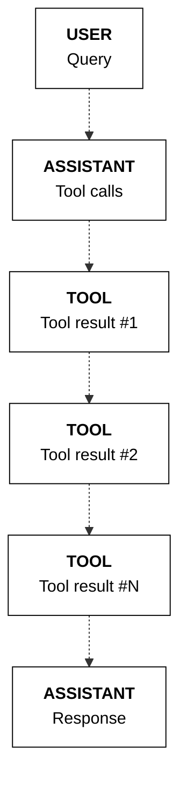
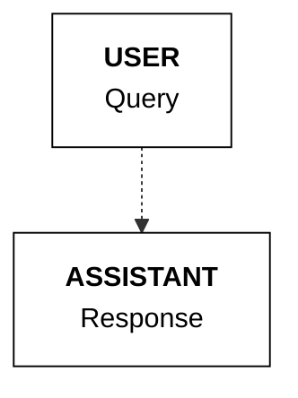
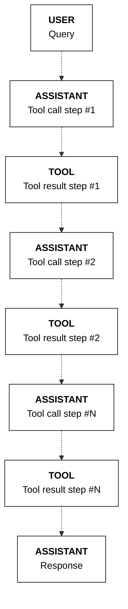
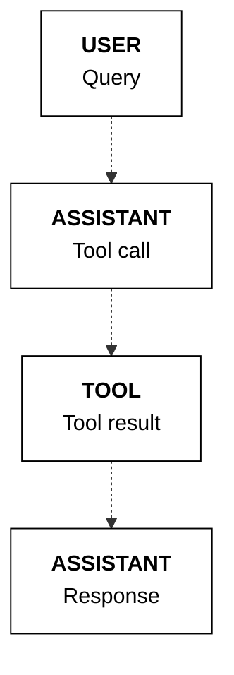
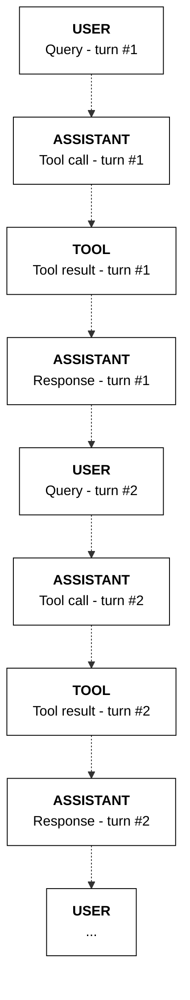

The tool use feature of the Chat endpoint comes with a set of capabilities that enable developers to implement a variety of tool use scenarios. This section describes the different patterns of tool use implementation supported by these capabilities. Each pattern can be implemented on its own or in combination with the others.

## Setup

First, import the Cohere library and create a client.

<Tabs>
<Tab title="Cohere platform">

```python PYTHON
# ! pip install -U cohere
import cohere

co = cohere.ClientV2(
    "COHERE_API_KEY"
)  # Get your free API key here: https://dashboard.cohere.com/api-keys
```
</Tab>

<Tab title="Private deployment">
```python PYTHON
# ! pip install -U cohere
import cohere

co = cohere.ClientV2(
    api_key="",  # Leave this blank
    base_url="<YOUR_DEPLOYMENT_URL>",
)
```
</Tab>
</Tabs>

We'll use the same `search_docs` tool as in the [previous example](https://docs.cohere.com/v2/docs/tool-use-overview#creating-the-tool).

```python PYTHON
def search_docs(query, top_k=3):
    # Implement any retrieval logic here (vector DB, keyword search, etc.)
    return [
        {
            "title": "Tool use (function calling) overview",
            "url": "https://docs.cohere.com/v2/docs/tool-use-overview",
            "text": "Tool use connects models to external tools like search engines and APIs.",
        },
        {
            "title": "Structured outputs",
            "url": "https://docs.cohere.com/docs/structured-outputs",
            "text": "Use JSON schema to define structured inputs/outputs for tools and responses.",
        },
        {
            "title": "Chat API reference (v2)",
            "url": "https://docs.cohere.com/reference/chat",
            "text": "Use the Chat endpoint to generate responses and optionally call tools.",
        },
    ][:top_k]
    # Return a string or a list of objects. In Step 3, we'll wrap each object into a `document` content block.


functions_map = {"search_docs": search_docs}

tools = [
    {
        "type": "function",
        "function": {
            "name": "search_docs",
            "description": "Search documentation and return relevant snippets as documents.",
            "parameters": {
                "type": "object",
                "properties": {
                    "query": {
                        "type": "string",
                        "description": "The search query to look up in the docs.",
                    },
                    "top_k": {
                        "type": "integer",
                        "description": "How many documents to return.",
                    },
                },
                "required": ["query"],
            },
        },
    },
]
```

## Parallel tool calling
The model can determine that more than one tool call is required, where it will call multiple tools in parallel. This can be calling the same tool multiple times or different tools for any number of calls.

In the example below, the user asks for documentation about tool use and structured outputs. This requires calling the `search_docs` tool twice, once per topic. This is reflected in the model's response, where two parallel tool calls are generated.

<CodeBlocks>
```python PYTHON
messages = [
    {
        "role": "user",
        "content": "Find docs about tool use and structured outputs.",
    }
]

response = co.chat(
    model="command-a-03-2025", messages=messages, tools=tools
)

if response.message.tool_calls:
    messages.append(response.message)
    print(response.message.tool_plan, "\n")
    print(response.message.tool_calls)
```
```bash cURL
curl --request POST \
  --url https://api.cohere.ai/v2/chat \
  --header 'accept: application/json' \
  --header 'content-type: application/json' \
  --header "Authorization: bearer $CO_API_KEY" \
  --data '{
  "model": "command-a-03-2025",
  "messages": [
    {
      "role": "user",
      "content": "Find docs about tool use and structured outputs."
    }
  ],
  "tools": [
    {
      "type": "function",
      "function": {
        "name": "search_docs",
        "description": "Search documentation and return relevant snippets as documents.",
        "parameters": {
          "type": "object",
          "properties": {
            "query": {
              "type": "string",
              "description": "The search query to look up in the docs."
            },
            "top_k": {
              "type": "integer",
              "description": "How many documents to return."
            }
          },
          "required": ["query"]
        }
      }
    }
  ]
}'
```
</CodeBlocks>
Example response:
```mdx wordWrap
I will search the docs for tool use and structured outputs.

[
    ToolCallV2(
        id="search_docs_9b0nr4kg58a8",
        type="function",
        function=ToolCallV2Function(
            name="search_docs", arguments='{"query":"tool use","top_k":3}'
        ),
    ),
    ToolCallV2(
        id="search_docs_0qq0mz9gwnqr",
        type="function",
        function=ToolCallV2Function(
            name="search_docs", arguments='{"query":"structured outputs","top_k":3}'
        ),
    ),
]
```
**State management**

When tools are called in parallel, we append the messages list with one single `assistant` message containing all the tool calls and one `tool` message for each tool call.

```python PYTHON
import json

if response.message.tool_calls:
    for tc in response.message.tool_calls:
        tool_result = functions_map[tc.function.name](
            **json.loads(tc.function.arguments)
        )
        tool_content = []
        for data in tool_result:
            # Optional: the "document" object can take an "id" field for use in citations, otherwise auto-generated
            tool_content.append(
                {
                    "type": "document",
                    "document": {"data": json.dumps(data)},
                }
            )
        messages.append(
            {
                "role": "tool",
                "tool_call_id": tc.id,
                "content": tool_content,
            }
        )
```

The sequence of messages is represented in the diagram below.



## Directly answering
A key attribute of tool use systems is the model’s ability to choose the right tools for a task. This includes the model's ability to decide to *not* use any tool, and instead, respond to a user message directly.

In the example below, the user asks a simple arithmetic question. The model determines that it does not need to use any of the available tools (only one, `search_docs`, in this case), and instead, directly answers the user.

<CodeBlocks>
```python PYTHON
messages = [{"role": "user", "content": "What's 2+2?"}]

response = co.chat(
    model="command-a-03-2025", messages=messages, tools=tools
)

if response.message.tool_calls:
    print(response.message.tool_plan, "\n")
    print(response.message.tool_calls)

else:
    print(response.message.content[0].text)
```
```bash cURL
curl --request POST \
  --url https://api.cohere.ai/v2/chat \
  --header 'accept: application/json' \
  --header 'content-type: application/json' \
  --header "Authorization: bearer $CO_API_KEY" \
  --data '{
  "model": "command-a-03-2025",
  "messages": [
    {
      "role": "user",
      "content": "What'\''s 2+2?"
    }
  ],
  "tools": [
    {
      "type": "function",
      "function": {
        "name": "search_docs",
        "description": "Search documentation and return relevant snippets as documents.",
        "parameters": {
          "type": "object",
          "properties": {
            "query": {
              "type": "string",
              "description": "The search query to look up in the docs."
            },
            "top_k": {
              "type": "integer",
              "description": "How many documents to return."
            }
          },
          "required": ["query"]
        }
      }
    }
  ]
}'
```
</CodeBlocks>
Example response:
```mdx wordWrap
The answer to 2+2 is 4.
```

**State management**

When the model opts to respond directly to the user, there will be no items 2 and 3 above (the tool calling and tool response messages). Instead, the final `assistant` message will contain the model's direct response to the user.



Note: you can force the model to directly answer every time using the `tool_choice` parameter, [described here](#forcing-tool-usage)

## Multi-step tool use

The Chat endpoint supports multi-step tool use, which enables the model to perform sequential reasoning. This is especially useful in agentic workflows that require multiple steps to complete a task.

As an example, suppose a tool use application has access to a web search tool. Given the question "What was the revenue of the most valuable company in the US in 2023?”,  it will need to perform a series of steps in a specific order:
- Identify the most valuable company in the US in 2023
- Then only get the revenue figure now that the company has been identified

To illustrate this, we'll use our `search_docs` tool and ask a question that usually requires multiple searches (first for tool use basics, then for `tool_choice`).

Here's the function definition for the tool:
```python PYTHON
def search_docs(query, top_k=3):
    # Implement any retrieval logic here (vector DB, keyword search, etc.)
    return [
        {
            "title": "Tool use (function calling) overview",
            "url": "https://docs.cohere.com/v2/docs/tool-use-overview",
            "text": "Tool use connects models to external tools like search engines and APIs.",
        },
        {
            "title": "Usage patterns for tool use",
            "url": "https://docs.cohere.com/v2/docs/tool-use-usage-patterns",
            "text": "Common patterns include parallel tool calling, multi-step tool use, and more.",
        },
        {
            "title": "Structured outputs",
            "url": "https://docs.cohere.com/docs/structured-outputs",
            "text": "Use JSON schema to define structured inputs/outputs for tools and responses.",
        },
    ][:top_k]


functions_map = {"search_docs": search_docs}
```

And here is the corresponding tool schema:
```python PYTHON
tools = [
    {
        "type": "function",
        "function": {
            "name": "search_docs",
            "description": "Search documentation and return relevant snippets as documents.",
            "parameters": {
                "type": "object",
                "properties": {
                    "query": {
                        "type": "string",
                        "description": "The search query to look up in the docs.",
                    },
                    "top_k": {
                        "type": "integer",
                        "description": "How many documents to return.",
                    },
                },
                "required": ["query"],
            },
        },
    },
]
```

Next, we implement the four-step tool use workflow as described in the [previous page](https://docs.cohere.com/v2/docs/tool-use-overview).

The key difference here is the second (tool calling) and third (tool execution) steps are put in a `while` loop, which means that a sequence of this pair can happen for a number of times. This stops when the model decides in the tool calling step that no more tool calls are needed, which then triggers the fourth step (response generation).

In this example, the user asks for an explanation of tool use and how to force tool usage, with citations.

```python PYTHON
import json

# Step 1: Get the user message
messages = [
    {
        "role": "user",
        "content": "Explain how tool use works and how to force tool usage. Please cite your sources.",
    }
]

# Step 2: Generate tool calls (if any)
model = "command-a-03-2025"
response = co.chat(
    model=model, messages=messages, tools=tools, temperature=0.3
)

while response.message.tool_calls:
    print("TOOL PLAN:")
    print(response.message.tool_plan, "\n")
    print("TOOL CALLS:")
    for tc in response.message.tool_calls:
        print(
            f"Tool name: {tc.function.name} | Parameters: {tc.function.arguments}"
        )
    print("=" * 50)

    messages.append(response.message)

    # Step 3: Get tool results
    print("TOOL RESULT:")
    for tc in response.message.tool_calls:
        tool_result = functions_map[tc.function.name](
            **json.loads(tc.function.arguments)
        )
        tool_content = []
        print(tool_result)
        for data in tool_result:
            # Optional: the "document" object can take an "id" field for use in citations, otherwise auto-generated
            tool_content.append(
                {
                    "type": "document",
                    "document": {"data": json.dumps(data)},
                }
            )
        messages.append(
            {
                "role": "tool",
                "tool_call_id": tc.id,
                "content": tool_content,
            }
        )

    # Step 4: Generate response and citations
    response = co.chat(
        model=model,
        messages=messages,
        tools=tools,
        temperature=0.1,
    )

messages.append(
    {
        "role": "assistant",
        "content": response.message.content[0].text,
    }
)

# Print final response
print("RESPONSE:")
print(response.message.content[0].text)
print("=" * 50)

# Print citations (if any)
verbose_source = (
    True  # Change to True to display the contents of a source
)
if response.message.citations:
    print("CITATIONS:\n")
    for citation in response.message.citations:
        print(
            f"Start: {citation.start}| End:{citation.end}| Text:'{citation.text}' "
        )
        print("Sources:")
        for idx, source in enumerate(citation.sources):
            print(f"{idx+1}. {source.id}")
            if verbose_source:
                print(f"{source.tool_output}")
        print("\n")
```

The model may decide it needs to look up documentation about tool use first, then do a second search for specifics about forcing tool usage via `tool_choice`.

This is reflected in the model's response, where multiple tool calling-result pairs can be generated in a sequence.

Example response:
```mdx wordWrap
TOOL PLAN:
First, I will search the docs for how tool use works. Then, I will search for how to force tool usage (tool_choice).

TOOL CALLS:
Tool name: search_docs | Parameters: {"query":"tool use","top_k":3}
==================================================
TOOL RESULT:
[{'title': 'Tool use (function calling) overview', 'url': 'https://docs.cohere.com/v2/docs/tool-use-overview', 'text': 'Tool use connects models to external tools like search engines and APIs.'}]
TOOL PLAN:
Now I'll search for how to force tool usage via the tool_choice parameter.

TOOL CALLS:
Tool name: search_docs | Parameters: {"query":"tool_choice REQUIRED NONE","top_k":3}
==================================================
TOOL RESULT:
[{'title': 'Usage patterns for tool use', 'url': 'https://docs.cohere.com/v2/docs/tool-use-usage-patterns', 'text': 'Common patterns include parallel tool calling, multi-step tool use, and more.'}]
RESPONSE:
Tool use lets models call external tools (like doc search) and then answer using tool results with citations. You can force tool usage with tool_choice="REQUIRED" or force a direct response with tool_choice="NONE".
==================================================
CITATIONS:

Start: 126| End:135| Text:'tool_choice'
Sources:
1. search_docs_p0dage9q1nv4:0
{'title': 'Usage patterns for tool use', 'url': 'https://docs.cohere.com/v2/docs/tool-use-usage-patterns', 'text': 'Common patterns include parallel tool calling, multi-step tool use, and more.'}
```

**State management**

In a multi-step tool use scenario, instead of just one occurence of `assistant`-`tool` messages, there will be a sequence of `assistant`-`tool` messages to reflect the multiple steps of tool calling involved.



## Forcing tool usage

<Note>
This feature is only compatible with the [Command R7B](https://docs.cohere.com/v2/docs/command-r7b) and newer models.
</Note>

As shown in the previous examples, during the tool calling step, the model may decide to either:
- make tool call(s)
- or, respond to a user message directly.

You can, however, force the model to choose one of these options. This is done via the `tool_choice` parameter.
- You can force the model to make tool call(s), i.e. to not respond directly, by setting the `tool_choice` parameter to `REQUIRED`.
- Alternatively, you can force the model to respond directly, i.e. to not make tool call(s), by setting the `tool_choice` parameter to `NONE`.

By default, if you don’t specify the `tool_choice` parameter, then it is up to the model to decide whether to make tool calls or respond directly.

```python PYTHON {5}
response = co.chat(
    model="command-a-03-2025",
    messages=messages,
    tools=tools,
    tool_choice="REQUIRED" # optional, to force tool calls
    # tool_choice="NONE" # optional, to force a direct response
)
```

**State management**

Here's the sequence of messages when `tool_choice` is set to `REQUIRED`.


Here's the sequence of messages when `tool_choice` is set to `NONE`.


## Chatbots (multi-turn)

Building chatbots requires maintaining the memory or state of a conversation over multiple turns. To do this, we can keep appending each turn of a conversation to the `messages` list.

As an example, here's the messages list from the first turn of a conversation.

```python PYTHON
from cohere import ToolCallV2, ToolCallV2Function

messages = [
    {
        "role": "user",
        "content": "How does tool use work in Cohere? Please cite your sources.",
    },
    {
        "role": "assistant",
        "tool_plan": "I will search the docs for how tool use works in Cohere.",
        "tool_calls": [
            ToolCallV2(
                id="search_docs_1byjy32y4hvq",
                type="function",
                function=ToolCallV2Function(
                    name="search_docs",
                    arguments='{"query":"tool use Cohere","top_k":3}',
                ),
            )
        ],
    },
    {
        "role": "tool",
        "tool_call_id": "search_docs_1byjy32y4hvq",
        "content": [
            {
                "type": "document",
                "document": {
                    "data": '{"title":"Tool use (function calling) overview","url":"https://docs.cohere.com/v2/docs/tool-use-overview","text":"Tool use connects models to external tools like search engines and APIs."}'
                },
            }
        ],
    },
    {
        "role": "assistant",
        "content": "Tool use lets models call external tools (like doc search) and then answer using tool results with citations.",
    },
]
```

Then, in the second turn, when provided with a rather vague follow-up user message, the model correctly infers that the context is still about tool use, and searches for information about `tool_choice`.

<CodeBlocks>
```python PYTHON
messages.append(
    {"role": "user", "content": "How do I force tool usage?"}
)

response = co.chat(
    model="command-a-03-2025", messages=messages, tools=tools
)

if response.message.tool_calls:
    messages.append(response.message)
    print(response.message.tool_plan, "\n")
    print(response.message.tool_calls)
```
```bash cURL
curl --request POST   --url https://api.cohere.ai/v2/chat   --header 'accept: application/json'   --header 'content-type: application/json'   --header "Authorization: bearer $CO_API_KEY"   --data '{
  "model": "command-a-03-2025",
  "messages": [
    {
      "role": "user",
      "content": "How does tool use work in Cohere? Please cite your sources."
    },
    {
      "role": "assistant",
      "tool_plan": "I will search the docs for how tool use works in Cohere.",
      "tool_calls": [
        {
          "id": "search_docs_1byjy32y4hvq",
          "type": "function",
          "function": {
            "name": "search_docs",
            "arguments": "{"query":"tool use Cohere","top_k":3}"
          }
        }
      ]
    },
    {
      "role": "tool",
      "tool_call_id": "search_docs_1byjy32y4hvq",
      "content": [
        {
          "type": "document",
          "document": {
            "data": "{"title":"Tool use (function calling) overview","url":"https://docs.cohere.com/v2/docs/tool-use-overview","text":"Tool use connects models to external tools like search engines and APIs."}"
          }
        }
      ]
    },
    {
      "role": "assistant",
      "content": "Tool use lets models call external tools (like doc search) and then answer using tool results with citations."
    },
    {
      "role": "user",
      "content": "How do I force tool usage?"
    }
  ],
  "tools": [
    {
      "type": "function",
      "function": {
        "name": "search_docs",
        "description": "Search documentation and return relevant snippets as documents.",
        "parameters": {
          "type": "object",
          "properties": {
            "query": {
              "type": "string",
              "description": "The search query to look up in the docs."
            },
            "top_k": {
              "type": "integer",
              "description": "How many documents to return."
            }
          },
          "required": ["query"]
        }
      }
    }
  ]
}'
```
</CodeBlocks>
Example response:
```mdx wordWrap
I will search the docs for how to force tool usage using tool_choice.

[ToolCallV2(id='search_docs_8hwpm7d4wr14', type='function', function=ToolCallV2Function(name='search_docs', arguments='{"query":"tool_choice REQUIRED NONE","top_k":3}'))]
```

**State management**

The sequence of messages is represented in the diagram below.


