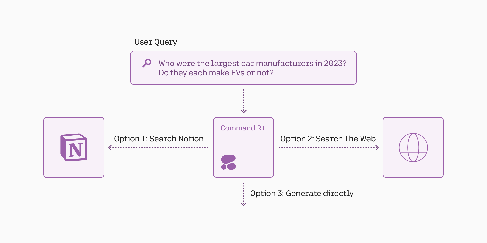

Welcome to the tutorial on Agentic RAG with Cohere!

[Retrieval Augmented Generation](https://docs.cohere.com/docs/retrieval-augmented-generation-rag) (RAG) is a technique that gives LLMs the capability to ground their responses in external text data, making the response more accurate and less prone to hallucinations.

However, a standard RAG implementation struggles on more complex type of tasks, such as:
- When it has to search over diverse set of sources
- When the question requires sequential reasoning
- When the question has multiple parts
- When it requires comparing multiple documents
- When it requires analyzing structured data

In an enterprise setting where data sources are diverse with non-homogeneous formats this approach becomes even more important. For example, the data sources could be a mix of structured, semi-structured and unstructured data.

This is where agentic RAG comes into play, and in this tutorial, we'll see how agentic RAG can solve these type of tasks. 

Concretely, this is achieved using the tool use approach. Tool use allows for greater flexibility in accessing and utilizing data sources, thus unlocking new use cases not possible with a standard RAG approach.

This tutorial is split into six parts, with each part focusing on one use case:
- [Part 1: Routing queries to data sources](/v2/docs/routing-queries-to-data-sources)
    - Getting started with agentic RAG
    - Setting up the tools
    - Running an agentic RAG workflow 
    - Routing queries to tools
- [Part 2: Generating parallel queries](/v2/docs/generating-parallel-queries)
    - Query expansion
    - Query expansion over multiple data sources
    - Query expansion in multi-turn conversations
- [Part 3: Performing tasks sequentially](/v2/docs/performing-tasks-sequentially)
    - Multi-step tool calling
    - Multi-step, parallel tool calling
    - Self-correction
- Part 4: Generating multi-faceted queries
    - *coming next*
- Part 5: Querying structured data (tables)
    - *coming next*
- Part 6: Querying structured data (databases)
    - *coming next*